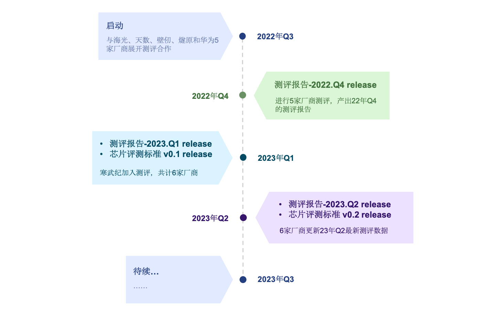
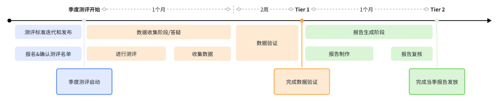

# 硬件测评

<!-- AI底层技术通常分为芯片、计算、框架三个层次，在目前的国际主流AI生态中，英伟达GPU是人工智能计算芯片的领导者，其V100和A100型号的GPU是当今最主流的人工智能计算加速芯片，并基于CUDA生态筑起AI算力的“护城河”。经过多年的政府支持和自主创新，国产软硬件也取得了一定突破，在国内逐渐形成了涵盖计算芯片、开源平台、基础应用、行业应用及产品等环节较完善的人工智能产业链，但是我们仍需正视、重视与英伟达等国际一流企业的技术差距。 -->
<!-- 上海人工智能实验室牵头的 -->
硬件测评基于团体标准评测方法，以国际主流芯片的性能作为对标，对送测芯片进行技术规格、软件生态、功能、性能等多维度测试，并按季度产出硬件评测报告。评测结论可为各类国产加速卡在不同维度的表现提供参考。

### 什么是硬件测评
<!-- 硬件测评是面向国产深度学习加速卡进行的多维度评测工作。硬件测评提供一套标准的行业测试方法，提供技术规格、软件生态、功能测试、性能测试等多视角，并周期性产出标准测评结果。硬件测评结果可用作各类国产加速卡在不同维度表现的参考。 -->
<!-- 其以《英伟达A100训练测基准测试报告》中相关数据为基准值，着重体现国产训练芯片相比A100基准的差异性(包含优/劣势)。 -->

<!-- 目前硬件测评设计了两个层面的实施方案，分别是[AI芯片评测实施方案](https://deeplink.readthedocs.io/zh-cn/latest/doc/Chip_test/basicmodel.html)和[基于大模型的AI芯片评测实施方案](https://deeplink.readthedocs.io/zh-cn/latest/doc/Chip_test/largecmodel.html)，以应对市场对硬件在不同场景下的能力要求。 -->

硬件测评是面向国产深度学习加速卡进行的多维度评测工作，目前硬件测评设计了两个层面的实施方案，分别是《AI芯片评测实施方案》和《基于大模型的AI芯片评测实施方案》，以应对市场对硬件在不同场景下的能力要求。

### 为什么做硬件测评
硬件测评可作为芯片生产厂商、应用厂商、前场销售及第三方机构对深度学习训练芯片（包含AI芯片模组和AI加速卡等形态）进行设计、采购、评测的参考。

<!-- ### 当前进度和规划

厂商合作进度：目前我们已经和寒武纪、海光、昇腾、燧原、天数、壁仞等硬件厂商达成测评合作。 -->

<!-- 硬件测评工作进度和规划：

 -->

## 测评流程
DeepLink将以季度为单位对测评标准进行迭代，并定期开展芯片测评工作。测评流程如下图所示：

  

1. 季度测评开始前，联系硬件测评工作人员(或邮件联系 deeplink_benchmark@pjlab.org.cn )，确认参与本季度测评。
2. 季度测评开始，基于实施方案对自家芯片进行测试，并进行数据汇总。
3. 相关链接可见：
  * 实施方案：[AI芯片评测实施方案](https://aicarrier.feishu.cn/wiki/WOMuwRlF6ilBf5kug8DcbpZwnqb)和[基于大模型的AI芯片评测实施方案](https://aicarrier.feishu.cn/wiki/C2NYwAJEqidHUbkfNPgcO6EsnOd)（数据汇总模版见方案开头）；
  * [评测仓库&数据下载](https://github.com/DeepLink-org/AIChipBenchmark)。
4. 厂商提交数据汇总表和相关验证材料至指定位置，实验室进行结果核验。
5. 实验室完成单芯片评测报告整理，点对点发放。
6. 厂商可对评测结果和方案和理性进行意见反馈。

<!-- 
1. 季度测评开始前，联系硬件测评工作人员(或邮件联系\"deeplink_benchmark@pjlab.org.cn\")，确认参与本季度测评
2. 季度测评开始，参与测评的芯片请阅读“[测评标准&实施方案](https://aicarrier.feishu.cn/wiki/WOMuwRlF6ilBf5kug8DcbpZwnqb?from=from_copylink)”，基于实施方案对自家芯片进行测试； 
3. 厂商提交数据和验证材料，实验室会进行结果核验； 
4. 实验室完成单芯片评测报告整理（可参考：[报告模版](https://aicarrier.feishu.cn/wiki/R970wOBEhihaoakWkuMco9ognu7)），点对点发放。  -->
<!-- 
### 相关链接
* **测评方案**：[测评标准&实施方案](https://aicarrier.feishu.cn/wiki/WOMuwRlF6ilBf5kug8DcbpZwnqb?from=from_copylink)
* **测评仓库**：[AIChipBenchmark](https://github.com/DeepLink-org/AIChipBenchmark) -->

## 联系我们

如果您所代表的芯片厂商，也期望能够参与硬件测评，可联系社区：deeplink_benchmark@pjlab.org.cn。