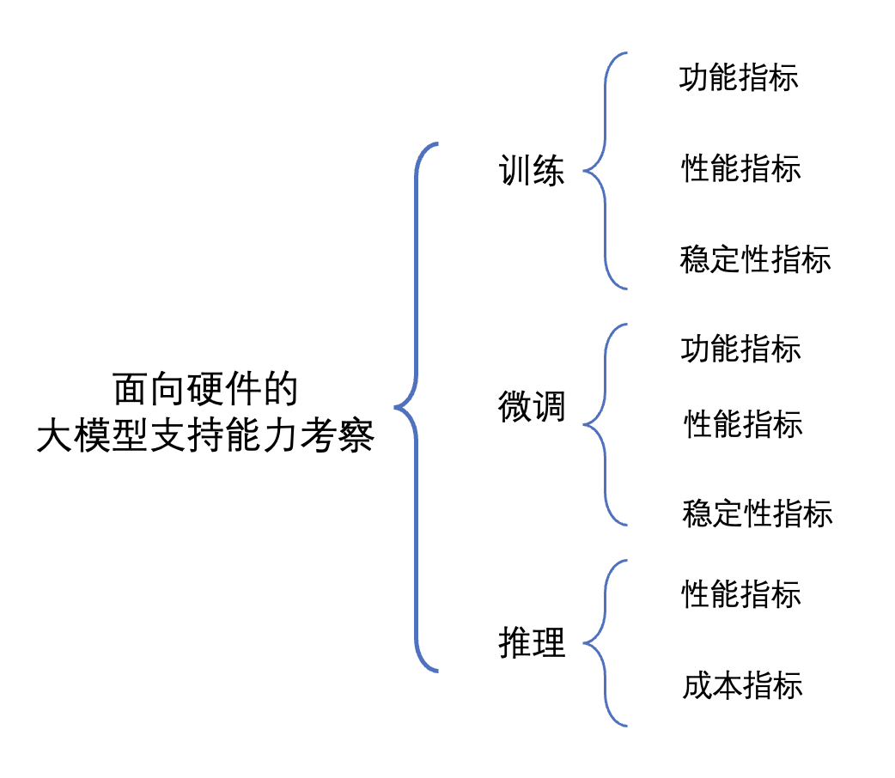

# 面向硬件的大模型评测实施方案

国产AI芯片的大模型支持也是重点考察的能力，增加大模型训练功能、性能及稳定性指标、大模型微调功能、性能以及稳定性指标以及大模型推理性能及成本指标，全面覆盖模型训练、微调和推理三大关键环节： 

评测的结果将为硬件厂商提供宝贵的参考信息，帮助他们了解自身在大模型领域的发展方向和优化需求。同时，评测结果也将为用户和开发者提供有价值的参考，帮助他们选择适合自己需求的硬件设备，并优化和改进应用程序的性能和效果。 
我们期待通过这一评测方案的实施，能够为国产硬件的发展注入新的动力，推动大模型技术的普及和应用，促进语言处理领域的创新和进步。 

  

