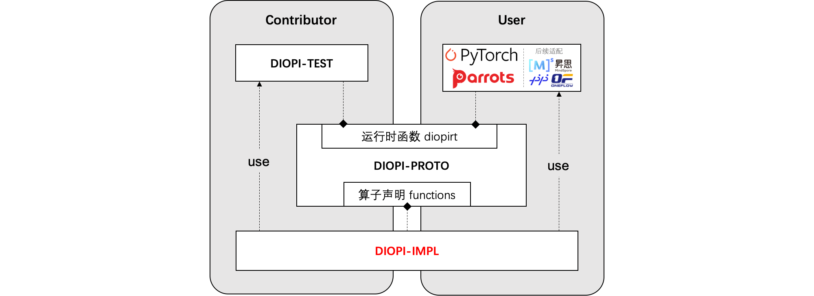

# DIOPI Introduction

DIOPI-设备无关算子接口（Device-Independent Operator Interface, DIOPI）在框架和芯片计算库之间定义了统一的**标准接口**。旨在训练框架和人工智能芯片之间定义了一套计算契约，良好的函数抽象使得上（框架）下（芯片）两层在适配工程实施时能有效地解耦。基于这套契约训练框架和人工智能芯片可以独立开发，并将下层芯片适配的工作复用到不同的训练框架适配中去，可降低芯片+框架的适配成本，保障算子实现正确性。

其主要的核心功能如下：
1. 提供120+个标准算子接口。涵盖了分类、检测、分割及姿态估计等多个领域深度学习模型所需训练算子。
2. 训练框架和硬件芯片的“桥梁”，提供统一的标准算子接口。以此降低训练框架和硬件芯片之间的适配成本，创造更好的国产训练生态。
3. 提供标准测试套件，为硬件芯片实现的算子库提供调试验证功能。

----

## 结构说明



DIOPI主要包含以下几个组件：

- [DIOPI-PROTO](https://github.com/DeepLink-org/DIOPI/tree/main/DIOPI-PROTO)：声明了一套运行时函数接口(diopirt)和标准算子接口(function)。
- [DIOPI-IMPL](https://github.com/DeepLink-org/DIOPI/tree/main/DIOPI-IMPL)：对接硬件芯片。硬件厂商可在其中使用硬件软件栈提供的计算接口，实现算子功能。其使用 ```DIOPI-PROTO/include/diopi/diopirt.h``` 提供的接口实现 ```DIOPI-PROTO/include/diopi/functions.h``` 声明的标准算子, 并编译为 ```libdiopi_impl.so``` 动态库。在测试阶段，DIOPI-IMPL 还需实现并注册 ```DIOPI-TEST/include/diopi_register.h``` 声明的硬件芯片管理相关的函数。
- [DIOPI-TEST](https://github.com/DeepLink-org/DIOPI/tree/main/DIOPI-TEST)：用于保证算子功能正确性。实现 ```DIOPI-PROTO/include/diopi/diopirt.h``` 声明基础运行时函数，并调用 ```libdiopi_impl.so``` 进行测试验证。

----

## Learn More

组件介绍
* [DIOPI-PROTO Readme](https://github.com/DeepLink-org/DIOPI/tree/main/DIOPI-PROTO#readme)
* [DIOPI-IMPL Readme](https://github.com/DeepLink-org/DIOPI/tree/main/DIOPI-IMPL#readme)
* [DIOPI-TEST Readme](https://github.com/DeepLink-org/DIOPI/tree/main/DIOPI-TEST#readme)
<!--* [DIPU-Adapter Readme](DIPU-Adapter.md)-->

其他文档
<!--* [API文档]{} -->
* [常见问题](https://deeplink-org.github.io/OpenComputeLab.github.io/5%20FAQ.html)
* [Release Note](https://github.com/DeepLink-org/DIOPI/releases)
* [开发者指南](https://github.com/DeepLink-org/DIOPI/blob/main/Contributors.md)