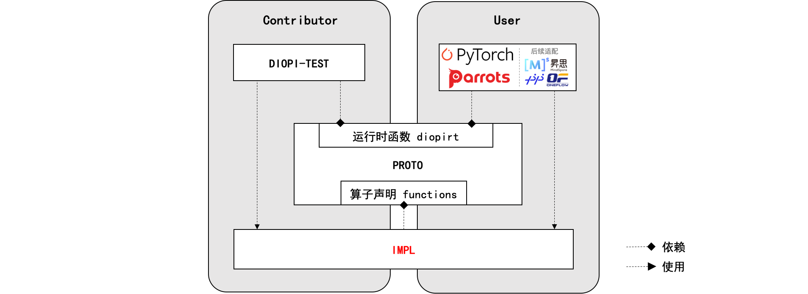

# DIOPI Introduction

DIOPI-设备无关算子接口（Device-Independent Operator Interface, DIOPI）在框架和芯片计算库之间定义了统一的**标准接口**。
旨在训练框架和人工智能芯片之间定义了一套计算契约，良好的函数抽象使得上（框架）下（芯片）两层在适配工程实施时能有效地解耦。
基于这套契约训练框架和人工智能芯片可以独立开发，并将下层芯片适配的工作复用到不同的训练框架适配中去，可降低芯片+框架的适配成本，保障算子实现正确性。

其主要的核心功能如下：
1. **<font color="2980b9">提供200+个标准算子接口，包含LLaMa大模型算子接口</font>**。涵盖了大模型、分类、检测、分割及姿态估计等多个领域深度学习模型所需训练算子。
2. **<font color="2980b9">提供统一的标准算子接口，接入7+款硬件芯片</font>**。是训练框架和硬件芯片的“桥梁”，降低训练框架和硬件芯片之间的适配成本，创造更好的软硬训练生态。
3. **<font color="2980b9">提供标准测试套件，支持5000+个常见算子测例</font>**，为硬件芯片实现的算子库提供调试验证功能。


## 结构说明



DIOPI主要包含以下几个组件：

- [**PROTO**](https://github.com/DeepLink-org/DIOPI/tree/main/proto)：声明了一套运行时函数接口(diopirt)和标准算子接口(function)。
- [**IMPL**](https://github.com/DeepLink-org/DIOPI/tree/main/impl)：对接硬件芯片。硬件厂商可在其中使用硬件软件栈提供的计算接口，实现算子功能。其使用 ```proto/include/diopi/diopirt.h``` 提供的接口实现 ```proto/include/diopi/functions.h``` 声明的标准算子, 并编译为 ```libdiopi_impl.so``` 动态库。在测试阶段，impl 还需实现并注册 ```diopi_test/include/diopi_register.h``` 声明的硬件芯片管理相关的函数。
- [**DIOP_TEST**](https://github.com/DeepLink-org/DIOPI/tree/main/diopi_test)：用于保证算子功能正确性。实现 ```proto/include/diopi/diopirt.h``` 声明基础运行时函数，并调用 ```libdiopi_impl.so``` 进行测试验证。
- [**ADAPTER**](https://github.com/DeepLink-org/DIOPI/tree/main/adaptor)：用于提供辅助功能函数。目前提供的功能包括自动类型转换、内存分布转换等。


----

### PROTO

PROTO是标准算子接口的原型声明，是芯片厂商实现与框架算子调用的中间层。通过规定标准的运行时函数与算子接口的声明，对框架来说，统一了算子接口，无需考虑芯片厂商具体的算子实现；对厂商来说，可以只聚焦于算子实现与优化，无需考虑框架适配。PROTO作为DIOPI中具体算子声明的环节，起到了承上（框架）启下（芯片厂商）的作用。

PROTO有如下核心功能：
 1. **实现Runtime标准接口定义**。
 声明了在实现标准算子函数时可以使用的工具函数以及相关数据结构。其中，工具函数用于对Context和Tensor两类对象进行操作。
 2. **实现标准算子的接口定义**。
 声明了标准算子的函数，每一个函数完成一个特定的、需要计算设备参与执行的功能。


PROTO的主要组成部分包括 _运行时函数(diopirt)_ 和 _算子声明(functions)_。运行时函数主要为芯片厂商提供实现算子函数时需要框架提供的工具函数，主要包括一些公共类型的声明以及分配与管理张量数据等；算子声明包含了用于人工智能计算的大量函数声明，为各个算子接口的具体参数及其类型提供了标准化的定义；C-API文档生成为算子声明生成API说明文档，供算子开发与使用者查阅更多信息可以查看[PROTO](https://github.com/DeepLink-org/DIOPI/tree/main/proto)。


### IMPL

IMPL 主要用于芯片厂商基于 PROTO 进行标准算子实现，和基于 TEST 注册基础少量的运行时函数。芯片厂商需要在 IMPL 通过注册的形式，为后续测试提供如内存拷贝、流创建销毁等可管理设备芯片的功能，该实现部分仅供 TEST 测试所用。更为重要的是，芯片厂商可通过封装自身计算库或者调用 ``kernel`` 的方式来实现 PROTO 定义良好的标准算子接口以备后续测试调用和训练框架调用。

其价值体现在以实现统一接口计算库的形式，来对接不同训练框架。无需考虑不同训练框架特性，可更专注于提升每个功能性算子的性能。更多信息可以查看[IMPL](https://github.com/DeepLink-org/DIOPI/tree/main/impl)。


### DIOPI_TEST

DIOPI_TEST是构建于设备无关算子接口（Device-Independent Operator Interface, DIOPI）之上的测试框架，它支持了没有训练框架的情况下，验证算子适配正确性的功能。DIOPI_TEST设计了一套完整的测试框架和一套算子函数测试。测试套件，可以使芯片厂商适配 DIOPI 算子时，无需训练框架即可对适配结果的正确性进行验证。

主要模块：
* diopi_test 运行时：支持了运行时函数的接口，用以管理设备相关资源。
* 非算子测试：
    * 测试获取设备相关信息标准接口。
    * 测试获取错误信息标准接口。
    * 测试上下文 Context 中 Stream 的正确使用。
* 算子测试：
    * 自定义测例配置：套件提供了描述算子测例的配置文件，用户可自定义扩展测例。
    * 生成基准数据：套件可以根据配置文件生成算子测例的基准输入和输出数据。
    * 校验适配算子：算子适配完成后使用基准输入数据得到的结果与基准输出数据进行比较验证。
* 模型算子测试：
    * 采用算子测试相同的测例配置规则, 使用同一个测试框架生成基准数据并进行测试验证。
    * 从30多个模型训练过程中抓取张量形状，数据类型及其他非张量参数值生成测例。

更多信息可以查看[DIOPI_TEST](https://github.com/DeepLink-org/DIOPI/tree/main/diopi_test)。

### ADAPTER

ADAPTER 是 DIOPI 提供的辅助工具箱，目前提供的功能包括自动类型转换、内存分布转换等，使用时在 IMPL 设备文件夹下添加配置问题，具体配置方法见[IMPL Readme](https://github.com/DeepLink-org/DIOPI/tree/main/impl#readme)。

