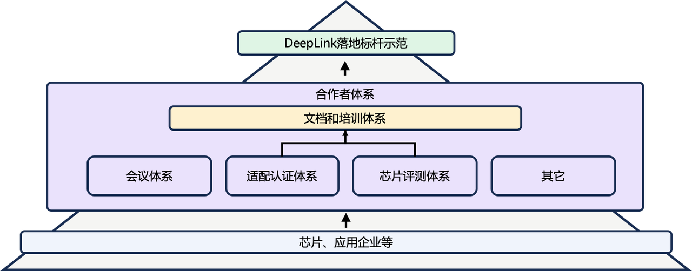

# DeepLink合作伙伴生态计划

## 什么是DeepLink合作伙伴生态
DeepLink以硬件评测交流会的顺利举办为抓手，深度挖掘硬件企业与应用企业之间的合作需求，推出DeepLink合作伙伴生态，以中立的身位与上下游的企事业单位共同推进生态建设。合作伙伴生态生态以AI产学研为核心，链接软硬件/上下游的多家企事业单位。DeepLink合作伙伴生态将从评测、适配、标准三个方面着手，以公平中立的态度制定各方向的评级认证标准，并为不同认证级别的合作伙伴提供相应的伙伴权益，如技术合作、培训支持、业务推广等多项权益。

合作伙伴生态预期构建合作伙伴间的深度交流渠道，搭建算力提供方、智算中心建设方以及算力使用需求方的交流平台，帮助合作伙伴进行落地和推广。同时沉淀和转化行业、企业等多层次的需求，使DeepLink围绕合作伙伴更好地助力国产算力提升易用性，共建国产生态。

  

DeepLink合作伙伴生态目前已经正式发布，欢迎感兴趣的企事业单位与DeepLink团队联系，并参与合作伙伴生态！

## DeepLink合作伙伴申请流程

* 第一步：请填写申请表（DeepLink合作伙伴申请表.docx）；
* 第二步：整理相关电子版材料（包含申请表、企业资质证明材料、补充材料等）；
* 第三步：邮件发送申请信息至邮箱（deeplink@pjlab.org.cn），邮件标题请以“【企业名称】参与DeepLink合作伙伴申请”；
* 第四步：等待实验室审核（约30个工作日）；
* 第五步：认证完成，获得官方认证登记通知、证书发放；

<a href="../../../../doc/PartnerPlan/DeepLink_registration_form.docx" target="_blank" class="button" onclick="showConfirmation2(event)">
  导出数据
</a>

<!-- 
 -->
