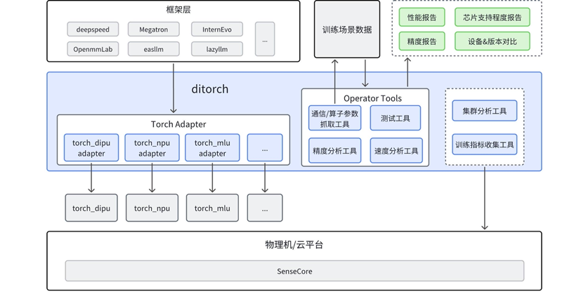
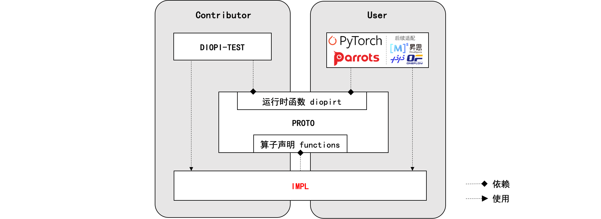
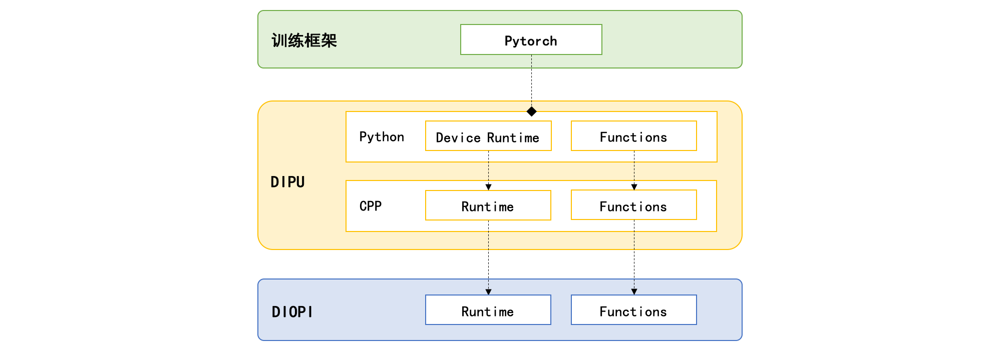
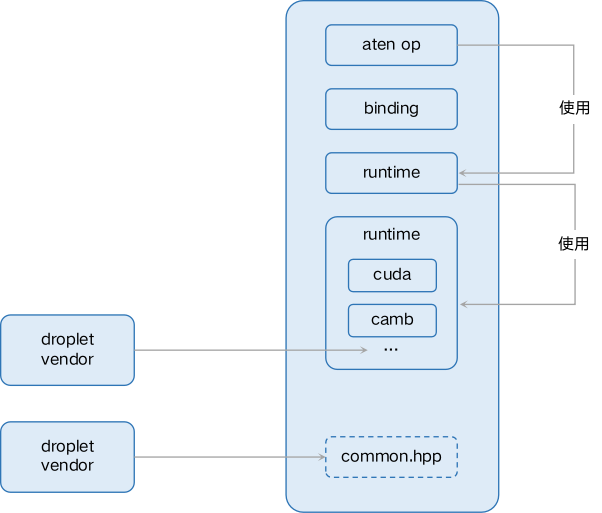
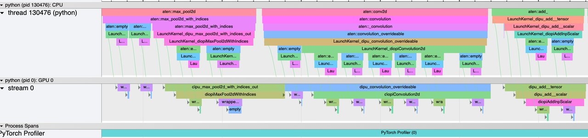
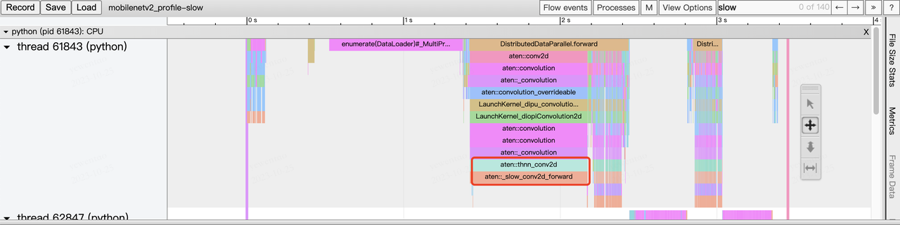
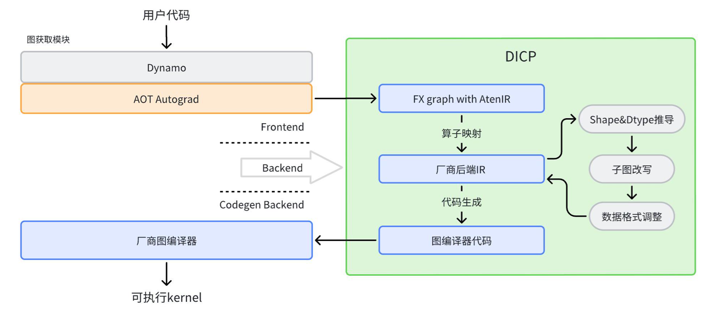

# 训练

## 多训练芯片通用框架（ditorch）

ditorch 是设备无关 torch， 旨在屏蔽各硬件厂商 torch 差异，为用户提供一致使用体验。通过 ditorch，开发者可以适配多个硬件算子库；此外，ditorch 提供训练过程中需要的基础工具，解决模型训练过程中出现的痛点问题。


<!-- .. image:: _static/image/ditorch/ditorch.png
   :class: doc-img 


/Users/yuyue/Documents/GitHub/deeplink-rtd-docs/docs/_static/image/ditorch/ditorch.png
   -->

### **模型芯片适配列表**

<style>
table {
  font-size: 12px; /* 设置表格内文字的字号为16px，可根据需要调整 */
}
</style>

| **模型系列/型号** | **NV <br>(全系列)** | **华为 <br>A2** | **华为 <br>A3** | **沐曦 <br>C500** | **平头哥<br>PPU 810** | **天数 <br>BI-V150** | **壁仞 <br>BR 106** | **寒武纪 <br>MLU370** | **海光 <br>K100_AI** |
|------------------|-----------------|---------------|---------------|---------------|-------------------|------------------|------------------|------------------|------------------|
| **Llama系列** <br>llama2 7B<br>llama2 70B <br> llama3 70B<br>（70B以下模型适用） | ✔️ | ✔️ |  | ✔️ | ✔️ | ✔️ | ✔️ | ✔️ | ✔️ |
| **InternLM系列**  <br>InternLM2-7B <br>InternLM2-20B <br>InternLM2-100B | ✔️ | ✔️ |  | ✔️ | ✔️ | ✔️ | ✔️ | ✔️ | ✔️ |
| **Qwen系列** <br>Qwen2-7B<br>Qwen3-32B<br>Qwen3-30B-A3B | ✔️ | ✔️ |  | ✔️ | ✔️ | ✔️ | ✔️ | ✔️ | ✔️ |
| (*) Qwen3-235B-A22B |  |  | ✔️<br>（研发中） |  |  |  |  |  |  |
| **InternVL系列**<br>InternVL1-5 | ✔️ | ✔️ |  | ✔️ | ✔️ | ✔️ | ✔️ | ✔️ | ✔️ |
| (*) DeepSeek V3 |  |  | ✔️<br>（研发中） |  |  |  |  |  |  |

<br>

### **核心功能**
#### **1. 可无感切换 pytorch 至国产芯片**

只需添加两行代码，即可在国产芯片上像官方 pytorch 一样使用。
```
import torch
import ditorch
```

#### **2. 提供多个基础工具，解决训练过程的问题**

提供模型训练过程中需要的基础工具，解决模型训练过程中出现的痛点问题 [算子工具](op_tools/README.md)。

| 序号 |  工具  |  简介  |
| ---- |  ------  |  ------  |
| 1 | [算子参数抓取工具](#tool1) |  抓取模型真实训练过程中真实的输入输出  |
| 2 | [精度分析工具](#tool2) | 进行离线和实时的精度分析 |
| 3 | [速度分析工具](#tool3) | 可进行离线和实时的耗时分析，协助性能优化 |
| 4 | [算子 Fallback](#tool4) | 可将指定、全部算子在设备上运行的操作 fallback 到 CPU 计算 |


##### **算子参数抓取工具** <a id="tool1"></a>
抓取模型真实训练过程中真实的输入输出：
```
# usage1
import op_tools
capture = op_tools.OpCapture()
capture.start()
code_snippet_to_capture
capture.stop()
...
```

```
# usage2
import op_tools
with op_tools.OpCapture():
    code_snippet_to_capture()
```

######  **抓取前向和反向的所有输入输出**

```
op_capture_result/0/2024-08-06--11-41/torch.Tensor.to/8/input.pth saved
op_capture_result/0/2024-08-06--11-41/torch.Tensor.to/8/output.pth saved
apply OpCaptureHook on torch.Tensor.mul
op_capture_result/0/2024-08-06--11-41/torch.Tensor.mul/9/input.pth saved
op_capture_result/0/2024-08-06--11-41/torch.Tensor.mul/9/output.pth saved
apply OpCaptureHook on torch.Tensor.add
op_capture_result/0/2024-08-06--11-41/torch.Tensor.add/10/input.pth saved
op_capture_result/0/2024-08-06--11-41/torch.Tensor.add/10/output.pth saved
apply OpCaptureHook on torch.Tensor.sub
op_capture_result/0/2024-08-06--11-41/torch.Tensor.sub/11/input.pth saved
op_capture_result/0/2024-08-06--11-41/torch.Tensor.sub/11/output.pth saved
apply OpCaptureHook on torch.Tensor.div
op_capture_result/0/2024-08-06--11-41/torch.Tensor.div/12/input.pth saved
op_capture_result/0/2024-08-06--11-41/torch.Tensor.div/12/output.pth saved
apply OpCaptureHook on torch.Tensor.sort
op_capture_result/0/2024-08-06--11-41/torch.Tensor.sort/13/input.pth saved
op_capture_result/0/2024-08-06--11-41/torch.Tensor.sort/13/output.pth saved
apply OpCaptureHook on torch.Tensor.sum
op_capture_result/0/2024-08-06--11-41/torch.Tensor.sum/14/input.pth saved
op_capture_result/0/2024-08-06--11-41/torch.Tensor.sum/14/output.pth saved
skip OpCaptureHook on torch.Tensor.backward
op_capture_result/0/2024-08-06--11-41/torch.Tensor.sum/14/grad_inputs.pth saved
op_capture_result/0/2024-08-06--11-41/torch.Tensor.sum/14/grad_outputs.pth saved
op_capture_result/0/2024-08-06--11-41/torch.Tensor.sort/13/grad_inputs.pth saved
op_capture_result/0/2024-08-06--11-41/torch.Tensor.sort/13/grad_outputs.pth saved
op_capture_result/0/2024-08-06--11-41/torch.Tensor.to/8/grad_inputs.pth saved
op_capture_result/0/2024-08-06--11-41/torch.Tensor.to/8/grad_outputs.pth saved
...
```

###### **只抓取sort算子的参数，忽略其他算子 OP_CAPTURE_LIST=torch.Tensor.sort**
```
...
skip OpCaptureHook on torch.Tensor.mul
skip OpCaptureHook on torch.Tensor.add
skip OpCaptureHook on torch.Tensor.sub
skip OpCaptureHook on torch.Tensor.div
apply OpCaptureHook on torch.Tensor.sort
op_capture_result/0/2024-08-06--11-41/torch.Tensor.sort/34/input.pth saved
op_capture_result/0/2024-08-06--11-41/torch.Tensor.sort/34/output.pth saved
op_capture_result/0/2024-08-06--11-41/torch.Tensor.sort/34/grad_inputs.pth saved
op_capture_result/0/2024-08-06--11-41/torch.Tensor.sort/34/grad_outputs.pth saved
...
```

######  **排除指定算子，抓取所有其他算子 OP_CAPTURE_DISABLE_LIST="torch.Tensor.add,torch.Tensor.sub"**
```
apply OpCaptureHook on torch.Tensor.to
op_capture_result/0/2024-08-06--11-46/torch.Tensor.to/29/input.pth saved
op_capture_result/0/2024-08-06--11-46/torch.Tensor.to/29/output.pth saved
apply OpCaptureHook on torch.Tensor.mul
op_capture_result/0/2024-08-06--11-46/torch.Tensor.mul/30/input.pth saved
op_capture_result/0/2024-08-06--11-46/torch.Tensor.mul/30/output.pth saved
skip OpCaptureHook on torch.Tensor.add
skip OpCaptureHook on torch.Tensor.sub
apply OpCaptureHook on torch.Tensor.div
op_capture_result/0/2024-08-06--11-46/torch.Tensor.div/31/input.pth saved
op_capture_result/0/2024-08-06--11-46/torch.Tensor.div/31/output.pth saved
apply OpCaptureHook on torch.Tensor.sort
op_capture_result/0/2024-08-06--11-46/torch.Tensor.sort/32/input.pth saved
op_capture_result/0/2024-08-06--11-46/torch.Tensor.sort/32/output.pth saved
apply OpCaptureHook on torch.Tensor.sum
op_capture_result/0/2024-08-06--11-46/torch.Tensor.sum/33/input.pth saved
op_capture_result/0/2024-08-06--11-46/torch.Tensor.sum/33/output.pth saved
...
```
##### **精度分析工具** <a id="tool2"></a>
精度分析工具可以实现：
1. 离线分析：用模型训练过程中真实输入输出，离线对比。
2. 实时精度对比：模型训练时实时与cpu对比分析精度。

```
# usage1
import op_tools
with op_tools.OpAutoCompare():
    code_snippet_to_autocompare()
```

```
# usage2
import op_tools
autocompare = op_tools.OpAutoCompare()
autocompare.start()
code_snippet_to_autocompare()
autocompare.stop()
```

###### **基于InternEvo + ditorch + torch_npu 在华为910B上实时精度分析输出片段**


```
...
OpAutoCompareHook: torch.nn.functional.linear                         allclose: False    max_diff:          0.003906250
OpAutoCompareHook: torch.nn.functional.linear                         input: {'args': ({'shape': torch.Size([1, 16384, 2048]), 'stride': (33554432, 2048, 1), 'numel': 33554432, 'dtype': 'torch.bfloat16', 'device': 'npu:0', 'requires_grad': False, 'layout': 'torch.strided', 'data': 20075956404224}, {'shape': torch.Size([2048, 2048]), 'stride': (2048, 1), 'numel': 4194304, 'dtype': 'torch.bfloat16', 'device': 'npu:0', 'requires_grad': True, 'layout': 'torch.strided', 'data': 20078077673472}, 'None')}
OpAutoCompareHook: torch.nn.functional.linear                         output: ({'shape': torch.Size([1, 16384, 2048]), 'stride': (33554432, 2048, 1), 'numel': 33554432, 'dtype': 'torch.bfloat16', 'device': 'npu:0', 'requires_grad': False, 'layout': 'torch.strided', 'data': 20076023513600},)
op_capture_result/torch.nn.functional.linear/93/device/input.pth saved
op_capture_result/torch.nn.functional.linear/93/device/output.pth saved
op_capture_result/torch.nn.functional.linear/93/cpu/input.pth saved
op_capture_result/torch.nn.functional.linear/93/cpu/output.pth saved
OpAutoCompareHook: torch.Tensor.contiguous                            allclose: True    max_diff:          0.000000000
OpAutoCompareHook: torch.Tensor.is_complex                            allclose: True    max_diff:          0.000000000
OpAutoCompareHook: torch.nn.functional.dropout                        allclose: True    max_diff:          0.000000000
OpAutoCompareHook: torch.Tensor.add                                   allclose: True    max_diff:          0.000000000
OpAutoCompareHook: torch.Tensor.to                                    allclose: True    max_diff:          0.000000000
...
OpAutoCompareHook: torch.Tensor.max                                   allclose: True    max_diff:          0.000000000
OpAutoCompareHook: torch.Tensor.int                                   allclose: True    max_diff:          0.000000000
OpAutoCompareHook: torch.Tensor.add                                   allclose: True    max_diff:          0.000000000
...
OpAutoCompareHook: torch.functional.norm                              allclose: True    max_diff:          0.001953125
OpAutoCompareHook: torch.functional.norm                              allclose: True    max_diff:         71.062500000
OpAutoCompareHook: torch.functional.norm                              allclose: True    max_diff:        237.750000000
OpAutoCompareHook: torch.functional.norm                              allclose: True    max_diff:          0.000488281
OpAutoCompareHook: torch.functional.norm                              allclose: False    max_diff:       1473.750000000
OpAutoCompareHook: torch.functional.norm                              input: {'args': ({'shape': torch.Size([2048, 8192]), 'stride': (8192, 1), 'numel': 16777216, 'dtype': 'torch.float32', 'device': 'npu:0', 'requires_grad': False, 'layout': 'torch.strided', 'data': 20067372762112},), 'kwargs': {'p': '2', 'dim': 'None', 'keepdim': 'False', 'out': 'None', 'dtype': 'None'}}
OpAutoCompareHook: torch.functional.norm                              output: ({'shape': torch.Size([]), 'stride': (), 'numel': 1, 'dtype': 'torch.float32', 'device': 'npu:0', 'requires_grad': False, 'layout': 'torch.strided', 'data': 20067180820992},)
op_capture_result/torch.functional.norm/93/device/input.pth saved
op_capture_result/torch.functional.norm/93/device/output.pth saved
op_capture_result/torch.functional.norm/93/cpu/input.pth saved
op_capture_result/torch.functional.norm/93/cpu/output.pth saved
...
OpAutoCompareHook: torch.triu                                         allclose: True    max_diff:          0.000000000
OpAutoCompareHook: torch.Tensor.bool                                  allclose: True    max_diff:          0.000000000
OpAutoCompareHook: torch.Tensor.tolist                            0th allclose: True    max_diff:          0.000000000
OpAutoCompareHook: torch.Tensor.tolist                            1th allclose: True    max_diff:          0.000000000
OpAutoCompareHook: torch.Tensor.tolist                            2th allclose: True    max_diff:          0.000000000
OpAutoCompareHook: torch.Tensor.tolist                            3th allclose: True    max_diff:          0.000000000
OpAutoCompareHook: torch.Tensor.tolist                            0th allclose: True    max_diff:          0.000000000
OpAutoCompareHook: torch.Tensor.tolist                            1th allclose: True    max_diff:          0.000000000
OpAutoCompareHook: torch.Tensor.tolist                            2th allclose: True    max_diff:          0.000000000
OpAutoCompareHook: torch.Tensor.tolist                            3th allclose: True    max_diff:          0.000000000
skip OpAutoCompareHook on npu.npu_fusion_attention
...

```

###### **离线算子精度测试**
```
python op_tools/run_op_from_data.py /deeplink/op_capture_result/torch.Tensor.div/2334011/5  --acc_check --run_times 1
ditorch.framework: torch_npu:2.1.0.post3
OpAutoCompareHook: torch.Tensor.div                                   allclose: True    max_diff:          0.000000060
OpAutoCompareHook: torch.Tensor.div 0th input grad                    allclose: True    max_diff:          0.000000954
OpAutoCompareHook: torch.Tensor.div 1th input grad                    allclose: True    max_diff:          0.000000238
```

##### 速度分析工具 <a id="tool3"> </a>

速度分析工具同样可以支持（1）离线分析和（2）实时分析。

用模型训练过程中真实的输入输出分析算子和通信的耗时，分析出性能瓶颈
```
# 测量算子耗时（输入为使用算子抓取工具在模型训练时抓取到的真实数据）
python op_tools/run_op_from_data.py /deeplink/op_capture_result/torch.Tensor.div/2334011/5 --run_times 3 --sync_time_measure
ditorch.framework: torch_npu:2.1.0.post3
SyncExecuteTimer: torch.Tensor.div forward  elasped 69.61202621 ms
SyncExecuteTimer: torch.Tensor.div backward elasped 169.42977905 ms
SyncExecuteTimer: torch.Tensor.div forward  elasped 0.08678436 ms
SyncExecuteTimer: torch.Tensor.div backward elasped 2.97260284 ms
SyncExecuteTimer: torch.Tensor.div forward  elasped 0.04935265 ms
SyncExecuteTimer: torch.Tensor.div backward elasped 0.16641617 ms
```

###### **只跑指定算子3遍前向**
```
ditorch/op_tools# python run_op_from_data.py /op_capture_result/torch.Tensor.div/2278281/5  --run_times 3 --only_run_forward --sync_time_measure
ditorch.framework: torch_npu:2.1.0.post3
/deeplink_afs/zhaoguochun/ditorch/op_tools/op_capture_result/torch.Tensor.div/2278281/5
SyncExecuteTimer: torch.Tensor.div forward elasped 91.06540680 ms
SyncExecuteTimer: torch.Tensor.div forward elasped 0.24318695 ms
SyncExecuteTimer: torch.Tensor.div forward elasped 0.07224083 ms
```

###### **模型训练时算子耗时分析 (前向 + 反向)**
```
# usage1
import op_tools
with op_tools.OpTimeMeasure():
    code_snippet_to_time_measure()
```

```
# usage2
import op_tools
timemeasure = op_tools.OpTimeMeasure()
timemeasure.start()
code_snippet_to_time_measure()
timemeasure.end()
```

```
...
OpTimeMeasureHook: torch.Tensor.is_floating_point forward elasped:  0.00929832 ms     input: {'args': ({'shape': torch.Size([8192, 2048]), 'stride': (2048, 1), 'numel': 16777216, 'dtype': 'torch.bfloat16', 'device': 'npu:0', 'requires_grad': True, 'layout': 'torch.strided', 'data': 20067618127872},)} output: {'args': ('True',)}
OpTimeMeasureHook: torch.Tensor.to                forward elasped:  0.01168251 ms     input: {'args': ({'shape': torch.Size([8192, 2048]), 'stride': (2048, 1), 'numel': 16777216, 'dtype': 'torch.bfloat16', 'device': 'npu:0', 'requires_grad': True, 'layout': 'torch.strided', 'data': 20067618127872}, 'None', 'torch.bfloat16', 'False')} output: {'args': ({'shape': torch.Size([8192, 2048]), 'stride': (2048, 1), 'numel': 16777216, 'dtype': 'torch.bfloat16', 'device': 'npu:0', 'requires_grad': True, 'layout': 'torch.strided', 'data': 20067618127872},)}
...
OpTimeMeasureHook: torch.Tensor.is_complex        forward elasped:  0.00929832 ms     input: {'args': ({'shape': torch.Size([]), 'stride': (), 'numel': 1, 'dtype': 'torch.float32', 'device': 'npu:0', 'requires_grad': False, 'layout': 'torch.strided', 'data': 20067179829760},)} output: {'args': ('False',)}
OpTimeMeasureHook: torch.Tensor.item              forward elasped:  0.02098083 ms     input: {'args': ({'shape': torch.Size([]), 'stride': (), 'numel': 1, 'dtype': 'torch.float32', 'device': 'npu:0', 'requires_grad': False, 'layout': 'torch.strided', 'data': 20067179829760},)} output: {'args': ('0.16592097282409668',)}
skip OpTimeMeasureHook on None
OpTimeMeasureHook: torch.Tensor.to                forward elasped:  0.03743172 ms     input: {'args': ({'shape': torch.Size([]), 'stride': (), 'numel': 1, 'dtype': 'torch.float32', 'device': 'cpu', 'requires_grad': False, 'layout': 'torch.strided', 'data': 33419042112}, 'npu:0')} output: {'args': ({'shape': torch.Size([]), 'stride': (), 'numel': 1, 'dtype': 'torch.float32', 'device': 'npu:0', 'requires_grad': False, 'layout': 'torch.strided', 'data': 20067179829760},)}
OpTimeMeasureHook: torch.Tensor.is_complex        forward elasped:  0.00929832 ms     input: {'args': ({'shape': torch.Size([]), 'stride': (), 'numel': 1, 'dtype': 'torch.float32', 'device': 'npu:0', 'requires_grad': False, 'layout': 'torch.strided', 'data': 20067179829760},)} output: {'args': ('False',)}
OpTimeMeasureHook: torch.Tensor.item              forward elasped:  0.01811981 ms     input: {'args': ({'shape': torch.Size([]), 'stride': (), 'numel': 1, 'dtype': 'torch.float32', 'device': 'npu:0', 'requires_grad': False, 'layout': 'torch.strided', 'data': 20067179829760},)} output: {'args': ('4.982948303222656e-05',)}
OpTimeMeasureHook: torch.Tensor.to                forward elasped:  0.02336502 ms     input: {'args': ({'shape': torch.Size([]), 'stride': (), 'numel': 1, 'dtype': 'torch.float32', 'device': 'cpu', 'requires_grad': False, 'layout': 'torch.strided', 'data': 33419044160}, 'npu:0')} output: {'args': ({'shape': torch.Size([]), 'stride': (), 'numel': 1, 'dtype': 'torch.float32', 'device': 'npu:0', 'requires_grad': False, 'layout': 'torch.strided', 'data': 20067179829760},)}
OpTimeMeasureHook: torch.Tensor.is_complex        forward elasped:  0.00810623 ms     input: {'args': ({'shape': torch.Size([]), 'stride': (), 'numel': 1, 'dtype': 'torch.float32', 'device': 'npu:0', 'requires_grad': False, 'layout': 'torch.strided', 'data': 20067179829760},)} output: {'args': ('False',)}
OpTimeMeasureHook: torch.Tensor.item              forward elasped:  0.01740456 ms     input: {'args': ({'shape': torch.Size([]), 'stride': (), 'numel': 1, 'dtype': 'torch.float32', 'device': 'npu:0', 'requires_grad': False, 'layout': 'torch.strided', 'data': 20067179829760},)} output: {'args': ('0.004927396774291992',)}
2024-08-07 20:40:04,803 INFO record_metrics.py:373 in record_execution_times -- {'import_time': 0.07344746589660645, 'init_comm_time': 12.286690711975098, 'init_model_time': 0.8780200481414795, 'load_data_time': 36.91646957397461, 'init_optim_time': 0.16592097282409668, 'load_ckpt_time': 4.982948303222656e-05, 'init_trainer_time': 0.004927396774291992}
OpTimeMeasureHook: torch.Tensor.random_           forward elasped:  0.05078316 ms     input: {'args': ({'shape': torch.Size([]), 'stride': (), 'numel': 1, 'dtype': 'torch.int64', 'device': 'cpu', 'requires_grad': False, 'layout': 'torch.strided', 'data': 33419039680},), 'kwargs': {'generator': 'None'}} output: {'args': ({'shape': torch.Size([]), 'stride': (), 'numel': 1, 'dtype': 'torch.int64', 'device': 'cpu', 'requires_grad': False, 'layout': 'torch.strided', 'data': 33419039680},)}
...
OpTimeMeasureHook: torch.nn.init.normal_          forward elasped:  701.74193382 ms     input: {'args': (), 'kwargs': {'tensor': {'shape': torch.Size([92544, 2048]), 'stride': (2048, 1), 'numel': 189530112, 'dtype': 'torch.float32', 'device': 'cpu', 'requires_grad': True, 'layout': 'torch.strided', 'data': 140665192181824}, 'mean': '0.0', 'std': '0.02'}} output: {'args': ({'shape': torch.Size([92544, 2048]), 'stride': (2048, 1), 'numel': 189530112, 'dtype': 'torch.float32', 'device': 'cpu', 'requires_grad': True, 'layout': 'torch.strided', 'data': 140665192181824},)}
...

```

##### 算子 fallback <a id="tool4"> </a>
```
# usage 1
with op_tools.OpFallback():
    code_snippet_op_to_be_fallbacked()
```

```
# usage 2
fallback = op_tools.OpFallback()
fallback.start()
code_snippet_op_to_be_fallbacked()
fallback.end()
```

###### **只 fallback 指定算子 (export OP_FALLBACK_LIST="torch.nn.functional.linear")**
```
skip OpFallbackHook on torch.Tensor.float
skip OpFallbackHook on torch.Tensor.add
skip OpFallbackHook on torch.Tensor.div
skip OpFallbackHook on torch.Tensor.item
skip OpFallbackHook on torch.Tensor.float
skip OpFallbackHook on torch.Tensor.div
skip OpFallbackHook on torch.Tensor.fill_
skip OpFallbackHook on torch.Tensor.is_complex
skip OpFallbackHook on torch.Tensor.numel
skip OpFallbackHook on torch.Tensor.unbind
skip OpFallbackHook on torch.Tensor.sub
skip OpFallbackHook on torch.Tensor.max
...
OpFallbackHook: torch.nn.functional.linear                         input: {'args': ({'shape': torch.Size([1, 16384, 2048]), 'stride': (33554432, 2048, 1), 'numel': 33554432, 'dtype': 'torch.bfloat16', 'device': 'npu:0', 'requires_grad': False, 'layout': 'torch.strided', 'data': 20076203868160}, {'shape': torch.Size([4096, 2048]), 'stride': (2048, 1), 'numel': 8388608, 'dtype': 'torch.bfloat16', 'device': 'npu:0', 'requires_grad': True, 'layout': 'torch.strided', 'data': 20077985398784}, 'None')}
OpFallbackHook: torch.nn.functional.linear                         output: ({'shape': torch.Size([1, 16384, 4096]), 'stride': (67108864, 4096, 1), 'numel': 67108864, 'dtype': 'torch.bfloat16', 'device': 'npu:0', 'requires_grad': False, 'layout': 'torch.strided', 'data': 20075820089344},) cpu output: ({'shape': torch.Size([1, 16384, 4096]), 'stride': (67108864, 4096, 1), 'numel': 67108864, 'dtype': 'torch.bfloat16', 'device': 'cpu', 'requires_grad': False, 'layout': 'torch.strided', 'data': 139743270527040},) dtype_convert_back_dict:{}
skip OpFallbackHook on torch.Tensor.shape.__get__
...
```

###### **fallback 指定算子以外所有算子（export OP_FALLBACK_DISABLE_LIST="torch.nn.functional.linear"）**
```
...
skip OpFallbackHook on torch.nn.functional.linear
OpFallbackHook: torch.Tensor.float                                 input: {'args': ({'shape': torch.Size([1, 16384, 92544]), 'stride': (1516240896, 92544, 1), 'numel': 1516240896, 'dtype': 'torch.bfloat16', 'device': 'npu:0', 'requires_grad': True, 'layout': 'torch.strided', 'data': 20081119592448},)}
OpFallbackHook: torch.Tensor.float                                 output: ({'shape': torch.Size([1, 16384, 92544]), 'stride': (1516240896, 92544, 1), 'numel': 1516240896, 'dtype': 'torch.float32', 'device': 'npu:0', 'requires_grad': True, 'layout': 'torch.strided', 'data': 20100446945280},) cpu output: ({'shape': torch.Size([1, 16384, 92544]), 'stride': (1516240896, 92544, 1), 'numel': 1516240896, 'dtype': 'torch.float32', 'device': 'cpu', 'requires_grad': True, 'layout': 'torch.strided', 'data': 140152888873024},) dtype_convert_back_dict:{}
OpFallbackHook: torch.Tensor.contiguous                            input: {'args': ({'shape': torch.Size([1, 16384, 92544]), 'stride': (1516240896, 92544, 1), 'numel': 1516240896, 'dtype': 'torch.float32', 'device': 'npu:0', 'requires_grad': True, 'layout': 'torch.strided', 'data': 20100446945280},)}
OpFallbackHook: torch.Tensor.contiguous                            output: ({'shape': torch.Size([1, 16384, 92544]), 'stride': (1516240896, 92544, 1), 'numel': 1516240896, 'dtype': 'torch.float32', 'device': 'npu:0', 'requires_grad': True, 'layout': 'torch.strided', 'data': 20106889396224},) cpu output: ({'shape': torch.Size([1, 16384, 92544]), 'stride': (1516240896, 92544, 1), 'numel': 1516240896, 'dtype': 'torch.float32', 'device': 'cpu', 'requires_grad': True, 'layout': 'torch.strided', 'data': 140155921358912},) dtype_convert_back_dict:{}
OpFallbackHook: torch.Tensor.view                                  input: {'args': ({'shape': torch.Size([1, 16384, 92544]), 'stride': (1516240896, 92544, 1), 'numel': 1516240896, 'dtype': 'torch.float32', 'device': 'npu:0', 'requires_grad': True, 'layout': 'torch.strided', 'data': 20106889396224}, '-1', '92544')}
OpFallbackHook: torch.Tensor.view                                  output: ({'shape': torch.Size([16384, 92544]), 'stride': (92544, 1), 'numel': 1516240896, 'dtype': 'torch.float32', 'device': 'npu:0', 'requires_grad': True, 'layout': 'torch.strided', 'data': 20113331847168},) cpu output: ({'shape': torch.Size([16384, 92544]), 'stride': (92544, 1), 'numel': 1516240896, 'dtype': 'torch.float32', 'device': 'cpu', 'requires_grad': True, 'layout': 'torch.strided', 'data': 140155921358912},) dtype_convert_back_dict:{}
OpFallbackHook: torch.Tensor.contiguous                            input: {'args': ({'shape': torch.Size([1, 16384]), 'stride': (16384, 1), 'numel': 16384, 'dtype': 'torch.int64', 'device': 'npu:0', 'requires_grad': False, 'layout': 'torch.strided', 'data': 20067180535808},)}
OpFallbackHook: torch.Tensor.contiguous                            output: ({'shape': torch.Size([1, 16384]), 'stride': (16384, 1), 'numel': 16384, 'dtype': 'torch.int64', 'device': 'npu:0', 'requires_grad': False, 'layout': 'torch.strided', 'data': 20067179877888},) cpu output: ({'shape': torch.Size([1, 16384]), 'stride': (16384, 1), 'numel': 16384, 'dtype': 'torch.int64', 'device': 'cpu', 'requires_grad': False, 'layout': 'torch.strided', 'data': 33663304832},) dtype_convert_back_dict:{}
OpFallbackHook: torch.Tensor.view                                  input: {'args': ({'shape': torch.Size([1, 16384]), 'stride': (16384, 1), 'numel': 16384, 'dtype': 'torch.int64', 'device': 'npu:0', 'requires_grad': False, 'layout': 'torch.strided', 'data': 20067179877888}, '-1')}
...

```

###### **fallback 所有算子时部分输出**
```
...
OpFallbackHook: torch.nn.functional.linear                         input: {'args': ({'shape': torch.Size([1, 16384, 2048]), 'stride': (33554432, 2048, 1), 'numel': 33554432, 'dtype': 'torch.bfloat16', 'device': 'npu:0', 'requires_grad': False, 'layout': 'torch.strided', 'data': 20074851205120}, {'shape': torch.Size([2048, 2048]), 'stride': (2048, 1), 'numel': 4194304, 'dtype': 'torch.bfloat16', 'device': 'npu:0', 'requires_grad': False, 'layout': 'torch.strided', 'data': 20067599254528}, 'None')}
OpFallbackHook: torch.nn.functional.linear                         output: ({'shape': torch.Size([1, 16384, 2048]), 'stride': (33554432, 2048, 1), 'numel': 33554432, 'dtype': 'torch.bfloat16', 'device': 'npu:0', 'requires_grad': False, 'layout': 'torch.strided', 'data': 20074920411136},) cpu output: ({'shape': torch.Size([1, 16384, 2048]), 'stride': (33554432, 2048, 1), 'numel': 33554432, 'dtype': 'torch.bfloat16', 'device': 'cpu', 'requires_grad': False, 'layout': 'torch.strided', 'data': 139739386380352},) dtype_convert_back_dict:{}
OpFallbackHook: torch.Tensor.contiguous                            input: {'args': ({'shape': torch.Size([1, 16384, 2048]), 'stride': (33554432, 2048, 1), 'numel': 33554432, 'dtype': 'torch.bfloat16', 'device': 'npu:0', 'requires_grad': False, 'layout': 'torch.strided', 'data': 20074920411136},)}
OpFallbackHook: torch.Tensor.contiguous                            output: ({'shape': torch.Size([1, 16384, 2048]), 'stride': (33554432, 2048, 1), 'numel': 33554432, 'dtype': 'torch.bfloat16', 'device': 'npu:0', 'requires_grad': False, 'layout': 'torch.strided', 'data': 20074851205120},) cpu output: ({'shape': torch.Size([1, 16384, 2048]), 'stride': (33554432, 2048, 1), 'numel': 33554432, 'dtype': 'torch.bfloat16', 'device': 'cpu', 'requires_grad': False, 'layout': 'torch.strided', 'data': 139739506286656},) dtype_convert_back_dict:{}
OpFallbackHook: torch.Tensor.is_complex                            input: {'args': ({'shape': torch.Size([1, 16384, 2048]), 'stride': (33554432, 2048, 1), 'numel': 33554432, 'dtype': 'torch.bfloat16', 'device': 'npu:0', 'requires_grad': False, 'layout': 'torch.strided', 'data': 20074851205120},)}
OpFallbackHook: torch.Tensor.is_complex                            output: ('False',) cpu output: ('False',) dtype_convert_back_dict:{}
OpFallbackHook: torch.nn.functional.dropout                        input: {'args': ({'shape': torch.Size([1, 16384, 2048]), 'stride': (33554432, 2048, 1), 'numel': 33554432, 'dtype': 'torch.bfloat16', 'device': 'npu:0', 'requires_grad': False, 'layout': 'torch.strided', 'data': 20074851205120},), 'kwargs': {'p': '0', 'training': 'True', 'inplace': 'False'}}
OpFallbackHook: torch.nn.functional.dropout                        output: ({'shape': torch.Size([1, 16384, 2048]), 'stride': (33554432, 2048, 1), 'numel': 33554432, 'dtype': 'torch.bfloat16', 'device': 'npu:0', 'requires_grad': False, 'layout': 'torch.strided', 'data': 20067756539904},) cpu output: ({'shape': torch.Size([1, 16384, 2048]), 'stride': (33554432, 2048, 1), 'numel': 33554432, 'dtype': 'torch.bfloat16', 'device': 'cpu', 'requires_grad': False, 'layout': 'torch.strided', 'data': 139739506286656},) dtype_convert_back_dict:{}
OpFallbackHook: torch.Tensor.add                                   input: {'args': ({'shape': torch.Size([1, 16384, 2048]), 'stride': (33554432, 2048, 1), 'numel': 33554432, 'dtype': 'torch.bfloat16', 'device': 'npu:0', 'requires_grad': False, 'layout': 'torch.strided', 'data': 20067756539904}, {'shape': torch.Size([1, 16384, 2048]), 'stride': (33554432, 2048, 1), 'numel': 33554432, 'dtype': 'torch.bfloat16', 'device': 'npu:0', 'requires_grad': False, 'layout': 'torch.strided', 'data': 20076199673856})}
OpFallbackHook: torch.Tensor.add                                   output: ({'shape': torch.Size([1, 16384, 2048]), 'stride': (33554432, 2048, 1), 'numel': 33554432, 'dtype': 'torch.bfloat16', 'device': 'npu:0', 'requires_grad': False, 'layout': 'torch.strided', 'data': 20074712793088},) cpu output: ({'shape': torch.Size([1, 16384, 2048]), 'stride': (33554432, 2048, 1), 'numel': 33554432, 'dtype': 'torch.bfloat16', 'device': 'cpu', 'requires_grad': False, 'layout': 'torch.strided', 'data': 139739319267392},) dtype_convert_back_dict:{}
OpFallbackHook: torch.Tensor.to                                    input: {'args': ({'shape': torch.Size([1, 16384, 2048]), 'stride': (33554432, 2048, 1), 'numel': 33554432, 'dtype': 'torch.bfloat16', 'device': 'npu:0', 'requires_grad': False, 'layout': 'torch.strided', 'data': 20074712793088}, 'torch.float32')}
OpFallbackHook: torch.Tensor.to                                    output: ({'shape': torch.Size([1, 16384, 2048]), 'stride': (33554432, 2048, 1), 'numel': 33554432, 'dtype': 'torch.float32', 'device': 'npu:0', 'requires_grad': False, 'layout': 'torch.strided', 'data': 20076338085888},) cpu output: ({'shape': torch.Size([1, 16384, 2048]), 'stride': (33554432, 2048, 1), 'numel': 33554432, 'dtype': 'torch.float32', 'device': 'cpu', 'requires_grad': False, 'layout': 'torch.strided', 'data': 139739319271488},) dtype_convert_back_dict:{}
OpFallbackHook: torch.Tensor.to                                    input: {'args': ({'shape': torch.Size([1, 16384, 2048]), 'stride': (33554432, 2048, 1), 'numel': 33554432, 'dtype': 'torch.float32', 'device': 'npu:0', 'requires_grad': False, 'layout': 'torch.strided', 'data': 20076338085888}, 'torch.float32')}
OpFallbackHook: torch.Tensor.to                                    output: ({'shape': torch.Size([1, 16384, 2048]), 'stride': (33554432, 2048, 1), 'numel': 33554432, 'dtype': 'torch.float32', 'device': 'npu:0', 'requires_grad': False, 'layout': 'torch.strided', 'data': 20076474400768},) cpu output: ({'shape': torch.Size([1, 16384, 2048]), 'stride': (33554432, 2048, 1), 'numel': 33554432, 'dtype': 'torch.float32', 'device': 'cpu', 'requires_grad': False, 'layout': 'torch.strided', 'data': 139739319271488},) dtype_convert_back_dict:{}
OpFallbackHook: torch.Tensor.pow                                   input: {'args': ({'shape': torch.Size([1, 16384, 2048]), 'stride': (33554432, 2048, 1), 'numel': 33554432, 'dtype': 'torch.float32', 'device': 'npu:0', 'requires_grad': False, 'layout': 'torch.strided', 'data': 20076474400768}, '2')}
OpFallbackHook: torch.Tensor.pow                                   output: ({'shape': torch.Size([1, 16384, 2048]), 'stride': (33554432, 2048, 1), 'numel': 33554432, 'dtype': 'torch.float32', 'device': 'npu:0', 'requires_grad': False, 'layout': 'torch.strided', 'data': 20076610715648},) cpu output: ({'shape': torch.Size([1, 16384, 2048]), 'stride': (33554432, 2048, 1), 'numel': 33554432, 'dtype': 'torch.float32', 'device': 'cpu', 'requires_grad': False, 'layout': 'torch.strided', 'data': 139730855391296},) dtype_convert_back_dict:{}
OpFallbackHook: torch.Tensor.mean                                  input: {'args': ({'shape': torch.Size([1, 16384, 2048]), 'stride': (33554432, 2048, 1), 'numel': 33554432, 'dtype': 'torch.float32', 'device': 'npu:0', 'requires_grad': False, 'layout': 'torch.strided', 'data': 20076610715648}, ('-1',)), 'kwargs': {'keepdim': 'True'}}
OpFallbackHook: torch.Tensor.mean                                  output: ({'shape': torch.Size([1, 16384, 1]), 'stride': (16384, 1, 1), 'numel': 16384, 'dtype': 'torch.float32', 'device': 'npu:0', 'requires_grad': False, 'layout': 'torch.strided', 'data': 20067180141056},) cpu output: ({'shape': torch.Size([1, 16384, 1]), 'stride': (16384, 1, 1), 'numel': 16384, 'dtype': 'torch.float32', 'device': 'cpu', 'requires_grad': False, 'layout': 'torch.strided', 'data': 33561021952},) dtype_convert_back_dict:{}
...
```

## 标准算子接口（DIOPI）

DIOPI-设备无关算子接口（Device-Independent Operator Interface, DIOPI）在框架和芯片计算库之间定义了统一的**标准接口**。
旨在训练框架和人工智能芯片之间定义了一套计算契约，良好的函数抽象使得上（框架）下（芯片）两层在适配工程实施时能有效地解耦。
基于这套契约训练框架和人工智能芯片可以独立开发，并将下层芯片适配的工作复用到不同的训练框架适配中去，可降低芯片+框架的适配成本，保障算子实现正确性。

其主要的核心功能如下：
1. **<font color="2980b9">提供300+个标准算子接口，包含LLaMa大模型算子接口</font>**。涵盖了大模型、分类、检测、分割及姿态估计等多个领域深度学习模型所需训练算子。
2. **<font color="2980b9">提供统一的标准算子接口，接入7款硬件芯片</font>**。是训练框架和硬件芯片的“桥梁”，降低训练框架和硬件芯片之间的适配成本，创造更好的国产训练生态。
3. **<font color="2980b9">提供标准测试套件，支持11000+个常见算子测例</font>**，为硬件芯片实现的算子库提供调试验证功能。


### 结构说明


DIOPI主要包含以下几个组件：

- [**proto**](https://github.com/DeepLink-org/DIOPI/tree/main/proto)：声明了一套运行时函数接口(diopirt)和标准算子接口(function)。
- [**impl**](https://github.com/DeepLink-org/DIOPI/tree/main/impl)：对接硬件芯片。硬件厂商可在其中使用硬件软件栈提供的计算接口，实现算子功能。其使用 ```proto/include/diopi/diopirt.h``` 提供的接口实现 ```proto/include/diopi/functions.h``` 声明的标准算子, 并编译为 ```libdiopi_impl.so``` 动态库。
- [**diopi_test**](https://github.com/DeepLink-org/DIOPI/tree/main/diopi_test)：用于保证算子功能正确性。实现 ```proto/include/diopi/diopirt.h``` 声明基础运行时函数，并调用 ```libdiopi_impl.so``` 进行测试验证。
- [**adaptor**](https://github.com/DeepLink-org/DIOPI/tree/main/adaptor)：用于提供辅助功能函数。目前提供的功能包括自动类型转换、内存分布转换等。

----

#### PROTO

PROTO是标准算子接口的原型声明，是芯片厂商实现与框架算子调用的中间层。通过规定标准的运行时函数与算子接口的声明，对框架来说，统一了算子接口，无需考虑芯片厂商具体的算子实现；对厂商来说，可以只聚焦于算子实现与优化，无需考虑框架适配。PROTO作为DIOPI中具体算子声明的环节，起到了承上（框架）启下（芯片厂商）的作用。

PROTO有如下核心功能：
 1. **实现Runtime标准接口定义**。
 声明了在实现标准算子函数时可以使用的工具函数以及相关数据结构。其中，工具函数用于对Context和Tensor两类对象进行操作。
 2. **实现标准算子的接口定义**。
 声明了标准算子的函数，每一个函数完成一个特定的、需要计算设备参与执行的功能。


PROTO的主要组成部分包括 _运行时函数(diopirt)_ 和 _算子声明(functions)_。运行时函数主要为芯片厂商提供实现算子函数时需要框架提供的工具函数，主要包括一些公共类型的声明以及分配与管理张量数据等；算子声明包含了用于人工智能计算的大量函数声明，为各个算子接口的具体参数及其类型提供了标准化的定义；C-API文档生成为算子声明生成API说明文档，供算子开发与使用者查阅更多信息可以查看[PROTO](https://github.com/DeepLink-org/DIOPI/tree/main/proto)。


#### IMPL

IMPL 主要用于芯片厂商基于 PROTO 进行标准算子实现，芯片厂商可通过封装自身计算库或者调用 ``kernel`` 的方式来实现 PROTO 定义良好的标准算子接口以备后续测试调用和训练框架调用。

其价值体现在以实现统一接口计算库的形式，来对接不同训练框架。无需考虑不同训练框架特性，可更专注于提升每个功能性算子的性能。更多信息可以查看[IMPL](https://github.com/DeepLink-org/DIOPI/tree/main/impl)。


#### DIOPI_TEST

DIOPI_TEST是构建于设备无关算子接口（Device-Independent Operator Interface, DIOPI）之上的测试框架，它支持了没有训练框架的情况下，验证算子适配正确性的功能。DIOPI_TEST设计了一套完整的测试框架和一套算子函数测试。测试套件，可以使芯片厂商适配 DIOPI 算子时，无需训练框架即可对适配结果的正确性进行验证。

主要模块：
* diopi_test 运行时：支持了运行时函数的接口，用以管理设备相关资源。
* 非算子测试：
    * 测试获取设备相关信息标准接口。
    * 测试获取错误信息标准接口。
    * 测试上下文 Context 中 Stream 的正确使用。
* 算子测试：
    * 自定义测例配置：套件提供了描述算子测例的配置文件，用户可自定义扩展测例。
    * 生成基准数据：套件可以根据配置文件生成算子测例的基准输入和输出数据。
    * 校验适配算子：算子适配完成后使用基准输入数据得到的结果与基准输出数据进行比较验证。
* 模型算子测试：
    * 采用算子测试相同的测例配置规则, 使用同一个测试框架生成基准数据并进行测试验证。
    * 从40多个模型训练过程中抓取张量形状，数据类型及其他非张量参数值生成测例。

更多信息可以查看[DIOPI_TEST](https://github.com/DeepLink-org/DIOPI/tree/main/diopi_test)。

#### ADAPTER

ADAPTER 是 DIOPI 提供的辅助工具箱，目前提供的功能包括自动类型转换、内存分布转换等，使用时在 IMPL 设备文件夹下添加配置问题，具体配置方法见[IMPL Readme](https://github.com/DeepLink-org/DIOPI/tree/main/impl#readme)。

### Quick Start

#### 仓库下载
如需在硬件芯片中进行计算接口算子实现，可进行以下步骤（具体参考 [README](https://github.com/DeepLink-org/DIOPI#readme)）。


1. 需下载 [DIOPI仓库](https://github.com/DeepLink-org/DIOPI)，可使用命令：
    ```
    git clone https://github.com/DeepLink-org/DIOPI.git
    ```

    如遇到权限问题，可以参考[FAQ-权限问题](https://deeplink.readthedocs.io/zh_CN/latest/doc/DIOPI/FAQ.html)


#### 算子编译


1. 在设备相关目录下提供相应的编译文件，通过脚本进行编译, 以cuda为例：
    ```
    cd impl && sh scripts/build_impl.sh torch
    ```
    或者参考以下命令示例编译 impl：
    ```
    cd impl && mkdir build && cd build && cmake .. -DIMPL_OPT=torch && make -j32
    ```
#### 更新基准数据

1. 进入python目录，生成基准数据(需准备 nv 机器和 pytorch2.0 环境)
    ```
    cd python && python main.py --mode gen_data
    ```
    如需指定模型：
    ```
    python main.py --mode gen_data --model_name xxx
    ```
    其中支持的模型名和对应的算子可以通过如下命令获得：
    ```
    python main.py --get_model_list
    ```
    如果想只生成某一个算子的测例可以使用如下命令, 以add系列的算子为例：
    ```
    python main.py --mode gen_data --fname add
    ```


#### 校验算子
1. 将数据拷贝到芯片机器上，执行以下命令验证算子：
    ```
    python main.py --mode run_test
    ```
    如需指定模型：
    ```
    python main.py --mode run_test --model_name xxx
    ```
    如需指定某个算子， 以add为例：
    ```
    python main.py --mode run_test --fname add
    ```
    如需过滤不支持的数据类型以及部分测试使用nhwc格式张量(如跳过float64以及int64测例)：
    ```
    python main.py --mode run_test --filter_dtype float64 int64 --nhwc
    ```
    可以查看[diopi_test Readme](https://github.com/DeepLink-org/DIOPI/tree/main/diopi_test#readme) 了解更详细的设置


2. 验证结果分析

##### 测例通过
测例通过的输出形式如下：
```
2022-09-29 16:40:40,550 - DIOPI-Test - INFO - Run diopi_functions.relu succeed
```

### 常见问题


#### 1. DIOPI算子开发流程是怎样的？

- 搭建环境：安装芯片厂商SDK和必要的系统工具。
- 添加算子代码：在impl项目相应目录中添加算子c++代码。
- 生成基准数据：执行基准数据生成命令，生成测试时需要的基准数据。
- 算子测试：执行算子测试命令，将自己实现的算子计算结果和基准数据进行对比。

#### 2. 如何搭建IMPL开发环境？如果在自己的PC中开发，需要安装哪些包，cmakelist中include、lib路径需要修改哪些？

首先机器上要有芯片厂商的软件栈，配好环境变量后CMakelist中的include和lib路径第不用修改的，source完环境后可以直接编译。我们推荐使用conda管理python环境，具体安装的包可以在运行报错时，根据提示安装。

#### 3. 代码的目录结构是怎样的？编译的命令是什么？编译的结果在哪里？

（1）代码目录结构
* diopi_test主要包含impl(算子实现)，diopi运行时文件和一致性测试的代码
* impl中将不同厂商的的算子实现存放在不同的路径下，例如camb对应寒武纪的算子实现

（2）编译指令
    以寒武纪软件栈为例，先source对应环境, 然后使用如下指令进行编译，
    请注意：对应的软件栈不同，则环境和编译选项也有所不同
```
sh scripts/build_impl.sh camb 
```

（3）编译结果位置
```
/impl/lib下 
```
    
#### 4. 生成baseline有哪些环境要求？如何生成baseline并进行测试？生成的数据在哪里？如何查看数据的详细内容？

(1) 生成baseline的环境要求

- ```cuda```：需要环境预装好pytorch，安装pytorch可参考[pytorch官网](https://github.com/pytorch/pytorch)

(2) 如何生成baseline并进行测试？

第一步生成基准输入和输出数据，第二步验证适配的算子的正确性。

测试脚本运行命令（在./python目录下）：
```
python main.py [-h] [--mode MODE] [--fname FNAME]
```
选项说明：
- ```--mode``` 可选项：```gen_data```, ```run_test```
运行模式选项，用于选择当前函数生成基准数据还是测试算子
- ```--fname``` 缺省：```all_ops```
函数名字选项，如果指定函数名字（配置文件中测例的 name）则会对该算子进行基准数据生成和测试，不指定默认对所有算子生成基准数据和测试。

例如：
1.  在 Nvidia 设备上生成基准输入和输出数据
```
python main.py --mode gen_data --fname all_ops
```
2. 在接入芯片设备上运行测试
```
python main.py --mode run_test --fname all_ops
```

(3) 生成的数据在哪里？

在```diopi_test/python/data```中，以pickle形式存储

(4)如何查看数据的详细内容？
有两种方式可以查看数据的详细内容
- ```pickle.load()``` 将测试object读取进内存再进行自定义的可视化和操作，pickle相关使用可以参考[页面](https://docs.python.org/3/library/pickle.html)
- 将```diopi_test/python/conformance/utils.py```中```log_level```设置为```DEBUG```
这样在测试中，如果发现异常（如值不对）则会将数据信息打出

#### 5. 如何测试添加的算子是否正确？测试命令是什么？测试结果如何看？如果测试结果不对如何查看更多详细内容？

在README中会有介绍算子测试方法，我们这里使用的是根据```python/conformance/diopi_configs.py```中描述的算子信息在Nvidia机器上生成算子输入以及算子的输出，并将其他芯片厂商的算子运算结果与Nvidia对比。

算子添加后，CI上会进行测试，算子是否正确可看CI日志。测试命令请见README。测试结果会在终端中打印出来。如果结果不正确，可以在```python/conformance/utils.py中将default_cfg_dict[log_level] = DEBUG```。这样会在```python/error_report.csv```中显示详细的错误信息。


#### 6. 对于数据类型不支持导致的测试失败如何解决

对于数据类型不支持的测例，提供两种处理方式：

1. 使用ADAPTOR进行类型转换
ADAPTOR可以通过读取设备配置，自动对一些不支持的数据类型进行转换，只需在 impl/ 设备文件夹下添加convert_config.yaml文件，在其中配置不支持的类型及转换规则，编译时即会自动生成转换代码。详细的配置规则参考IMPL的README。

2. 添加设备测试的device_config.py文件（建议放到 impl/ 设备）文件夹下，在其中配置需要跳过的测例以及不支持的数据类型等，使用如下命令运行测试，则会跳过数据类型不支持的测例。device_config.py的详细配置方法参考DIOPI_TEST的README。

```
python main.py --mode run_test --impl_folder device_config.py文件路径。
```

#### 7. Clone时出现权限问题？

目前最新的DIOPI仓库中已经没有submodule了，后续如有需要，会在使用教程中补充clone相关步骤。


---
#### 无法找到问题
您可在项目中提交issue，将您遇到的问题告诉我们。
<!-- issue回复的流程可在[开发者指南中](Contributors.md)获取。
2. 或者您也可以加入[开发者社区]()，像我们提供反馈和建议。 -->


## 非侵入Pytorch接入方案（DIPU）

DIPU (device independent process unit) 是由 **一组抽象设备 Runtime 接口，一组框架能力相关的运行时基类/接口，一个针对 DIOPI 标准算子的适配层** 共同组成的拓展包。用来在训练框架 PyTorch 上接入 DIOPI 算子库，实现 Eager 模式的推理和训练。其能够在编译时，决定抽象设备被影射的方式；并使用统一的运行时，减少在多硬件上适配训练框架的成本。DIPU 即可以基于统一的设备运行时来屏蔽厂商的实际设备；也可以基于统一的框架相关的运行时基类，由厂商自行实现特有的运行时逻辑。

虽然 PyTorch 定义了一套基础的运行时接口 `c10`，可以基于这个接口直接抽象各个设备接口，但是 `c10` 首先是个直面框架层的接口，每个接入的设备都需要实现大量类似的逻辑来完成 `c10` 的实现，对于多设备的支持很不方便。DIPU 先把 `c10` 的运行时适配到 DIPU 自己的运行时，把通用的逻辑抽取出来，可以让厂商仅实现必要的设备接口即可工作。

### 代码结构

DIPU 结构上分为 Python 和 CPP 两部分：



#### CPP 层

##### Runtime (`csrc/dipu/runtime`)

Runtime 主要有以下几个部分：

1. *Core & Distributed*
   - PyTorch 把一些基本的设备层接口放到了一个叫 `c10` 的目录下，不同的设备接入者需要实现该接口来接入 PyTorch。详见 [参考文档](http://blog.ezyang.com/2019/05/pytorch-internals/) 对于`c10` 的介绍。
   - DIPU 的这一部分主要就是对 PyTorch 的 `c10` 和 `c10d` 相关接口的实现，把设备无关的部分抽象出一组运行时基类。目前包含 `DIPUAllocator`、`DIPUGenerator`、`DIPUStream/Event/Guard`、`ProcessGroupDICL` 等。这些类会把设备相关的请求代理到 *device* 部分定义的一组设备接口。另外用户也可以继承上述基类，实现并注册自己的子类，实现设备特化的某些行为（这个能力的支持目前尚待完善）。
2. *Device*
   - 包含 `deviceapis.h` 和 `diclapis.h` 两个接口文件。主要是设备 `memory/stream/event/communcation` 相关的接口函数（这部分接口后续有考虑挪到 DIOPI 中，成为 DIOPI 的 *Device* 接口，见上图）。

##### Aten (`csrc/dipu/aten`)

Aten 的能力主要依赖于 PyTorch 提供的注册自定义 *backend* 的能力，DIPU 没有在 PyTorch 的源码里新增 *Backend Key*，而是使用 `PrivateUse1` 作为 key。

主要功能是把 ATen 的 *backend* 层算子适配到 DIOPI 标准算子库。ATen 的 *backend* 层算子基本可以认为是 ATen IR，它定义的算子集合和 DIOPI 算子库是高度一致的。因此这块目前只有较少的算子转换/组合逻辑，大多数时候都是直接从 ATen 算子映射到 DIOPI 算子。这一部分以后可以支持设备特化的算子注册（规划中）。

另外，并不是所有的算子实现都代理到 DIOPI。对于 *view* 型算子和内存分配型算子，DIPU 目前是自行实现的。

##### DiopiRT (`csrc/dipu/diopirt`)

用于实现 DIOPI 要求的 *Runtime*，具体参考 [DIOPI 项目](https://github.com/DeepLink-org/DIOPI)。

##### Binding to Python (`csrc/dipu/binding`)

主要用于导出 DIPU *Runime* 接口到 Python，并定义一些在 CPP 层做 `monkey-patch` 的 PyTorch 原生函数（这部分后面会谨慎新增）。

##### Vendor (`csrc/dipu/vendor`)

这里实现了“硬件设备相关的接口”和“编译选项”。

一般的，除了要实现上面 *Device* 部分要求的接口函数外，*Vendor* 还需要实现一个特殊的 `vendorapi.h`，在这里导出设备 `device/stream/event/comm` 相关的数据结构定义。未来计划在设备层允许 *Vendor* 注册特化的 *Runtime* 子类，或者实现子类的构建器/工厂方法接口，实现设备特化的 *Runtime* 行为。

#### Python 层

1. DIPU 设备层接口 (`torch_dipu/dipu`):
   - 包含 CPP 层的 *Runtime* 接口对应的 Python 层。这部分会导出部分函数给用户侧，导出的函数类比 PyTorch 的 `torch/cuda` 部分。
2. DIPU 采用 `monkey-patch` 的方式模拟了部分 PyTorch tensor 接口，让它们可以处理 DIPU 特殊的参数，该部分的设计还在优化中。
3. DIPU 拥有一定的模拟 CUDA 接口的能力。简单来说就是在 Python 层 用前面 DIPU 设备层的接口来替换 `torch.cuda` 的同名接口。

后面另有规划 DIPU 的配置化接口等能力，可以为不同的 *Vendor* 输入不同配置。以配置驱动的方式来指导 *Runtime* 和 DIOPI 算子适配流程的构建。

### 功能介绍

##### Dispatch 机制与 DIOPI 算子库

PyTorch 的算子注册和分派有很多步骤，详见 [参考文档](https://github.com/pytorch/pytorch/wiki/PyTorch-dispatcher-walkthrough)。

DIPU CPP 层适配的 ATen 算子对应的是分派过程中最底层（*backend* 层）的算子或者 *composite* 层里等效为 *backend* 的算子。

这里面有一定的灵活性，以`Linear` 算子为例，在 PyTorch 的 `cpu/cuda` 设备上，它被实现为一个 `composite` 算子，实际的 *backend* 层算子是组合算子内部调用的 `addmm` 或者更底层的 `mm`。而在 DIPU (`privateuse1`) 设备中，目前是注册了一个 `Linear` 算子（DIOPI 有这个算子）来替代组合算子，所以分派会直接走到新的 *backend* 层算子 `Linear`，而不会在调用原来的 `addmm/mm`。但是如果对应设备的 DIOPI 的 IMPL 算子库 没有实现 `diopiLinear` 而是实现了 `mm` 算子，也是可以正常走通 `Linear` 的调用流程的。

##### 无侵入式的 PyTorch 扩展包

DIPU 没有直接修改 PyTorch 的代码，而是使用 out-of-tree 的方式接入新设备，详见 [参考文档](https://pytorch.org/tutorials/advanced/extend_dispatcher.html)。

PyTorch 要求 out-of-tree 的代码必须定义一个私有的 *Backend Key*，DIPU目前没有和 PyTorch 做官方的沟通，因此 PyTorch 主干里没有 `DIPU` 这个设备，目前是暂时借用 `PrivateUse1` 这个 Key（后续考虑改为借用 `XPU` 设备 Key，因为这个 Key 在 PyTorch 主干代码中有更好的支持）。

基于用户私有的 *Backend Key* 和 `Dispatch Key`，PyTorch 会把算子调用请求分发到对应设备的算子实现。另外 `c10` 本身提供了一些注册能力，比如 `C10_REGISTER_GUARD_IMPL`，可以让用户把私有设备的 *Runtime* 代码注册到框架中。

但是 PyTorch 并不完全符合“扩展开放，修改关闭”的范式。很多能力不是基于“注册”的方式来开放给扩展组件的，而是在代码里对不同的 *Backend Key* 做的 if-else 判断。并且不同的组件对于 *Backend Key* 的支持程度也不同。有些 Legacy 逻辑只支持 CUDA & CPU，完全无法扩展；还有一些仅支持固定的几个 *Backend Key*。DIPU 目前的做法是在 Python 层加一层代理，把用户的函数调用转换成底层可以支持的方式。这样的问题是会带来很多无谓的适配逻辑，但是鉴于 PyTorch 的现状，暂时先这样处理。后续也希望和 PyTorch 官方有所合作。

##### 算子适配能力

为了更好的接入 DIOPI 算子，DIPU 提供了一组算子适配相关的辅助能力，比如灵活的算子 Fallback to CPU 的能力、算子精度自动对比的能力（对比 DIOPI 算子和 PyTorch 原生的 CPU 算子），算子执行过程中打印算子参数的能力。基于这些能力，接入算子时可以更方便排查算子精度等问题。 相关能力的具体说明参见 [Quick Start 文档](https://deeplink.readthedocs.io/zh-cn/latest/doc/DIPU/quick_start.html) 的“算子库接入”章节。

#### 质量保障体系

在每次代码合并之前，都会在各个设备上测试，测试全都跑通过才能合并。
我们的测试包括三部分：

1. PyTorch 测例。我们充分利用了 PyTorch 的测试框架的功能及 PyTorch 的测例。有些情况下，PyTorch 测例过于严苛，超过了设备的支持能力时，也可以在配置文件中跳过相关测例。可以为每个设备单独设置：算子精度阈值，支持的数据类型，要跳过的测例，要跑的测例等。
2. 简单开发的手工测例。这部分测例更注重算子能否跑通，对算子要求较低。
3. 模型测试。我们开发了 `one_iter` 精度对比工具，会先在精度正确性没问题的设备（如 CPU 和 CUDA）上训练模型，保存每一层的算子输入、输出、权重、梯度数据，再在待测试设备上训练模型，逐层对比训练精度。

*更多信息请参考 [dipu/tests](https://github.com/DeepLink-org/DIPU/tree/main/dipu/tests) 目录。

<!-- ## Learn More

- [Quick Start](https://deeplink.readthedocs.io/zh-cn/latest/doc/DIPU/quick_start.html)
- [常见问题](https://deeplink.readthedocs.io/zh-cn/latest/doc/DIPU/FAQ.html)
- [开发者指南](https://github.com/DeepLink-org/deeplink.framework/blob/main/dipu/Contributors.md)
- [Profiler](./profiler_intro.md) -->


### Quick Start

#### 环境准备

在使用国产硬件接入 DIPU 之前，我们需要先准备一个自己编译的 PyTorch2.0（纯 CPU 版本即可），并确保自己的 PyTorch2.0 处于可用状态。这里需要确定使用的 gcc、cmake、python3 等基础库的版本尽可能匹配，同时确保这个环境能够编译硬件算子库。

以下步骤供参考。

##### 配置 Python 及 GCC 等工具

``` bash
# 准备 python，如 3.8 版本
conda create --prefix=dipu python=3.8
conda activate /home/$USER/env/dipu

# 安装 gcc，推荐 7.5
wget http://mirrors.ustc.edu.cn/gnu/gcc/gcc-7.5.0/gcc-7.5.0.tar.gz
tar -zxvf gcc-7.5.0.tar.gz
cd gcc-7.5.0
./contrib/download_prerequisites

# --prefix 请根据自己的需求修改
./configure --disable-multilib --enable-languages=c,c++ --prefix=/home/$USER/env/dipu/gcc
make -j20
make install

# 环境生效
cd /home/$USER/env/dipu/gcc/bin
export PATH=$PWD:$PATH
```

##### 安装 PyTorch

使用 gcc 7.5 编译 PyTorch：
```note
PyTorch 2.0 推荐使用 commit id 为 `c263bd43e8e8502d4726643bc6fd046f0130ac0e` 的版本。
```

```bash
cd /home/$USER/code
git clone git@github.com:pytorch/pytorch.git
cd pytorch
git submodule update --init --recursive
git checkout c263bd43e8e8502d4726643bc6fd046f0130ac0e
pip install -r requirements.txt
export CMAKE_PREFIX_PATH=${CONDA_PREFIX:-"$(dirname $(which conda))/../"}
BUILD_BINARY=0 USE_PRECOMPILED_HEADERS=1 BUILD_TEST=0 USE_CUDA=0 python setup.py develop
```

#### 编译 DIPU

``` bash
cd /home/$USER/code
git clone --recurse-submodules https://github.com/DeepLink-org/deeplink.framework.git

# 修改 template_build _sh 中 PYTORCH_DIR、PYTHON_INCLUDE_DIR
# 示例
# PYTORCH_DIR="/home/$USER/code/pytorch"
#
# DIPU_DEVICE 设置成厂商在 dipu 的设备名，即 CMakeLists.txt 中的 DEVICE_CAMB、DEVICE_ASCEND 对应的字符串
# 示例
# export DIPU_DEVICE=camb
pip install ./deeplink.framework/dipu
```

#### 验证 DIPU

``` bash
export DIOPI_ROOT=/home/$USER/code/dipu/third_party/DIOPI/impl/lib
export DIPU_ROOT=/home/$USER/code/dipu/torch_dipu
export LIBRARY_PATH=$DIPU_ROOT:$DIOPI_ROOT:$LIBRARY_PATH;
export LD_LIBRARY_PATH=$DIPU_ROOT:$DIOPI_ROOT:$LD_LIBRARY_PATH

sh ./tests/python/run_tests.sh
```

#### 算子库

##### 算子库接入（请参考 DIOPI 第三方芯片算子库）

在接入 DIPU 之前，我们的硬件应该提供一个已经实现的算子库，并已经按照 DIOPI 的 PROTO 声明进行了对应函数的实现，接入 DIOPI 的 IMPL。通过 DIOPI 的 IMPL，我们在之前编译 DIPU 时会默认为对应设备编译出 `libdiopi_impl.so` 作为算子库文件。

- 细节可参考 [DIOPI 仓库](https://github.com/DeepLink-org/DIOPI)。
- 需要注意的是，在我们进行一致性测试 (diopi_test) 时，会在编译时开启 `DTEST=ON`，在我们接入 DIPU 时，编译的算子库应该关闭测试选项，即在 CMake 阶段使用 `DTEST=OFF`。
- 下面是一个 DIOPI 的 IMPL 中的算子接入样例：

    ```cpp
    __global__ void softmaxKernel(const float* in, float* out, int64_t outer_dim, int64_t inner_dim, int64_t axis_dim) {
        for (int64_t k = threadIdx.x; k < inner_dim; k += blockDim.x) {
            const float *cur_in = in + blockIdx.x * axis_dim * inner_dim + k;
            float *cur_out = out + blockIdx.x * axis_dim * inner_dim + k;

            float max_val = cur_in[0];
            for (int64_t j = 0; j < axis_dim; ++j) {
                if (cur_in[j * inner_dim] > max_val) {
                    max_val = cur_in[j * inner_dim];
                }
            }

            float exp_sum = (float)0.0;
            for (int64_t j = 0; j < axis_dim; ++j) {
                float exp_val = expf(cur_in[j * inner_dim] - max_val);
                cur_out[j * inner_dim] = exp_val;
                exp_sum += exp_val;
            }

            const float r_exp_sum = (float) 1.0 / exp_sum;
            for (int64_t j = 0; j < axis_dim; ++j) {
                cur_out[j * inner_dim] *= r_exp_sum;
            }
        }
    }

    DIOPI_API diopiError_t diopiSoftmax(diopiContextHandle_t ctx, diopiTensorHandle_t out,
            diopiConstTensorHandle_t input, int64_t dim)
    {
        auto stream  = impl::tang::getStream(ctx);
        auto trInput = impl::tang::makeTensor(input);
        auto trOut   = impl::tang::makeTensor(out);

        diopiSize_t inShape = trInput.shape();
        int64_t dim_count = inShape.len;
        int64_t real_axis = dim + (dim < 0 ? dim_count : 0);
        int64_t dim_shape = inShape.data[real_axis];
        int64_t inner_dim = 1;
        int64_t outer_dim = 1;
        for (int64_t i = 0; i < real_axis; ++i) {
            outer_dim *= inShape.data[i];
        }
        for (int64_t i = real_axis + 1; i < dim_count; ++i) {
            inner_dim *= inShape.data[i];
        }
        int32_t block_dimx = 512;
        int32_t grid_dimx = outer_dim;
        dim3 grid = grid_dimx;
        dim3 block = block_dimx;

        const void* inData = trInput.data();
        void* outData = trOut.data();

        void* args[] = {&inData, &outData, &outer_dim, &inner_dim, &dim_shape};
        DIOPI_CALLDROPLET(launchKernel(softmaxKernel, grid, block, args, 0, stream))

        return diopiSuccess;
    }
    ```

##### 算子库拓展功能

###### 算子 Fallback

Fallback 给定算子：

```bash
export DIPU_FORCE_FALLBACK_OPS_LIST=add.out,conv2d
python -c "import torch_dipu"
```

Fallback scalar 版本的重载函数，tensor 版本的重载函数类似：

```bash
export DIPU_FORCE_FALLBACK_OPS_LIST='.*.Scalar'
python -c "import torch_dipu"
```

Fallback 所有设备算子：

```bash
export DIPU_FORCE_FALLBACK_OPS_LIST='.*'
python -c "import torch_dipu"
```

###### 算子精度自动对比功能介绍

由于该功能默认不开启，使用该功能时需要打开该功能并重新编译 DIPU。

如在寒武纪设备上，可将 `dipu/torch_dipu/csrc_dipu/CMakeLists.txt` 中的 `autocompare` 修改为 `True`。

```cmake
add_custom_command(
  OUTPUT "${DIPU_AUTOGENED_KERNELS_CPP}"
  COMMAND
    python "${DIPU_AUTOGEN_DIOPI_WRAPPER_SCRIPT}" --config
    "${DIPU_AUTOGEN_DIOPI_WRAPPER_CONFIG}" --out "${DIPU_AUTOGENED_KERNELS_CPP}"
    --use_diopi_adapter False --autocompare True --print_func_call_info True
    --print_op_arg True --fun_config_dict
    '{\"current_device\": \"${UsedVendor}\"}'
  DEPENDS ${DIPU_AUTOGEN_DIOPI_WRAPPER_SCRIPT}
          ${DIPU_AUTOGEN_DIOPI_WRAPPER_CONFIG})
```

以上方法是对所有算子开启自动精度对比。如果只需要对特定算子做精度对比，也可只给需要的算子做精度对比，只需要在相关的配置文件（如 `dipu/scripts/autogen_diopi_wrapper/diopi_functions.yaml`）给相应的算子添加 `autocompare: True` 即可。

```shell
$ unset  DIPU_FORCE_FALLBACK_OPS_LIST # 主要是确保要比较的算子没有强制 fallback 到 cpu, 可选
$ python
>>> import torch
>>> import torch_dipu
>>> x = torch.randn(4,5,5).cuda()
>>> y = x + x

dipu_add_out_autocompare
autocompare:    add.out out:
        numel:100, sizes:[4, 5, 5], stride:[25, 5, 1], is_view:0, TensorOptions(dtype=float, device=cpu, layout=Strided, requires_grad=false (default), pinned_memory=false (default), memory_format=(nullopt)), data_ptr:0x9d1e480
        numel:100, sizes:[4, 5, 5], stride:[25, 5, 1], is_view:0, TensorOptions(dtype=float, device=privateuseone:0, layout=Strided, requires_grad=false (default), pinned_memory=false (default), memory_format=(nullopt)), data_ptr:0x7efef9a00200
        allclose
autocompare:    add.out self: allclose
autocompare:    add.out other: allclose
>>> z = x + 3

dipu_add_out_autocompare
autocompare:    add.out out:
        numel:100, sizes:[4, 5, 5], stride:[25, 5, 1], is_view:0, TensorOptions(dtype=float, device=cpu, layout=Strided, requires_grad=false (default), pinned_memory=false (default), memory_format=(nullopt)), data_ptr:0x8f72ed00
        numel:100, sizes:[4, 5, 5], stride:[25, 5, 1], is_view:0, TensorOptions(dtype=float, device=privateuseone:0, layout=Strided, requires_grad=false (default), pinned_memory=false (default), memory_format=(nullopt)), data_ptr:0x7efef9a00400
        allclose
autocompare:    add.out self: allclose
autocompare:    add.out other: allclose
>>>
```

可以看到，CPU 计算结果与设备计算结果 `allclose`，也能看到 CPU 和设备计算结果的 `shape`、`dtype` 等信息。特别的，需要注意以下几个问题：

1. `dipu/scripts/autogen_diopi_wrapper/diopi_functions.yaml` 中配置了 `autograd:True` 的算子 (`cross_entropy_loss`、`conv2d`、`dropout`、`dropout_`、`linear`) 暂不支持 *backward* 的精度自动对比。如模型精度对不齐，可根据需要先将这几个算子 fallback 到 CPU 来确定问题。
2. 随机数生成相关的算子（`dipu/scripts/autogen_diopi_wrapper/diopi_functions.yaml` 中配置了 `autocompare:False`）没有做 `autocompare`，因为结果总是 `not_allclose`。
3. 对输入做检查是确保算子输入不被意外修改。

###### 抓取算子参数

该功能需要打开 `autogen` 的 `print_op_arg` 和 `print_func_call_info` 选项，在模型调试和测试时遇到问题时可方便的拿到算子输入情况；不需要打印时也可关掉。

```shell
>>> import torch
>>> import torch_dipu
>>> import os
diopi dyload init
>>> x = torch.randn(3,4).cuda()
>>> os.environ['DIPU_DUMP_OP_ARGS']='1' # 只打印调用的底层算子名以及相关的 diopi 函数
>>> y = x + x
[dipu_add_out:349]:add.out  diopiAdd

>>> os.environ['DIPU_DUMP_OP_ARGS']='2'  # 打印调用的底层算子名，相关的 diopi 函数，算子参数
>>> y = x + 3
[dipu_add_out:349]:add.out  diopiAdd
[dipu_add_scalar_out:248]:add.Scalar_out  diopiAddScalar
        add.Scalar_out: self:numel:12, sizes:[3, 4], stride:[4, 1], is_view:0, TensorOptions(dtype=float, device=privateuseone:0, layout=Strided, requires_grad=false (default), pinned_memory=false (default), memory_format=(nullopt)), data_ptr:0x7ff8c8c00000
        add.Scalar_out: other:3
        add.Scalar_out: alpha:1
        add.Scalar_out: out:numel:12, sizes:[3, 4], stride:[4, 1], is_view:0, TensorOptions(dtype=float, device=privateuseone:0, layout=Strided, requires_grad=false (default), pinned_memory=false (default), memory_format=(nullopt)), data_ptr:0x7ff8c8c00400

>>> os.environ['DIPU_DUMP_OP_ARGS']='3' # 打印调用的底层算子名，相关的 diopi 函数，算子参数， tensor 的值
>>> y = x * 3
[dipu_mul_out:815]:mul.out  diopiMul
[dipu_mul_scalar_out:753]:mul.Scalar_out  diopiMulScalar
        mul.Scalar_out: self:numel:12, sizes:[3, 4], stride:[4, 1], is_view:0, TensorOptions(dtype=float, device=privateuseone:0, layout=Strided, requires_grad=false (default), pinned_memory=false (default), memory_format=(nullopt)), data_ptr:0x7ff8c8c00000
-0.4226 -0.4211 -1.5073  1.1861
-1.0474 -2.6718  0.4150  0.9834
 0.4800 -1.5484 -0.5011  0.2218
[ PrivateUse1FloatType{3,4} ]
        mul.Scalar_out: other:3
        mul.Scalar_out: out:numel:12, sizes:[3, 4], stride:[4, 1], is_view:0, TensorOptions(dtype=float, device=privateuseone:0, layout=Strided, requires_grad=false (default), pinned_memory=false (default), memory_format=(nullopt)), data_ptr:0x7ff8c8c00200
 2.5774  2.5789  1.4927  4.1861
 1.9526  0.3282  3.4150  3.9834
 3.4800  1.4516  2.4989  3.2218
[ PrivateUse1FloatType{3,4} ]

>>> os.environ['DIPU_DUMP_OP_ARGS']='0'  # 不打印任何额外信息
>>> y = x / 3
>>>
```

### 新硬件 Runtime 接入实现

接入流程示意图：

<div align=center>

</div>

#### 核心代码添加

- 在 `dipu/torch_dipu/csrc_dipu/runtime/device/basedef.h` 中定义了 DIPU 支持的硬件类型，我们需要在 `VendorDeviceType` 枚举类中添加 `DROPLET` 的硬件后端，并在这个文件中的`VendorTypeToStr` 函数里添加新硬件支持。后续这个文件中可能有更多的函数会涉及到硬件类型，按需添加即可。
- `dipu/torch_dipu/csrc_dipu/vendor` 文件夹中存有各个硬件后端的 *runtime* 接入代码，我们需要根据 `dipu/torch_dipu/csrc_dipu/runtime/device/deviceapis.h` 中的声明，创建 `deviceimpl.cpp` 去根据硬件自己底层的 *runtime* 接口实现对应的函数。下面是 `deviceapis.h` 中的 `createStream` 函数的在国产硬件上的实现样例：

``` cpp
void createStream(deviceStream_t* stream, bool prior) {
    if (prior) {
        DIPU_CALLDROPLET(::tangStreamCreateWithPriority(stream, tangStreamDefault, -1))
    } else {
        DIPU_CALLDROPLET(::tangStreamCreate(stream))
    }
}
```

- 如果有多机多卡训练的需求，需要根据 `dipu/torch_dipu/csrc_dipu/runtime/device/diclapis.h` 中的声明，创建 `communicatorimpl.cpp` 去根据硬件自己底层的 *runtime* 接口实现对应的函数。
- DIPU 在 `dipu/torch_dipu/csrc_dipu/runtime/core/DIPUGeneratorImpl.h` 中声明了 `DIPUGeneratorImpl` 这一个基本类型，如果我们的硬件实现了自己的 `generator` 基础函数，可以在这基础上实现自己的 `DeviceGeneratorImpl`，并实现基础的 `generator` 相关函数。国产硬件暂无这方面的实现。

#### 增加编译脚本

- 在 `dipu/CMakeList.txt` 中，加入新硬件的控制代码。可以参考 CUDA、CAMB 等其他硬件，加入 DROPLET 选项，让打开 `USE_DROPLET`，并使得 `UsedVendor` 变为 DROPLET，同时添加该设备默认的 DIOPI 构建目标 `DIOPI_IMPL_OPT`，并修改对应 DIOPI 构建目标的 `CMakeLists.txt` 文件，DIOPI 的 `CMakeLists.txt` 修改细节可参考 [DIOPI 仓库](https://github.com/DeepLink-org/DIOPI)。如果不准备在构建 DIPU 时同时构建 DIOPI，可以将 `DIOPI_IMPL_OPT`设置为 `""`，参考的示例代码如下：

    ```cmake
    list(APPEND DEVICE_DROPLET "DROPLET" "droplet")
    ......
    elseif (${DEVICE} IN_LIST DEVICE_DROPLET)
    set(USE_DROPLET ON)
    set(UsedVendor droplet)
    set(DIOPI_IMPL_OPT "droplet")
    ......
    ```

- 在 `dipu/torch_dipu/csrc_dipu/vendor` 中我们需要编写 `CMakeList`，给出 `VENDOR_INCLUDE_DIRS`、`VENDOR_LIB_DIRS`、`DIPU_VENDOR_LIB`、`VENDOR_FILES` 这几个硬件后端自己的头文件、库文件和 runtime 接入源代码，来让上层根据这些变量进行编译。
- 对应上述 CMake 的修改，我们应该修改我们的环境变量，将 `DIPU_DEVICE` 设置为 `droplet`。

#### 编译与测试

- 根据 DIPU 的编译介绍，我们在编译了 DIPU 之后，需要注意将 `LIBRARY_PATH`、`LD_LIBRARY_PATH`、`PYTHONPATH` 都设置好避免后续使用出现问题。
- `dipu/tests` 文件夹中有许多基础功能的测试，建议首先尝试测试 `python -u dipu/tests/python/unittests/test_add.py`，该文件测试跑通基本意味着我们的设备 *runtime* 接入没有问题了。
- 编译脚本参考 **[编译 DIPU](#编译-dipu)**，测试脚本可以参考 **[验证 DIPU](#验证-dipu)**ss。

### Profiler 工具

DeepLink Profiler 是一个允许在训练和推理过程中收集性能指标的工具。Profiler的上下文管理器API可用于了解哪些模型算子最耗时，并检查其输入形状和堆栈跟踪，研究设备kernel活动并可视化执行跟踪。当使用DeepLink进行模型训练时，可以使用DeepLink Profiler定位性能瓶颈，指导性能优化。

本教程将以resnet18模型为例，讲解如何使用DeepLink Profiler分析模型性能。
#### 1. 导入必要的库

``` python
import torch_dipu
import torch
import torchvision.models as models
from torch.profiler import profile, record_function, ProfilerActivity
```

#### 2. 实例化 resnet18 模型

```python
model = models.resnet18()
inputs = torch.randn(5, 3, 224, 224)
```

#### 3. 使用 DeepLink profiler 分析模型执行时间

DeepLink profiler 接口对齐了PyTorch Profiler，通过上下文管理器启用，并接受很多参数，常用的参数有
+ `activities`：要收集的打点列表
    + `ProfilerActivity.CPU`：收集PyTorch算子、TorchScript函数以及用户自定义代码标签
    + `ProfilerActivity.CUDA`：收集设备kernel打点
+ `record_shapes`：是否记录算子输入的形状
+ `profile_memory`：是否统计模型张量内存消耗
+ `use_cuda`：是否统计设备 kernel 执行时间
+ `with_stack`：是否打印调用栈

```Python
with profile(activities=[ProfilerActivity.CPU], record_shapes=True) as prof:
    with record_function("model_inference"):
        model(inputs)
```

打印出上面执行的统计数据：

```Python
print(prof.key_averages().table(sort_by="cpu_time_total", row_limit=10))
```

输出如下:

```text
---------------------------------  ------------  ------------  ------------  ------------  ------------  ------------
                             Name    Self CPU %      Self CPU   CPU total %     CPU total  CPU time avg    # of Calls
---------------------------------  ------------  ------------  ------------  ------------  ------------  ------------
                  model_inference         6.44%      16.339ms       100.00%     253.751ms     253.751ms             1
                     aten::conv2d         0.07%     184.000us        87.19%     221.245ms      11.062ms            20
                aten::convolution         0.18%     460.000us        87.12%     221.061ms      11.053ms            20
               aten::_convolution         0.12%     298.000us        86.94%     220.601ms      11.030ms            20
                aten::thnn_conv2d         0.05%     128.000us        86.82%     220.303ms      11.015ms            20
       aten::_slow_conv2d_forward        86.61%     219.779ms        86.77%     220.175ms      11.009ms            20
                 aten::batch_norm         0.06%     155.000us         3.56%       9.036ms     451.800us            20
     aten::_batch_norm_impl_index         0.12%     313.000us         3.50%       8.881ms     444.050us            20
          aten::native_batch_norm         3.20%       8.126ms         3.36%       8.531ms     426.550us            20
                 aten::max_pool2d         0.03%      72.000us         1.24%       3.136ms       3.136ms             1
---------------------------------  ------------  ------------  ------------  ------------  ------------  ------------
Self CPU time total: 253.751ms
```

从输出中可以发现，大部分的执行时间花在conv2d。

需要说明的是，cpu time是指这个算子执行的总时间；同时，该算子有可能调用其他算子，self cpu time是该算子的总时间减去调用其他算子的时间。

要获得更精细的结果粒度并包括运算符输入形状，需要设置`group_by_input_shape=True`（注意：这需要将 profiler 的输入参数`record_shape`设置为 `True`）

```Python
print(prof.key_averages(group_by_input_shape=True).table(sort_by="cpu_time_total", row_limit=10))
```

输出如下

```text
---------------------------------  ------------  ------------  ------------  ------------  ------------  ------------  --------------------------------------------------------------------------------
                             Name    Self CPU %      Self CPU   CPU total %     CPU total  CPU time avg    # of Calls                                                                      Input Shapes
---------------------------------  ------------  ------------  ------------  ------------  ------------  ------------  --------------------------------------------------------------------------------
                  model_inference         6.22%      14.932ms       100.00%     239.937ms     239.937ms             1                                                                                []
                     aten::conv2d         0.01%      35.000us        35.20%      84.457ms      21.114ms             4                             [[5, 64, 56, 56], [64, 64, 3, 3], [], [], [], [], []]
                aten::convolution         0.04%     105.000us        35.19%      84.422ms      21.105ms             4                     [[5, 64, 56, 56], [64, 64, 3, 3], [], [], [], [], [], [], []]
               aten::_convolution         0.03%      64.000us        35.14%      84.317ms      21.079ms             4     [[5, 64, 56, 56], [64, 64, 3, 3], [], [], [], [], [], [], [], [], [], [], []]
                aten::thnn_conv2d         0.01%      27.000us        35.11%      84.253ms      21.063ms             4                                 [[5, 64, 56, 56], [64, 64, 3, 3], [], [], [], []]
       aten::_slow_conv2d_forward        35.05%      84.101ms        35.10%      84.226ms      21.056ms             4                                 [[5, 64, 56, 56], [64, 64, 3, 3], [], [], [], []]
                     aten::conv2d         0.01%      34.000us        14.44%      34.645ms      34.645ms             1                             [[5, 3, 224, 224], [64, 3, 7, 7], [], [], [], [], []]
                aten::convolution         0.03%      82.000us        14.43%      34.611ms      34.611ms             1                     [[5, 3, 224, 224], [64, 3, 7, 7], [], [], [], [], [], [], []]
               aten::_convolution         0.03%      64.000us        14.39%      34.529ms      34.529ms             1     [[5, 3, 224, 224], [64, 3, 7, 7], [], [], [], [], [], [], [], [], [], [], []]
                aten::thnn_conv2d         0.01%      15.000us        14.36%      34.465ms      34.465ms             1                                 [[5, 3, 224, 224], [64, 3, 7, 7], [], [], [], []]
---------------------------------  ------------  ------------  ------------  ------------  ------------  ------------  --------------------------------------------------------------------------------
```
从输出可以看到，resnet18 模型中卷积包含了几种不同的形状。

Profiler 还可用于分析在 GPU 和其他 AI 加速芯片上执行的模型的性能：

```Python
model = models.resnet18().cuda()
inputs = torch.randn(5, 3, 224, 224).cuda()

with profile(activities=[
        ProfilerActivity.CPU, ProfilerActivity.CUDA], record_shapes=True) as prof:
    with record_function("model_inference"):
        model(inputs)

print(prof.key_averages().table(sort_by="cuda_time_total", row_limit=20))
```

输出如下：

```text
-------------------------------------------------  ------------  ------------  ------------  ------------  ------------  ------------  ------------  ------------  ------------  ------------
                                             Name    Self CPU %      Self CPU   CPU total %     CPU total  CPU time avg     Self CUDA   Self CUDA %    CUDA total  CUDA time avg    # of Calls
-------------------------------------------------  ------------  ------------  ------------  ------------  ------------  ------------  ------------  ------------  ------------  ------------
                                  model_inference         3.29%       4.726ms       100.00%     143.583ms     143.583ms       0.000us         0.00%     168.781ms     168.781ms             1
                                 aten::batch_norm         0.11%     155.000us        39.21%      56.305ms       2.815ms       0.000us         0.00%      71.949ms       3.597ms            20
                     aten::_batch_norm_impl_index         0.20%     284.000us        39.11%      56.150ms       2.808ms       0.000us         0.00%      71.949ms       3.597ms            20
                          aten::native_batch_norm         0.35%     501.000us        35.33%      50.734ms       2.537ms      48.501ms        28.74%      69.400ms       3.470ms            20
                                     aten::conv2d         0.11%     155.000us        34.03%      48.859ms       2.443ms       0.000us         0.00%      63.652ms       3.183ms            20
                                aten::convolution         0.27%     383.000us        33.92%      48.704ms       2.435ms       0.000us         0.00%      63.652ms       3.183ms            20
                               aten::_convolution         0.16%     223.000us        33.65%      48.321ms       2.416ms       0.000us         0.00%      63.652ms       3.183ms            20
                   aten::convolution_overrideable         0.16%     230.000us        33.50%      48.098ms       2.405ms      45.552ms        26.99%      63.652ms       3.183ms            20
                           dipu_native_batch_norm         0.00%       0.000us         0.00%       0.000us       0.000us      48.501ms        28.74%      48.501ms       2.425ms            20
                    dipu_convolution_overrideable         0.00%       0.000us         0.00%       0.000us       0.000us      45.552ms        26.99%      45.552ms       2.278ms            20
                               diopiConvolution2d         0.00%       0.000us         0.00%       0.000us       0.000us      38.100ms        22.57%      38.100ms       1.905ms            20
                                   diopiBatchNorm         0.00%       0.000us         0.00%       0.000us       0.000us      31.526ms        18.68%      31.526ms       1.576ms            20
                                      aten::empty         1.52%       2.177ms        39.24%      56.337ms     249.279us      29.275ms        17.34%      29.275ms     129.535us           226
                 wrapper_DIPU_empty_memory_format         0.00%       0.000us         0.00%       0.000us       0.000us      29.257ms        17.33%      29.257ms     129.456us           226
                                       aten::add_         0.32%     458.000us        16.32%      23.433ms     836.893us      19.821ms        11.74%      25.136ms     897.714us            28
              LaunchKernel_dipu_native_batch_norm         2.07%       2.965ms        34.99%      50.233ms       2.512ms       0.000us         0.00%      20.899ms       1.045ms            20
                                 dipu_add__tensor         0.00%       0.000us         0.00%       0.000us       0.000us      19.821ms        11.74%      19.821ms     707.893us            28
                              aten::empty_strided         0.93%       1.341ms        24.80%      35.605ms     256.151us      18.928ms        11.21%      18.928ms     136.173us           139
                       wrapper_DIPU_empty_strided         0.00%       0.000us         0.00%       0.000us       0.000us      18.928ms        11.21%      18.928ms     136.173us           139
       LaunchKernel_dipu_convolution_overrideable         2.36%       3.384ms        33.34%      47.868ms       2.393ms       0.000us         0.00%      18.100ms     905.000us            20
-------------------------------------------------  ------------  ------------  ------------  ------------  ------------  ------------  ------------  ------------  ------------  ------------
Self CPU time total: 143.583ms
Self CUDA time total: 168.781ms
```

从输出可以看到，`diopiConvolution2d`和`diopiBatchNorm`是两个算子耗时最长。

#### 4. 分析内存消耗

PyTorch profiler 还可以统计算子分配或释放的内存量。要启用内存分析功能，请将 `profile_memory` 设置成 `True`。

```Python
model = models.resnet18()
inputs = torch.randn(5, 3, 224, 224)
with profile(activities=[ProfilerActivity.CPU], profile_memory=True, record_shapes=True) as prof:
    model(inputs)

print(prof.key_averages().table(sort_by="cpu_memory_usage", row_limit=10))
```

输出如下:

```
---------------------------------  ------------  ------------  ------------  ------------  ------------  ------------  ------------  ------------
                             Name    Self CPU %      Self CPU   CPU total %     CPU total  CPU time avg       CPU Mem  Self CPU Mem    # of Calls
---------------------------------  ------------  ------------  ------------  ------------  ------------  ------------  ------------  ------------
                      aten::empty         0.47%     557.000us         0.47%     557.000us       2.785us      94.85 Mb      94.85 Mb           200
                 aten::batch_norm         0.11%     126.000us        18.82%      22.476ms       1.124ms      47.41 Mb           0 b            20
     aten::_batch_norm_impl_index         0.36%     429.000us        18.71%      22.350ms       1.117ms      47.41 Mb           0 b            20
          aten::native_batch_norm        17.98%      21.480ms        18.33%      21.892ms       1.095ms      47.41 Mb     -71.00 Kb            20
                     aten::conv2d         0.18%     215.000us        70.73%      84.483ms       4.224ms      47.37 Mb           0 b            20
                aten::convolution         0.47%     558.000us        70.55%      84.268ms       4.213ms      47.37 Mb           0 b            20
               aten::_convolution         0.27%     325.000us        70.08%      83.710ms       4.186ms      47.37 Mb           0 b            20
         aten::mkldnn_convolution        69.02%      82.443ms        69.81%      83.385ms       4.169ms      47.37 Mb           0 b            20
                 aten::empty_like         0.08%     100.000us         0.15%     178.000us       8.900us      47.37 Mb           0 b            20
                 aten::max_pool2d         0.07%      80.000us         4.41%       5.268ms       5.268ms      11.48 Mb           0 b             1
---------------------------------  ------------  ------------  ------------  ------------  ------------  ------------  ------------  ------------
Self CPU time total: 119.442ms
```


#### 5. 使用 Chrome trace viewer 进行可视化

Profiling 结果可以输出成 json 文件

```Python
model = models.resnet18().cuda()
inputs = torch.randn(5, 3, 224, 224).cuda()
with profile(activities=[ProfilerActivity.CPU, ProfilerActivity.CUDA]) as prof:
    model(inputs)
    
prof.export_chrome_trace("trace.json")
```

使用 Chrome trace viewer (`chrome://tracing`)工具查看 `trace.json` 文件，可视化结果如下图

<div align=center>

</div>

#### 6. 打印调用链

Profiler可用于分析Python和TorchScript堆栈跟踪。

```Python
with profile(
    activities=[ProfilerActivity.CPU, ProfilerActivity.CUDA],
    with_stack=True,
    experimental_config=torch._C._profiler._ExperimentalConfig(verbose=True)
) as prof:
    model(inputs)

print(prof.key_averages(group_by_stack_n=5).table(sort_by="self_cuda_time_total", row_limit=2))
```

输出如下:

```text
-------------------------------------------------  ------------  ------------  ------------  ------------  ------------  ------------  ------------  ------------  ------------  ------------  -----------------------------------------------------------------
                                             Name    Self CPU %      Self CPU   CPU total %     CPU total  CPU time avg     Self CUDA   Self CUDA %    CUDA total  CUDA time avg    # of Calls  Source Location
-------------------------------------------------  ------------  ------------  ------------  ------------  ------------  ------------  ------------  ------------  ------------  ------------  -----------------------------------------------------------------
                   aten::convolution_overrideable         0.03%      37.000us         3.05%       4.253ms       4.253ms       4.044ms         2.38%       5.313ms       5.313ms             1  <built-in method conv2d of type object at 0x7f1c8db7ef20>
                                                                                                                                                                                               torch/nn/modules/conv.py(454): _conv_forward
                                                                                                                                                                                               torch/nn/modules/conv.py(462): forward
                                                                                                                                                                                               nn.Module: Conv2d_0
                                                                                                                                                                                               torchvision/models/resnet.py(266): _forward_impl

                    dipu_convolution_overrideable         0.00%       0.000us         0.00%       0.000us       0.000us       4.044ms         2.38%       4.044ms       4.044ms             1  <built-in method conv2d of type object at 0x7f1c8db7ef20>
                                                                                                                                                                                               torch/nn/modules/conv.py(454): _conv_forward
                                                                                                                                                                                               torch/nn/modules/conv.py(462): forward
                                                                                                                                                                                               nn.Module: Conv2d_0
                                                                                                                                                                                               torchvision/models/resnet.py(266): _forward_impl

-------------------------------------------------  ------------  ------------  ------------  ------------  ------------  ------------  ------------  ------------  ------------  ------------  -----------------------------------------------------------------
Self CPU time total: 139.666ms
Self CUDA time total: 169.640ms
```

#### 7. 使用Profiler分析长时间运行任务

Profiler 提供了一个额外的 API 来处理长时间运行的作业（如模型训练）。跟踪所有的执行可能很慢，并导致非常大的跟踪文件。要避免这种情况，请使用可选参数：

  1. `schedule`：指定一个函数，该函数以整数参数作为输入，并返回一个动作给 Profiler。使用这个参数的最佳方式是使用 `torch.profiler.schedule` 辅助函数，它可以为您生成一个 schedule
  2. `on_trace_ready`：指定一个函数，该函数将 Profiler 的引用作为输入，并在每次准备好新跟踪时由 Profiler 调用。

为了说明 API 是如何工作的，让我们首先考虑以下带有`torch.profiler.schedule`函数的示例：

```Python
from torch.profiler import schedule

my_schedule = schedule(
    skip_first=10,
    wait=5,
    warmup=1,
    active=3,
    repeat=2)
```

Profiler 假设长时间运行的任务由多个步骤组成，步骤编号从零开始。上面的示例定义了分析器的以下操作序列：
1. 参数 `skip_first` 告诉分析器在前 10 个步骤中忽略追踪（`skip_first` 的默认值为零）；
2. 在前 `skip_first` 个步骤之后，分析器开始执行分析器周期；
3. 每个周期包括三个阶段：
    1. 空闲阶段（`wait=5` 步骤），在此阶段分析器处于非活动状态；
    2. 预热阶段（`warmup=1` 步骤），在此阶段分析器开始追踪，但结果会被丢弃。此阶段用于丢弃追踪开始时分析器获取的样本，因为它们通常会被额外的开销所影响；
    3. 活动追踪阶段（`active=3` 步骤），在此阶段分析器进行追踪和记录数据；
4. 可选的 repeat 参数指定循环的上限。默认情况下（零值），分析器将在任务运行时执行循环。

因此，在上面的示例中，分析器将跳过前 15 个步骤，将下一个步骤用于预热，积极记录接下来的 3 个步骤，再跳过另外 5 个步骤，将下一个步骤用于预热，再积极记录另外 3 个步骤。由于指定了 `repeat=2` 参数值，分析器将在第一个两个周期后停止记录。

在每个周期结束时，分析器调用指定的 `on_trace_ready` 函数，并将自身作为参数传递。该函数用于处理新的追踪结果，可以通过获取表格输出或将输出保存为追踪文件来进行处理。

要向分析器发送下一个步骤已开始的信号，请调用 `prof.step()` 函数。当前分析器步骤存储在 `prof.step_num` 中。

以下示例显示了如何使用上述概念：

```Python
def trace_handler(p):
    output = p.key_averages().table(sort_by="self_cuda_time_total", row_limit=10)
    print(output)
    p.export_chrome_trace("/tmp/trace_" + str(p.step_num) + ".json")

with profile(
    activities=[ProfilerActivity.CPU, ProfilerActivity.CUDA],
    schedule=torch.profiler.schedule(
        wait=1,
        warmup=1,
        active=2),
    on_trace_ready=trace_handler
) as p:
    for idx in range(8):
        model(inputs)
        p.step()
```

### 使用案例

#### 案例一 Mobilenet v2 多卡训练性能分析与优化
##### 1. 问题描述：

  开发人员使用某个版本的DeepLink完成Mobilenet v2的适配后，发现该模型在NV上单机八卡训练很慢，需要进行性能优化，提升训练性能。

##### 2. 使用 DeepLink Profiler 进行性能分析
  1. 修改 `mmpretrain` 的 `tools/train.py` ，在 `runner.train()` 之前开启 Profiler，将收集到的性能分析数据存入`mobilenetv2_profiler-slow`

```Python
from mmengine.hooks import ProfilerHook

profiler_hook = ProfilerHook(by_epoch = False, profile_times=10, activity_with_cpu=True, activity_with_cuda=True, json_trace_path='mobilenetv2_profiler-slow')
runner.register_custom_hooks([profiler_hook])
```

  2. 使用 chrome trace viewer 查看，发现 conv2d 耗时长，从图中可以看到 conv2d 调用到了 `thnn_conv2d`，而不是预期的 `cudnn_convolution`
<div align=center>

</div>

  3. 最后定位到DeepLink某个版本新增了 `torch._C._set_cudnn_enabled(false)`，关闭了 cudnn，把这句话删除速度恢复正常。


+ 参考资料：[PyTorch profiler](https://pytorch.org/tutorials/recipes/recipes/profiler_recipe.html)

### 常见问题

#### 国产硬件如何接入 DIPU？

请参考 [Quick Start](https://deeplink.readthedocs.io/zh_CN/latest/doc/DIPU/quick_start.html)

#### 加载 DIPU 模块训练模型，出现 `loss` 异常如何排查？

根据项目组模型训练的经验，`loss` 异常通常是因为 `DIOPI` 算子实现有 `bug` 导致的。比较常见的一个 `bug` 是  `DIOPI` 算子实现未考虑不连续的 `tensor`，建议可以先从这个角度先梳理算子的实现。另外还可以通过以下步骤来定位

1. 模型用到的所有算子都用 `DIOPI` 一致性测试验证正确性(验证范围包含模型测例和算子测例)。如果未通过，定位修复，直至通过。
2. 跑 DIPU 测例 ，从 `DIPU` 角度验证算子实现的正确性。
3. 修改 `autogen` 配置，将 `autocompare` 和 `print_op_arg` 设置成 `True` ；此时 `autogen` 生成的代码将会自动比对 `DIPU` 算子执行结果和 `CPU` 执行结果，发现不匹配的情况，具体比对逻辑可以阅读生成的 `torch_dipu/csrc_dipu/aten/ops/AutoGenedKernels.cpp`。如果日志中出现关键字 `not_close`， 则说明跑模型过程中发现了算子执行结果错误的情况，此时可以从日志中拿到算子输入参数信息，构造最小复现集，排查该算子问题。注：`autocompare` 功能并不能覆盖所有的算子，例如 `conv2d backward` 操作并不会做 `autocompare`。
4. 如果 `autocompare` 仍然没有发现问题，则可以通过设置环境变量 `DIPU_FORCE_FALLBACK_OPS_LIST` 将算子加入黑名单，此时该算子会 `fallback` 到 `CPU`。假设怀疑`conv2d`算子，可以将`conv2d` 加入黑名单 (`export DIPU_FORCE_FALLBACK_OPS_LIST=conv2d`)，此时 `conv2d` 算子将会 `fallback` 到 `CPU`，观察 `loss` 是否正常。如果 `loss` 现在恢复正常，则说明 `conv2d` 存在 `bug`；如果 `loss` 仍然异常，则可以增加更多的算子到黑名单，不断试验，得到有问题的算子。

#### 使用 DIPU 出现显存泄露，如何定位？

`DIPU` 在几款芯片上都进行了测试，未发现显存泄露的问题；若厂商适配过程中出现显存泄露问题，可以重点排查DIOPI算子实现是否造成了内存泄露。

同时 DIPU 包含 [memory checker](https://github.com/DeepLink-org/deeplink.framework/blob/main/dipu/torch_dipu/csrc_dipu/runtime/core/MemChecker.cpp) 模块，能够协助排查内存泄露问题。当程序退出时，如果显存没被释放，会打印出分配显存的 `backtrace`；通过分析 `backtrace`，梳理变量的生命周期，即可定位显存泄露问题。

如若想开启 `memory checker` 功能，`export` 以下环境变量即可：

```bash
export DIPU_MEM_CHECK=1
export DIPU_MEM_CHECK_ENABLE_BACKTRACE=1
```

#### 如果仍然无法找到问题

您可在项目中提交 issue，将您遇到的问题告诉我们。

## 标准编译协议（DICP）

标准编译协议（Device-Independent Compile Protocol,DICP）定义了统一的计算描述（中间表示），通过计算图获取深度学习模型中的计算任务表达为上述中间表示，然后通过计算图优化技术自动生成人工智能芯片设备代码，从而提高研发效率和计算的执行性能。中间表示是介于源语言和目标语言之间的程序表示，能够极大程度地提高编译流程的可拓展性，同时也能降低优化流程对前端和后端的破坏。多层次中间表示包含从应用到芯片端的多种表示层次，不同层次旨在解决不同尺度的问题。

DICP主要的核心功能如下：
1. **通过接入编译路线带来性能优势，在大模型场景最大限度释放芯片能力**
2. **作为训练框架与国产硬件芯片之间的通用桥梁，支持多种前后端，带来使用易用性**
3. **提供易用、高效的一站式编译适配流程，灵活支持国产硬件图编译器的特性，提高芯片适配效率**

下图描述了DICP在编译链路中的位置：

<div align=center>

<p>*DICP在编译链路中的位置</p>

</div>

1. 训练框架通过图获取模块将用户的模型代码转换成统一的中间表达。此处的中间表达完全与芯片无关。所以在之后的编译协议部分中，需要建立起与后端芯片的联系。这样才能高效的完成接入。
2. 编译协议完成了衔接框架与芯片编译器的工作，其中包含硬件相关的切图，统一中间表达与芯片所支持的算子之间的映射关系以及数据格式的转换模块。
3. 在编译协议吸收了芯片特点之后，由代码生成模块生成最终的代码，并通过芯片的编译器生成二进制可执行文件之后由框架调用。


### 基于DICP的国产硬件接入PyTorch2实践
<!-- 
#### DICP vs 纯Dynamo -->

基于上述DICP，国产硬件可快速接入Pytorch2的编译路线。此路线中的TorchDynamo组件，可使国产硬件在运行时的overhead大幅缩小。  
并且针对国产硬件实现了以下特性：
  - 灵活支持国产硬件图编译器的特性
  - 支持多种国产硬件数据格式
  - 支持动态shape

#### 运行逻辑
DICP的运行逻辑如下图所示:
<!-- (**这张图有问题，需要讨论 by jinminxi**) -->

<div align=center>

</div>

其中：
1. **算子映射**： 主要解决框架层算子与后端图编译器的算子之间的语义差别，包括1对1和1对多的转换。  
2. **Shape&Dtype推导**： 进行Shape&data_type的推导，补全整张静态图上的信息，便于之后在代码生成模块能生成代码。  
3. **子图改写**： 将多个小算子融合成为一个或多个适合图编译器的算子，配合后端图编译器将计算效率最大化。
4. **数据格式调整**： 是根据后端芯片与其图编译器的特性，针对特定的算子调整其输入输出的数据格式，使得最大程度的发挥芯片性能。

#### 目录结构
* `dicp/dynamo_bridge`： 多后端通用的接入代码，包含了
  1. 接收从AOTAutograd下发而来的FX Graph
  2. 启动各个厂商的IR转换与优化
  3. 启动CodeGen以及JIT缓存的逻辑。
* `dicp/vender`: 主要包含了各个厂商IR的定义，AtenIR到厂商IR的转换，厂商IR上的优化以及最后的代码生成模块。
* `test`: 包含了model测试与op测试


#### Demo

##### 安装DICP

```
cd /path_to_dicp
pip install .
```

##### 在华为910上执行llama7B前向推理
```
export DIPU_MOCK_CUDA = false
export DICP_TOPS_DIPU = True
export TEST_DIR = /path_to_dicp/test/
export LLAMA_MODEL_DIR=/path_to_llama_model
bash /path_to_dicp/test/model/run_test_model.sh llama ascendgraph false
```

##### 在燧原T20上执行resnet50训练
```
export DIPU_MOCK_CUDA = false
export DICP_TOPS_DIPU = True
export TEST_DIR = /path_to_dicp/test/
bash /path_to_dicp/test/model/run_test_model.sh resnet50 topsgraph false
```

### Quick Start

标准编译协议（Device-Independent Compile Protocol, DICP）定义了统一的计算描述（中间表示），通过计算图获取深度学习模型中的计算任务表达为上述中间表示，然后通过计算图优化技术自动生成人工智能芯片设备代码，从而提高研发效率和计算的执行性能。

#### 准备工作

##### 获取代码仓库
```bash
## 拉取DIPU/DICP代码
cd /home/$USER/code
git clone --recurse-submodules https://github.com/DeepLink-org/deeplink.framework.git
```

##### 环境配置与编译 DIPU
- 参考 DIPU Quick Start ‒ DeepLink Doc 0.2.2 文档
- 按照上述文档，配置符合DIPU版本要求的Python、GCC等，安装指定的Pytorch，编译DIPU，导出环境变量并验证

##### 关联脚本配置
DICP 和 DIPU、 DIOPI 的某些功能可能需要协同或者独立运行，按照实际情况选择配置。
- 设置 DIPU 相关环境变量
```bash
export DIPU_DEVICE=xxx # 设置厂商在 dipu 的设备名，如果在配置DIPU时已经设置好就无需再设置
export DIPU_MOCK_CUDA=false # 是否mock torch.cuda等api
```
- 设置dipoi相关环境变量
```
export DIPU_WITH_DIOPI_LIBRARY=DISABLE # 如果需要禁用diopi，则设置该变量值为DISABLE
```

##### 编译安装DICP
确认 DIPU 安装完成且正常运行后，就可以安装DICP了
```bash
cd /home/$USER/code/dicp
# 面向开发
pip install -e ./
# 面向部署
python setup.py clean && python setup.py install  
```

### 使用DICP
示例：通过昇腾后端 ascendgraph 运行 torch.nn.BatchNorm2d
```python
# 导入torch和dipu相关模块
import os
import torch
import torch_dipu 

# 获取设备
def get_device():
    if os.environ.get("DIPU_MOCK_CUDA") == "True":
        device_name = "cuda"
    else:
        device_name = torch_dipu.dipu.device.__dipu__
    device_index = "0"
    device = f"{device_name}:{device_index}"
    return device

# 定义一个torch Module 或者 一个简单的函数
def foo(a, b, c):
    res = torch.ops.aten.addmm.default(a, b, c)
    return res

device = get_device() # 获取当前设备
backend = 'ascendgraph' # 使用昇腾图编译器后端,目前支持华为昇腾（'ascendgraph'）和燧原T20（'topsgraph'）
dynamic = False # 静态形状输入
compiled_foo = torch.compile(foo, backend=backend, dynamic=dynamic) # TorchDynamo使用指定后端编译模型

dicp_input1 = torch.randn(size=(5,3), dtype=torch.float32).to(device) # 生成输入并转移到设备上
dicp_input2 = torch.randn(size=(5,2), dtype=torch.float32).to(device) # 生成输入并转移到设备上
dicp_input3 = torch.randn(size=(2,3), dtype=torch.float32).to(device) # 生成输入并转移到设备上
dicp_output = compiled_foo(dicp_input1, dicp_input2, dicp_input3) # 得到输出
print(dicp_output.cpu())
```


### 新硬件接入

#### 新硬件接入PyTorch 2
##### 核心代码添加
- 在 `/home/$USER/code/dicp/dicp/vendor`中添加新硬件对应的文件夹及相应图编译代码，如 `new_backendGraph/` ，大致代码结构可以参考目前的华为 `AscendGraph/`  和燧原 `TopsGraph/`
```bash
|—— new_backendGraph
|   |—— codegen
|   |   |—— ...
|   |—— __init__.py # 在这里添加下面的代码
|   |—— compile_job.py 
|   |—— config.py
|   |—— conversion.py
|   |—— ...
```
```python
# new_backendGraph/__init__.py
def new_backendgraph(gm, fake_input_tensor):
    from dicp.dynamo_bridge.compile_fx import compile_fx

    return compile_fx(gm, fake_input_tensor, "new_backendgraph")
```
- 在 `/home/$USER/code/dicp/dicp/dynamo_bridge/graph.py` 中添加新硬件的后端模块相关代码
```python
class GraphTransformer:
    def __init__(
        self,
        gm: torch.fx.GraphModule,
        backend: str,
    ):
        self.gm = gm
        self.backend = backend
        self.folder = cache_dir()
        self.cpu_gm, self.graph_key = save_cpu_gm(gm, self.folder)
        if backend == 'topsgraph':
            from dicp.vendor.TopsGraph.opset_transform import topsgraph_opset_transform
            self.backend_opset_transform = topsgraph_opset_transform
            from dicp.vendor.TopsGraph.codegen.enflame import EnflameCodegen
            self.backend_codegen = EnflameCodegen
        elif backend == 'ascendgraph':
            from dicp.vendor.AscendGraph.opset_convert import ascendgraph_opset_convert
            self.backend_opset_transform = ascendgraph_opset_convert
            from dicp.vendor.AscendGraph.codegen.ascend import AscendCodegen
            self.backend_codegen = AscendCodegen
        '''
        在这里引入新硬件后端的图变换和代码生成模块
        elif backend == 'new_backendgraph':
            ...
        '''       

        ...
```
- 在 `/home/$USER/code/dicp/setup.py` 加入上面实现的 `new_backendgraph` 入口点
```python
def main():
        
        ...
        classifiers=[
            "Programming Language :: Python :: 3.8",
            "Programming Language :: Python :: 3.9",
            "Programming Language :: Python :: 3.10",
            "Operating System :: POSIX :: Linux"
        ],
        entry_points={
            'torch_dynamo_backends': [
                'topsgraph = dicp.vendor.TopsGraph:topsgraph', # 燧原的入口
                'ascendgraph = dicp.vendor.AscendGraph:ascendgraph', # 昇腾的入口
                'new_backendgraph = dicp.vendor.new_backendGraph:new_backendgraph', # 添加：新后端的入口
                
            ]
        },
        python_requires=">=3.8",
        install_requires=[
            "torch >= 2.0.0a0",
            "torch_dipu == 0.1"
        ]
    )
```

#### DICP 实践
##### 脚本配置
- 可以设置不希望custom_fallback的算子
```bash
# 示例，不希望rsqrt.out和_softmax.out custom_fallback
export DIPU_KEEP_TORCHOP_DEFAULT_IMPL_OPS="rsqrt.out,_softmax.out"
```
- 测试的代码在 dicp 的test/ 目录下
```bash
# 设置测试根目录
export TEST_DIR=/home/$USER/code/dicp/test
```

##### 单算子测试
示例：加入 `_unsafe_view` 算子
###### 代码添加
需要在 `/home/$USER/code/dicp/dicp/vendor/new_backendGraph/` 自己的后端代码中实现 `_unsafe_view` 算子对应的conversion和codegen等代码（可参考华为和燧原）
- aten算子到相应后端算子的转换
```python
@register_conversion([aten.view.default, aten._unsafe_view, aten._unsafe_view.default])
    def view(self, x, size):
        ...
 ```
- codegen相关代码：因不同后端而异

###### 新建测试文件
- 使用pytest测试，在 `/home/$USER/code/dicp/test/op` 下新建 `test__unsafe_view.py` 
```python
import pytest
from ..common.utils import (
    torch,
    dynamo,
    parse_args,
    compile_model,
    get_device,
    Size,
    update_dynamo_config,
)

class OpModule(torch.nn.Module):
    def forward(self, a, view_size):
        res_default = torch.ops.aten._unsafe_view.default(a, view_size) # aten算子或者torch接口
        return res_default

model = OpModule()
args = parse_args()
compiled_model = compile_model(model, args.backend, args.dynamic)

class TestUnsafeView():
    @pytest.mark.parametrize("dtype", [torch.float32])
    @pytest.mark.parametrize("sizes", [Size((5,), (5, 3)), Size((3, 5), (5, 3)), Size((2, 3, 4), (2, 4))])
    @pytest.mark.parametrize("compiled_model", compiled_model)
    def test_torch__unsafe_view(self, sizes, dtype, compiled_model):
        device = get_device() 
        size = sizes.dynamic if compiled_model.dynamic else sizes.static # 动态或静态形状
        input1 = torch.randn(size, dtype=dtype)

        dicp_input1 = input1.to(device) # 需要将数据和模型移动到后端对应设备
        view_size = tuple(reversed(size))

        output = model(input1, view_size)
        dynamo.reset()
        update_dynamo_config(compiled_model.dynamic)
        dicp_output = compiled_model.model(dicp_input1, view_size)

        assert torch.allclose(output, dicp_output.cpu(), equal_nan=True) # 比对设备和cpu上的结果
```
- 在 `/home/$USER/code/dicp/test/new_backend_script/ops` 下的`static.ini` （静态形状测试）、`dynamic.ini` （动态形状测试）中加入 `test__unsafe_view.py`

```python
[pytest]
testpaths = ../../op
python_files = 
                test__log_softmax.py
               test__native_batch_norm_legit_functional.py
               test__adaptive_avg_pool2d.py
               test__adaptive_avg_pool2d_backward.py
               test__softmax.py
               test__unsafe_view.py 
```

- 在 `/home/$USER/code/dicp/test/new_backend_script/ops` 下编写测试脚本 `run_test_ops.sh` 
``` python
if [ ! $TEST_DIR ]; then # 需要前面先定义好测试的根目录
    echo "TEST_DIR is not defined!" >&2
    exit 1
fi
CONFIG_DIR=${TEST_DIR}/new_backend_scripts/ops
TEST_OP_DIR=${TEST_DIR}/op

BACKEND=new_backendgraph # 后端
DYNAMIC=$1 # 动态、静态形状作为命令行参数

CONFIG_STATIC=${CONFIG_DIR}/static.ini 
CONFIG_DYNAMIC=${CONFIG_DIR}/dynamic.ini

cd ${TEST_OP_DIR}
if [ ${DYNAMIC} == false ]; then
    pytest -c ${CONFIG_STATIC} --backend ${BACKEND} --dynamic ${DYNAMIC}
elif [ ${DYNAMIC} == true ]; then
    pytest -c ${CONFIG_DYNAMIC} --backend ${BACKEND} --dynamic ${DYNAMIC}
elif [ ${DYNAMIC} == all ]; then
    pytest -c ${CONFIG_STATIC} --backend ${BACKEND} --dynamic false
    pytest -c ${CONFIG_DYNAMIC} --backend ${BACKEND} --dynamic true
else
    echo "DYNAMIC should in (true, false, all)" >&2
    exit 1
fi
```
- 命令行测试
```bash
bash /home/$USER/code/dicp/test/new_backend_scripts/ops/run_test_ops.sh false
```

##### 完整模型推理、训练
以**mmcv库实现的ResNet50训练**为例，流程类似单个算子
- 需要额外安装mmcv、mmcls库
- 在 `/home/$USER/code/dicp/test/model/test_resnet50.py` 文件已经使用mmcv库完成了网络搭建和训练代码
- 在 `/home/$USER/code/dicp/test/new_backend_script/models` 下的`static.ini` （静态形状测试）、`dynamic.ini` （动态形状测试）中加入 `test_resnet50.py`
```python
[pytest]
testpaths = ../../model
python_files = 
               test_llama.py
               test_stable_diffusion.py
               test_resnet50.py
```
- 在 `/home/$USER/code/dicp/test/new_backend_script/models` 下编写测试脚本 `run_test_models.sh`，与单算子测试的 `run_test_ops.sh` 类似
```python
if [ ! ${TEST_DIR} ] || [ ! ${LLAMA_MODEL_DIR} ] || [ ! ${LLAMA_FINETUNE_DIR} ]; then
    if [ ! ${TEST_DIR} ]; then
        echo "TEST_DIR is not defined!" >&2
    fi
    if [ ! ${LLAMA_MODEL_DIR} ]; then
        echo "LLAMA_MODEL_DIR is not defined!" >&2
    fi
    if [ ! ${LLAMA_FINETUNE_DIR} ]; then
        echo "LLAMA_FINETUNE_DIR is not defined!" >&2
    fi
    exit 1
fi
CONFIG_DIR=${TEST_DIR}/new_backend_scripts/models
TEST_MODEL_DIR=${TEST_DIR}/model

BACKEND=new_backendgraph # 后端
DYNAMIC=$1 # 动态、静态形状作为命令行参数

CONFIG_STATIC=${CONFIG_DIR}/static.ini
CONFIG_DYNAMIC=${CONFIG_DIR}/dynamic.ini

cd ${TEST_MODEL_DIR}
if [ ${DYNAMIC} == false ]; then
    pytest -c ${CONFIG_STATIC} --backend ${BACKEND} --dynamic ${DYNAMIC}
elif [ ${DYNAMIC} == true ]; then
    pytest -c ${CONFIG_DYNAMIC} --backend ${BACKEND} --dynamic ${DYNAMIC}
elif [ ${DYNAMIC} == all ]; then
    pytest -c ${CONFIG_STATIC} --backend ${BACKEND} --dynamic false
    pytest -c ${CONFIG_DYNAMIC} --backend ${BACKEND} --dynamic true
else
    echo "DYNAMIC should in (true, false, all)" >&2
    exit 1
fi
```
- 命令行测试
```bash
bash /home/$USER/code/dicp/test/new_backend_scripts/models/run_test_models.sh false
```