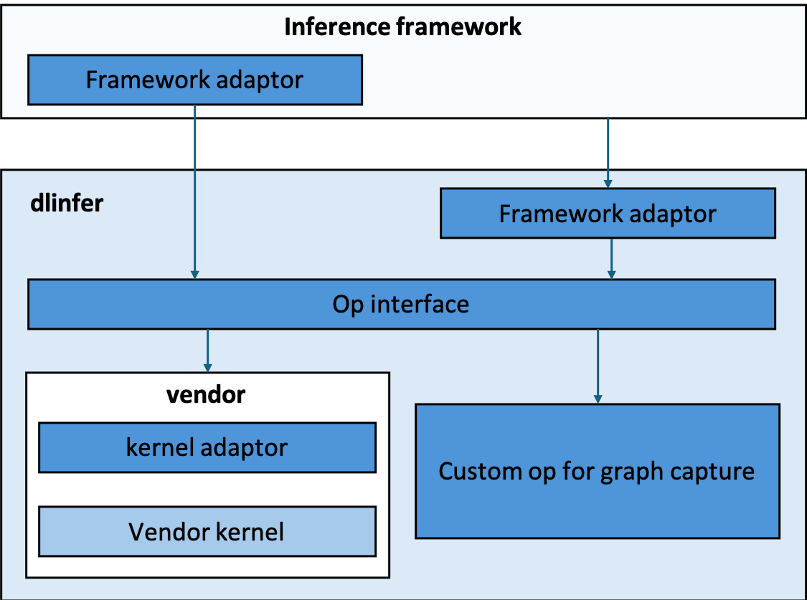

# DeepLink 2.0：

# 通用训练框架-ditorch

ditorch 是设备无关 torch， 旨在屏蔽各硬件厂商 torch 差异，为用户提供一致使用体验。通过 ditorch，开发者可以适配多个硬件算子库；此外，ditorch 提供训练过程中需要的基础工具，解决模型训练过程中出现的痛点问题。


<!-- .. image:: _static/image/ditorch/ditorch.png
   :class: doc-img -->

## **核心功能**
### **1. 可无感切换 pytorch 至国产芯片**

只需添加两行代码，即可在国产芯片上像官方 pytorch 一样使用。
```
import torch
import ditorch
```

### **2. 提供多个基础工具，解决训练过程的问题**

提供模型训练过程中需要的基础工具，解决模型训练过程中出现的痛点问题 [算子工具](op_tools/README.md)。

| 序号 |  工具  |  简介  |
| ---- |  ------  |  ------  |
| 1 | [算子参数抓取工具](#tool1) |  抓取模型真实训练过程中真实的输入输出  |
| 2 | [精度分析工具](#tool2) | 进行离线和实时的精度分析 |
| 3 | [速度分析工具](#tool3) | 可进行离线和实时的耗时分析，协助性能优化 |
| 4 | [算子 Fallback](#tool4) | 可将指定、全部算子在设备上运行的操作 fallback 到 CPU 计算 |


#### **算子参数抓取工具** <a id="tool1"></a>
抓取模型真实训练过程中真实的输入输出：
```
# usage1
import op_tools
capture = op_tools.OpCapture()
capture.start()
code_snippet_to_capture
capture.stop()
...
```

```
# usage2
import op_tools
with op_tools.OpCapture():
    code_snippet_to_capture()
```

#####  **抓取前向和反向的所有输入输出**

```
op_capture_result/0/2024-08-06--11-41/torch.Tensor.to/8/input.pth saved
op_capture_result/0/2024-08-06--11-41/torch.Tensor.to/8/output.pth saved
apply OpCaptureHook on torch.Tensor.mul
op_capture_result/0/2024-08-06--11-41/torch.Tensor.mul/9/input.pth saved
op_capture_result/0/2024-08-06--11-41/torch.Tensor.mul/9/output.pth saved
apply OpCaptureHook on torch.Tensor.add
op_capture_result/0/2024-08-06--11-41/torch.Tensor.add/10/input.pth saved
op_capture_result/0/2024-08-06--11-41/torch.Tensor.add/10/output.pth saved
apply OpCaptureHook on torch.Tensor.sub
op_capture_result/0/2024-08-06--11-41/torch.Tensor.sub/11/input.pth saved
op_capture_result/0/2024-08-06--11-41/torch.Tensor.sub/11/output.pth saved
apply OpCaptureHook on torch.Tensor.div
op_capture_result/0/2024-08-06--11-41/torch.Tensor.div/12/input.pth saved
op_capture_result/0/2024-08-06--11-41/torch.Tensor.div/12/output.pth saved
apply OpCaptureHook on torch.Tensor.sort
op_capture_result/0/2024-08-06--11-41/torch.Tensor.sort/13/input.pth saved
op_capture_result/0/2024-08-06--11-41/torch.Tensor.sort/13/output.pth saved
apply OpCaptureHook on torch.Tensor.sum
op_capture_result/0/2024-08-06--11-41/torch.Tensor.sum/14/input.pth saved
op_capture_result/0/2024-08-06--11-41/torch.Tensor.sum/14/output.pth saved
skip OpCaptureHook on torch.Tensor.backward
op_capture_result/0/2024-08-06--11-41/torch.Tensor.sum/14/grad_inputs.pth saved
op_capture_result/0/2024-08-06--11-41/torch.Tensor.sum/14/grad_outputs.pth saved
op_capture_result/0/2024-08-06--11-41/torch.Tensor.sort/13/grad_inputs.pth saved
op_capture_result/0/2024-08-06--11-41/torch.Tensor.sort/13/grad_outputs.pth saved
op_capture_result/0/2024-08-06--11-41/torch.Tensor.to/8/grad_inputs.pth saved
op_capture_result/0/2024-08-06--11-41/torch.Tensor.to/8/grad_outputs.pth saved
...
```

##### **只抓取sort算子的参数，忽略其他算子 OP_CAPTURE_LIST=torch.Tensor.sort**
```
...
skip OpCaptureHook on torch.Tensor.mul
skip OpCaptureHook on torch.Tensor.add
skip OpCaptureHook on torch.Tensor.sub
skip OpCaptureHook on torch.Tensor.div
apply OpCaptureHook on torch.Tensor.sort
op_capture_result/0/2024-08-06--11-41/torch.Tensor.sort/34/input.pth saved
op_capture_result/0/2024-08-06--11-41/torch.Tensor.sort/34/output.pth saved
op_capture_result/0/2024-08-06--11-41/torch.Tensor.sort/34/grad_inputs.pth saved
op_capture_result/0/2024-08-06--11-41/torch.Tensor.sort/34/grad_outputs.pth saved
...
```

#####  **排除指定算子，抓取所有其他算子 OP_CAPTURE_DISABLE_LIST="torch.Tensor.add,torch.Tensor.sub"**
```
apply OpCaptureHook on torch.Tensor.to
op_capture_result/0/2024-08-06--11-46/torch.Tensor.to/29/input.pth saved
op_capture_result/0/2024-08-06--11-46/torch.Tensor.to/29/output.pth saved
apply OpCaptureHook on torch.Tensor.mul
op_capture_result/0/2024-08-06--11-46/torch.Tensor.mul/30/input.pth saved
op_capture_result/0/2024-08-06--11-46/torch.Tensor.mul/30/output.pth saved
skip OpCaptureHook on torch.Tensor.add
skip OpCaptureHook on torch.Tensor.sub
apply OpCaptureHook on torch.Tensor.div
op_capture_result/0/2024-08-06--11-46/torch.Tensor.div/31/input.pth saved
op_capture_result/0/2024-08-06--11-46/torch.Tensor.div/31/output.pth saved
apply OpCaptureHook on torch.Tensor.sort
op_capture_result/0/2024-08-06--11-46/torch.Tensor.sort/32/input.pth saved
op_capture_result/0/2024-08-06--11-46/torch.Tensor.sort/32/output.pth saved
apply OpCaptureHook on torch.Tensor.sum
op_capture_result/0/2024-08-06--11-46/torch.Tensor.sum/33/input.pth saved
op_capture_result/0/2024-08-06--11-46/torch.Tensor.sum/33/output.pth saved
...
```
#### **精度分析工具** <a id="tool2"></a>
精度分析工具可以实现：
1. 离线分析：用模型训练过程中真实输入输出，离线对比。
2. 实时精度对比：模型训练时实时与cpu对比分析精度。

```
# usage1
import op_tools
with op_tools.OpAutoCompare():
    code_snippet_to_autocompare()
```

```
# usage2
import op_tools
autocompare = op_tools.OpAutoCompare()
autocompare.start()
code_snippet_to_autocompare()
autocompare.stop()
```

##### **基于InternEvo + ditorch + torch_npu 在华为910B上实时精度分析输出片段**


```
...
OpAutoCompareHook: torch.nn.functional.linear                         allclose: False    max_diff:          0.003906250
OpAutoCompareHook: torch.nn.functional.linear                         input: {'args': ({'shape': torch.Size([1, 16384, 2048]), 'stride': (33554432, 2048, 1), 'numel': 33554432, 'dtype': 'torch.bfloat16', 'device': 'npu:0', 'requires_grad': False, 'layout': 'torch.strided', 'data': 20075956404224}, {'shape': torch.Size([2048, 2048]), 'stride': (2048, 1), 'numel': 4194304, 'dtype': 'torch.bfloat16', 'device': 'npu:0', 'requires_grad': True, 'layout': 'torch.strided', 'data': 20078077673472}, 'None')}
OpAutoCompareHook: torch.nn.functional.linear                         output: ({'shape': torch.Size([1, 16384, 2048]), 'stride': (33554432, 2048, 1), 'numel': 33554432, 'dtype': 'torch.bfloat16', 'device': 'npu:0', 'requires_grad': False, 'layout': 'torch.strided', 'data': 20076023513600},)
op_capture_result/torch.nn.functional.linear/93/device/input.pth saved
op_capture_result/torch.nn.functional.linear/93/device/output.pth saved
op_capture_result/torch.nn.functional.linear/93/cpu/input.pth saved
op_capture_result/torch.nn.functional.linear/93/cpu/output.pth saved
OpAutoCompareHook: torch.Tensor.contiguous                            allclose: True    max_diff:          0.000000000
OpAutoCompareHook: torch.Tensor.is_complex                            allclose: True    max_diff:          0.000000000
OpAutoCompareHook: torch.nn.functional.dropout                        allclose: True    max_diff:          0.000000000
OpAutoCompareHook: torch.Tensor.add                                   allclose: True    max_diff:          0.000000000
OpAutoCompareHook: torch.Tensor.to                                    allclose: True    max_diff:          0.000000000
...
OpAutoCompareHook: torch.Tensor.max                                   allclose: True    max_diff:          0.000000000
OpAutoCompareHook: torch.Tensor.int                                   allclose: True    max_diff:          0.000000000
OpAutoCompareHook: torch.Tensor.add                                   allclose: True    max_diff:          0.000000000
...
OpAutoCompareHook: torch.functional.norm                              allclose: True    max_diff:          0.001953125
OpAutoCompareHook: torch.functional.norm                              allclose: True    max_diff:         71.062500000
OpAutoCompareHook: torch.functional.norm                              allclose: True    max_diff:        237.750000000
OpAutoCompareHook: torch.functional.norm                              allclose: True    max_diff:          0.000488281
OpAutoCompareHook: torch.functional.norm                              allclose: False    max_diff:       1473.750000000
OpAutoCompareHook: torch.functional.norm                              input: {'args': ({'shape': torch.Size([2048, 8192]), 'stride': (8192, 1), 'numel': 16777216, 'dtype': 'torch.float32', 'device': 'npu:0', 'requires_grad': False, 'layout': 'torch.strided', 'data': 20067372762112},), 'kwargs': {'p': '2', 'dim': 'None', 'keepdim': 'False', 'out': 'None', 'dtype': 'None'}}
OpAutoCompareHook: torch.functional.norm                              output: ({'shape': torch.Size([]), 'stride': (), 'numel': 1, 'dtype': 'torch.float32', 'device': 'npu:0', 'requires_grad': False, 'layout': 'torch.strided', 'data': 20067180820992},)
op_capture_result/torch.functional.norm/93/device/input.pth saved
op_capture_result/torch.functional.norm/93/device/output.pth saved
op_capture_result/torch.functional.norm/93/cpu/input.pth saved
op_capture_result/torch.functional.norm/93/cpu/output.pth saved
...
OpAutoCompareHook: torch.triu                                         allclose: True    max_diff:          0.000000000
OpAutoCompareHook: torch.Tensor.bool                                  allclose: True    max_diff:          0.000000000
OpAutoCompareHook: torch.Tensor.tolist                            0th allclose: True    max_diff:          0.000000000
OpAutoCompareHook: torch.Tensor.tolist                            1th allclose: True    max_diff:          0.000000000
OpAutoCompareHook: torch.Tensor.tolist                            2th allclose: True    max_diff:          0.000000000
OpAutoCompareHook: torch.Tensor.tolist                            3th allclose: True    max_diff:          0.000000000
OpAutoCompareHook: torch.Tensor.tolist                            0th allclose: True    max_diff:          0.000000000
OpAutoCompareHook: torch.Tensor.tolist                            1th allclose: True    max_diff:          0.000000000
OpAutoCompareHook: torch.Tensor.tolist                            2th allclose: True    max_diff:          0.000000000
OpAutoCompareHook: torch.Tensor.tolist                            3th allclose: True    max_diff:          0.000000000
skip OpAutoCompareHook on npu.npu_fusion_attention
...

```

##### **离线算子精度测试**
```
python op_tools/run_op_from_data.py /deeplink/op_capture_result/torch.Tensor.div/2334011/5  --acc_check --run_times 1
ditorch.framework: torch_npu:2.1.0.post3
OpAutoCompareHook: torch.Tensor.div                                   allclose: True    max_diff:          0.000000060
OpAutoCompareHook: torch.Tensor.div 0th input grad                    allclose: True    max_diff:          0.000000954
OpAutoCompareHook: torch.Tensor.div 1th input grad                    allclose: True    max_diff:          0.000000238
```

#### 速度分析工具 <a id="tool3"> </a>

速度分析工具同样可以支持（1）离线分析和（2）实时分析。

用模型训练过程中真实的输入输出分析算子和通信的耗时，分析出性能瓶颈
```
# 测量算子耗时（输入为使用算子抓取工具在模型训练时抓取到的真实数据）
python op_tools/run_op_from_data.py /deeplink/op_capture_result/torch.Tensor.div/2334011/5 --run_times 3 --sync_time_measure
ditorch.framework: torch_npu:2.1.0.post3
SyncExecuteTimer: torch.Tensor.div forward  elasped 69.61202621 ms
SyncExecuteTimer: torch.Tensor.div backward elasped 169.42977905 ms
SyncExecuteTimer: torch.Tensor.div forward  elasped 0.08678436 ms
SyncExecuteTimer: torch.Tensor.div backward elasped 2.97260284 ms
SyncExecuteTimer: torch.Tensor.div forward  elasped 0.04935265 ms
SyncExecuteTimer: torch.Tensor.div backward elasped 0.16641617 ms
```

##### **只跑指定算子3遍前向**
```
ditorch/op_tools# python run_op_from_data.py /op_capture_result/torch.Tensor.div/2278281/5  --run_times 3 --only_run_forward --sync_time_measure
ditorch.framework: torch_npu:2.1.0.post3
/deeplink_afs/zhaoguochun/ditorch/op_tools/op_capture_result/torch.Tensor.div/2278281/5
SyncExecuteTimer: torch.Tensor.div forward elasped 91.06540680 ms
SyncExecuteTimer: torch.Tensor.div forward elasped 0.24318695 ms
SyncExecuteTimer: torch.Tensor.div forward elasped 0.07224083 ms
```

##### **模型训练时算子耗时分析 (前向 + 反向)**
```
# usage1
import op_tools
with op_tools.OpTimeMeasure():
    code_snippet_to_time_measure()
```

```
# usage2
import op_tools
timemeasure = op_tools.OpTimeMeasure()
timemeasure.start()
code_snippet_to_time_measure()
timemeasure.end()
```

```
...
OpTimeMeasureHook: torch.Tensor.is_floating_point forward elasped:  0.00929832 ms     input: {'args': ({'shape': torch.Size([8192, 2048]), 'stride': (2048, 1), 'numel': 16777216, 'dtype': 'torch.bfloat16', 'device': 'npu:0', 'requires_grad': True, 'layout': 'torch.strided', 'data': 20067618127872},)} output: {'args': ('True',)}
OpTimeMeasureHook: torch.Tensor.to                forward elasped:  0.01168251 ms     input: {'args': ({'shape': torch.Size([8192, 2048]), 'stride': (2048, 1), 'numel': 16777216, 'dtype': 'torch.bfloat16', 'device': 'npu:0', 'requires_grad': True, 'layout': 'torch.strided', 'data': 20067618127872}, 'None', 'torch.bfloat16', 'False')} output: {'args': ({'shape': torch.Size([8192, 2048]), 'stride': (2048, 1), 'numel': 16777216, 'dtype': 'torch.bfloat16', 'device': 'npu:0', 'requires_grad': True, 'layout': 'torch.strided', 'data': 20067618127872},)}
...
OpTimeMeasureHook: torch.Tensor.is_complex        forward elasped:  0.00929832 ms     input: {'args': ({'shape': torch.Size([]), 'stride': (), 'numel': 1, 'dtype': 'torch.float32', 'device': 'npu:0', 'requires_grad': False, 'layout': 'torch.strided', 'data': 20067179829760},)} output: {'args': ('False',)}
OpTimeMeasureHook: torch.Tensor.item              forward elasped:  0.02098083 ms     input: {'args': ({'shape': torch.Size([]), 'stride': (), 'numel': 1, 'dtype': 'torch.float32', 'device': 'npu:0', 'requires_grad': False, 'layout': 'torch.strided', 'data': 20067179829760},)} output: {'args': ('0.16592097282409668',)}
skip OpTimeMeasureHook on None
OpTimeMeasureHook: torch.Tensor.to                forward elasped:  0.03743172 ms     input: {'args': ({'shape': torch.Size([]), 'stride': (), 'numel': 1, 'dtype': 'torch.float32', 'device': 'cpu', 'requires_grad': False, 'layout': 'torch.strided', 'data': 33419042112}, 'npu:0')} output: {'args': ({'shape': torch.Size([]), 'stride': (), 'numel': 1, 'dtype': 'torch.float32', 'device': 'npu:0', 'requires_grad': False, 'layout': 'torch.strided', 'data': 20067179829760},)}
OpTimeMeasureHook: torch.Tensor.is_complex        forward elasped:  0.00929832 ms     input: {'args': ({'shape': torch.Size([]), 'stride': (), 'numel': 1, 'dtype': 'torch.float32', 'device': 'npu:0', 'requires_grad': False, 'layout': 'torch.strided', 'data': 20067179829760},)} output: {'args': ('False',)}
OpTimeMeasureHook: torch.Tensor.item              forward elasped:  0.01811981 ms     input: {'args': ({'shape': torch.Size([]), 'stride': (), 'numel': 1, 'dtype': 'torch.float32', 'device': 'npu:0', 'requires_grad': False, 'layout': 'torch.strided', 'data': 20067179829760},)} output: {'args': ('4.982948303222656e-05',)}
OpTimeMeasureHook: torch.Tensor.to                forward elasped:  0.02336502 ms     input: {'args': ({'shape': torch.Size([]), 'stride': (), 'numel': 1, 'dtype': 'torch.float32', 'device': 'cpu', 'requires_grad': False, 'layout': 'torch.strided', 'data': 33419044160}, 'npu:0')} output: {'args': ({'shape': torch.Size([]), 'stride': (), 'numel': 1, 'dtype': 'torch.float32', 'device': 'npu:0', 'requires_grad': False, 'layout': 'torch.strided', 'data': 20067179829760},)}
OpTimeMeasureHook: torch.Tensor.is_complex        forward elasped:  0.00810623 ms     input: {'args': ({'shape': torch.Size([]), 'stride': (), 'numel': 1, 'dtype': 'torch.float32', 'device': 'npu:0', 'requires_grad': False, 'layout': 'torch.strided', 'data': 20067179829760},)} output: {'args': ('False',)}
OpTimeMeasureHook: torch.Tensor.item              forward elasped:  0.01740456 ms     input: {'args': ({'shape': torch.Size([]), 'stride': (), 'numel': 1, 'dtype': 'torch.float32', 'device': 'npu:0', 'requires_grad': False, 'layout': 'torch.strided', 'data': 20067179829760},)} output: {'args': ('0.004927396774291992',)}
2024-08-07 20:40:04,803 INFO record_metrics.py:373 in record_execution_times -- {'import_time': 0.07344746589660645, 'init_comm_time': 12.286690711975098, 'init_model_time': 0.8780200481414795, 'load_data_time': 36.91646957397461, 'init_optim_time': 0.16592097282409668, 'load_ckpt_time': 4.982948303222656e-05, 'init_trainer_time': 0.004927396774291992}
OpTimeMeasureHook: torch.Tensor.random_           forward elasped:  0.05078316 ms     input: {'args': ({'shape': torch.Size([]), 'stride': (), 'numel': 1, 'dtype': 'torch.int64', 'device': 'cpu', 'requires_grad': False, 'layout': 'torch.strided', 'data': 33419039680},), 'kwargs': {'generator': 'None'}} output: {'args': ({'shape': torch.Size([]), 'stride': (), 'numel': 1, 'dtype': 'torch.int64', 'device': 'cpu', 'requires_grad': False, 'layout': 'torch.strided', 'data': 33419039680},)}
...
OpTimeMeasureHook: torch.nn.init.normal_          forward elasped:  701.74193382 ms     input: {'args': (), 'kwargs': {'tensor': {'shape': torch.Size([92544, 2048]), 'stride': (2048, 1), 'numel': 189530112, 'dtype': 'torch.float32', 'device': 'cpu', 'requires_grad': True, 'layout': 'torch.strided', 'data': 140665192181824}, 'mean': '0.0', 'std': '0.02'}} output: {'args': ({'shape': torch.Size([92544, 2048]), 'stride': (2048, 1), 'numel': 189530112, 'dtype': 'torch.float32', 'device': 'cpu', 'requires_grad': True, 'layout': 'torch.strided', 'data': 140665192181824},)}
...

```

#### 算子 fallback <a id="tool4"> </a>
```
# usage 1
with op_tools.OpFallback():
    code_snippet_op_to_be_fallbacked()
```

```
# usage 2
fallback = op_tools.OpFallback()
fallback.start()
code_snippet_op_to_be_fallbacked()
fallback.end()
```

##### **只 fallback 指定算子 (export OP_FALLBACK_LIST="torch.nn.functional.linear")**
```
skip OpFallbackHook on torch.Tensor.float
skip OpFallbackHook on torch.Tensor.add
skip OpFallbackHook on torch.Tensor.div
skip OpFallbackHook on torch.Tensor.item
skip OpFallbackHook on torch.Tensor.float
skip OpFallbackHook on torch.Tensor.div
skip OpFallbackHook on torch.Tensor.fill_
skip OpFallbackHook on torch.Tensor.is_complex
skip OpFallbackHook on torch.Tensor.numel
skip OpFallbackHook on torch.Tensor.unbind
skip OpFallbackHook on torch.Tensor.sub
skip OpFallbackHook on torch.Tensor.max
...
OpFallbackHook: torch.nn.functional.linear                         input: {'args': ({'shape': torch.Size([1, 16384, 2048]), 'stride': (33554432, 2048, 1), 'numel': 33554432, 'dtype': 'torch.bfloat16', 'device': 'npu:0', 'requires_grad': False, 'layout': 'torch.strided', 'data': 20076203868160}, {'shape': torch.Size([4096, 2048]), 'stride': (2048, 1), 'numel': 8388608, 'dtype': 'torch.bfloat16', 'device': 'npu:0', 'requires_grad': True, 'layout': 'torch.strided', 'data': 20077985398784}, 'None')}
OpFallbackHook: torch.nn.functional.linear                         output: ({'shape': torch.Size([1, 16384, 4096]), 'stride': (67108864, 4096, 1), 'numel': 67108864, 'dtype': 'torch.bfloat16', 'device': 'npu:0', 'requires_grad': False, 'layout': 'torch.strided', 'data': 20075820089344},) cpu output: ({'shape': torch.Size([1, 16384, 4096]), 'stride': (67108864, 4096, 1), 'numel': 67108864, 'dtype': 'torch.bfloat16', 'device': 'cpu', 'requires_grad': False, 'layout': 'torch.strided', 'data': 139743270527040},) dtype_convert_back_dict:{}
skip OpFallbackHook on torch.Tensor.shape.__get__
...
```

##### **fallback 指定算子以外所有算子（export OP_FALLBACK_DISABLE_LIST="torch.nn.functional.linear"）**
```
...
skip OpFallbackHook on torch.nn.functional.linear
OpFallbackHook: torch.Tensor.float                                 input: {'args': ({'shape': torch.Size([1, 16384, 92544]), 'stride': (1516240896, 92544, 1), 'numel': 1516240896, 'dtype': 'torch.bfloat16', 'device': 'npu:0', 'requires_grad': True, 'layout': 'torch.strided', 'data': 20081119592448},)}
OpFallbackHook: torch.Tensor.float                                 output: ({'shape': torch.Size([1, 16384, 92544]), 'stride': (1516240896, 92544, 1), 'numel': 1516240896, 'dtype': 'torch.float32', 'device': 'npu:0', 'requires_grad': True, 'layout': 'torch.strided', 'data': 20100446945280},) cpu output: ({'shape': torch.Size([1, 16384, 92544]), 'stride': (1516240896, 92544, 1), 'numel': 1516240896, 'dtype': 'torch.float32', 'device': 'cpu', 'requires_grad': True, 'layout': 'torch.strided', 'data': 140152888873024},) dtype_convert_back_dict:{}
OpFallbackHook: torch.Tensor.contiguous                            input: {'args': ({'shape': torch.Size([1, 16384, 92544]), 'stride': (1516240896, 92544, 1), 'numel': 1516240896, 'dtype': 'torch.float32', 'device': 'npu:0', 'requires_grad': True, 'layout': 'torch.strided', 'data': 20100446945280},)}
OpFallbackHook: torch.Tensor.contiguous                            output: ({'shape': torch.Size([1, 16384, 92544]), 'stride': (1516240896, 92544, 1), 'numel': 1516240896, 'dtype': 'torch.float32', 'device': 'npu:0', 'requires_grad': True, 'layout': 'torch.strided', 'data': 20106889396224},) cpu output: ({'shape': torch.Size([1, 16384, 92544]), 'stride': (1516240896, 92544, 1), 'numel': 1516240896, 'dtype': 'torch.float32', 'device': 'cpu', 'requires_grad': True, 'layout': 'torch.strided', 'data': 140155921358912},) dtype_convert_back_dict:{}
OpFallbackHook: torch.Tensor.view                                  input: {'args': ({'shape': torch.Size([1, 16384, 92544]), 'stride': (1516240896, 92544, 1), 'numel': 1516240896, 'dtype': 'torch.float32', 'device': 'npu:0', 'requires_grad': True, 'layout': 'torch.strided', 'data': 20106889396224}, '-1', '92544')}
OpFallbackHook: torch.Tensor.view                                  output: ({'shape': torch.Size([16384, 92544]), 'stride': (92544, 1), 'numel': 1516240896, 'dtype': 'torch.float32', 'device': 'npu:0', 'requires_grad': True, 'layout': 'torch.strided', 'data': 20113331847168},) cpu output: ({'shape': torch.Size([16384, 92544]), 'stride': (92544, 1), 'numel': 1516240896, 'dtype': 'torch.float32', 'device': 'cpu', 'requires_grad': True, 'layout': 'torch.strided', 'data': 140155921358912},) dtype_convert_back_dict:{}
OpFallbackHook: torch.Tensor.contiguous                            input: {'args': ({'shape': torch.Size([1, 16384]), 'stride': (16384, 1), 'numel': 16384, 'dtype': 'torch.int64', 'device': 'npu:0', 'requires_grad': False, 'layout': 'torch.strided', 'data': 20067180535808},)}
OpFallbackHook: torch.Tensor.contiguous                            output: ({'shape': torch.Size([1, 16384]), 'stride': (16384, 1), 'numel': 16384, 'dtype': 'torch.int64', 'device': 'npu:0', 'requires_grad': False, 'layout': 'torch.strided', 'data': 20067179877888},) cpu output: ({'shape': torch.Size([1, 16384]), 'stride': (16384, 1), 'numel': 16384, 'dtype': 'torch.int64', 'device': 'cpu', 'requires_grad': False, 'layout': 'torch.strided', 'data': 33663304832},) dtype_convert_back_dict:{}
OpFallbackHook: torch.Tensor.view                                  input: {'args': ({'shape': torch.Size([1, 16384]), 'stride': (16384, 1), 'numel': 16384, 'dtype': 'torch.int64', 'device': 'npu:0', 'requires_grad': False, 'layout': 'torch.strided', 'data': 20067179877888}, '-1')}
...

```

##### **fallback 所有算子时部分输出**
```
...
OpFallbackHook: torch.nn.functional.linear                         input: {'args': ({'shape': torch.Size([1, 16384, 2048]), 'stride': (33554432, 2048, 1), 'numel': 33554432, 'dtype': 'torch.bfloat16', 'device': 'npu:0', 'requires_grad': False, 'layout': 'torch.strided', 'data': 20074851205120}, {'shape': torch.Size([2048, 2048]), 'stride': (2048, 1), 'numel': 4194304, 'dtype': 'torch.bfloat16', 'device': 'npu:0', 'requires_grad': False, 'layout': 'torch.strided', 'data': 20067599254528}, 'None')}
OpFallbackHook: torch.nn.functional.linear                         output: ({'shape': torch.Size([1, 16384, 2048]), 'stride': (33554432, 2048, 1), 'numel': 33554432, 'dtype': 'torch.bfloat16', 'device': 'npu:0', 'requires_grad': False, 'layout': 'torch.strided', 'data': 20074920411136},) cpu output: ({'shape': torch.Size([1, 16384, 2048]), 'stride': (33554432, 2048, 1), 'numel': 33554432, 'dtype': 'torch.bfloat16', 'device': 'cpu', 'requires_grad': False, 'layout': 'torch.strided', 'data': 139739386380352},) dtype_convert_back_dict:{}
OpFallbackHook: torch.Tensor.contiguous                            input: {'args': ({'shape': torch.Size([1, 16384, 2048]), 'stride': (33554432, 2048, 1), 'numel': 33554432, 'dtype': 'torch.bfloat16', 'device': 'npu:0', 'requires_grad': False, 'layout': 'torch.strided', 'data': 20074920411136},)}
OpFallbackHook: torch.Tensor.contiguous                            output: ({'shape': torch.Size([1, 16384, 2048]), 'stride': (33554432, 2048, 1), 'numel': 33554432, 'dtype': 'torch.bfloat16', 'device': 'npu:0', 'requires_grad': False, 'layout': 'torch.strided', 'data': 20074851205120},) cpu output: ({'shape': torch.Size([1, 16384, 2048]), 'stride': (33554432, 2048, 1), 'numel': 33554432, 'dtype': 'torch.bfloat16', 'device': 'cpu', 'requires_grad': False, 'layout': 'torch.strided', 'data': 139739506286656},) dtype_convert_back_dict:{}
OpFallbackHook: torch.Tensor.is_complex                            input: {'args': ({'shape': torch.Size([1, 16384, 2048]), 'stride': (33554432, 2048, 1), 'numel': 33554432, 'dtype': 'torch.bfloat16', 'device': 'npu:0', 'requires_grad': False, 'layout': 'torch.strided', 'data': 20074851205120},)}
OpFallbackHook: torch.Tensor.is_complex                            output: ('False',) cpu output: ('False',) dtype_convert_back_dict:{}
OpFallbackHook: torch.nn.functional.dropout                        input: {'args': ({'shape': torch.Size([1, 16384, 2048]), 'stride': (33554432, 2048, 1), 'numel': 33554432, 'dtype': 'torch.bfloat16', 'device': 'npu:0', 'requires_grad': False, 'layout': 'torch.strided', 'data': 20074851205120},), 'kwargs': {'p': '0', 'training': 'True', 'inplace': 'False'}}
OpFallbackHook: torch.nn.functional.dropout                        output: ({'shape': torch.Size([1, 16384, 2048]), 'stride': (33554432, 2048, 1), 'numel': 33554432, 'dtype': 'torch.bfloat16', 'device': 'npu:0', 'requires_grad': False, 'layout': 'torch.strided', 'data': 20067756539904},) cpu output: ({'shape': torch.Size([1, 16384, 2048]), 'stride': (33554432, 2048, 1), 'numel': 33554432, 'dtype': 'torch.bfloat16', 'device': 'cpu', 'requires_grad': False, 'layout': 'torch.strided', 'data': 139739506286656},) dtype_convert_back_dict:{}
OpFallbackHook: torch.Tensor.add                                   input: {'args': ({'shape': torch.Size([1, 16384, 2048]), 'stride': (33554432, 2048, 1), 'numel': 33554432, 'dtype': 'torch.bfloat16', 'device': 'npu:0', 'requires_grad': False, 'layout': 'torch.strided', 'data': 20067756539904}, {'shape': torch.Size([1, 16384, 2048]), 'stride': (33554432, 2048, 1), 'numel': 33554432, 'dtype': 'torch.bfloat16', 'device': 'npu:0', 'requires_grad': False, 'layout': 'torch.strided', 'data': 20076199673856})}
OpFallbackHook: torch.Tensor.add                                   output: ({'shape': torch.Size([1, 16384, 2048]), 'stride': (33554432, 2048, 1), 'numel': 33554432, 'dtype': 'torch.bfloat16', 'device': 'npu:0', 'requires_grad': False, 'layout': 'torch.strided', 'data': 20074712793088},) cpu output: ({'shape': torch.Size([1, 16384, 2048]), 'stride': (33554432, 2048, 1), 'numel': 33554432, 'dtype': 'torch.bfloat16', 'device': 'cpu', 'requires_grad': False, 'layout': 'torch.strided', 'data': 139739319267392},) dtype_convert_back_dict:{}
OpFallbackHook: torch.Tensor.to                                    input: {'args': ({'shape': torch.Size([1, 16384, 2048]), 'stride': (33554432, 2048, 1), 'numel': 33554432, 'dtype': 'torch.bfloat16', 'device': 'npu:0', 'requires_grad': False, 'layout': 'torch.strided', 'data': 20074712793088}, 'torch.float32')}
OpFallbackHook: torch.Tensor.to                                    output: ({'shape': torch.Size([1, 16384, 2048]), 'stride': (33554432, 2048, 1), 'numel': 33554432, 'dtype': 'torch.float32', 'device': 'npu:0', 'requires_grad': False, 'layout': 'torch.strided', 'data': 20076338085888},) cpu output: ({'shape': torch.Size([1, 16384, 2048]), 'stride': (33554432, 2048, 1), 'numel': 33554432, 'dtype': 'torch.float32', 'device': 'cpu', 'requires_grad': False, 'layout': 'torch.strided', 'data': 139739319271488},) dtype_convert_back_dict:{}
OpFallbackHook: torch.Tensor.to                                    input: {'args': ({'shape': torch.Size([1, 16384, 2048]), 'stride': (33554432, 2048, 1), 'numel': 33554432, 'dtype': 'torch.float32', 'device': 'npu:0', 'requires_grad': False, 'layout': 'torch.strided', 'data': 20076338085888}, 'torch.float32')}
OpFallbackHook: torch.Tensor.to                                    output: ({'shape': torch.Size([1, 16384, 2048]), 'stride': (33554432, 2048, 1), 'numel': 33554432, 'dtype': 'torch.float32', 'device': 'npu:0', 'requires_grad': False, 'layout': 'torch.strided', 'data': 20076474400768},) cpu output: ({'shape': torch.Size([1, 16384, 2048]), 'stride': (33554432, 2048, 1), 'numel': 33554432, 'dtype': 'torch.float32', 'device': 'cpu', 'requires_grad': False, 'layout': 'torch.strided', 'data': 139739319271488},) dtype_convert_back_dict:{}
OpFallbackHook: torch.Tensor.pow                                   input: {'args': ({'shape': torch.Size([1, 16384, 2048]), 'stride': (33554432, 2048, 1), 'numel': 33554432, 'dtype': 'torch.float32', 'device': 'npu:0', 'requires_grad': False, 'layout': 'torch.strided', 'data': 20076474400768}, '2')}
OpFallbackHook: torch.Tensor.pow                                   output: ({'shape': torch.Size([1, 16384, 2048]), 'stride': (33554432, 2048, 1), 'numel': 33554432, 'dtype': 'torch.float32', 'device': 'npu:0', 'requires_grad': False, 'layout': 'torch.strided', 'data': 20076610715648},) cpu output: ({'shape': torch.Size([1, 16384, 2048]), 'stride': (33554432, 2048, 1), 'numel': 33554432, 'dtype': 'torch.float32', 'device': 'cpu', 'requires_grad': False, 'layout': 'torch.strided', 'data': 139730855391296},) dtype_convert_back_dict:{}
OpFallbackHook: torch.Tensor.mean                                  input: {'args': ({'shape': torch.Size([1, 16384, 2048]), 'stride': (33554432, 2048, 1), 'numel': 33554432, 'dtype': 'torch.float32', 'device': 'npu:0', 'requires_grad': False, 'layout': 'torch.strided', 'data': 20076610715648}, ('-1',)), 'kwargs': {'keepdim': 'True'}}
OpFallbackHook: torch.Tensor.mean                                  output: ({'shape': torch.Size([1, 16384, 1]), 'stride': (16384, 1, 1), 'numel': 16384, 'dtype': 'torch.float32', 'device': 'npu:0', 'requires_grad': False, 'layout': 'torch.strided', 'data': 20067180141056},) cpu output: ({'shape': torch.Size([1, 16384, 1]), 'stride': (16384, 1, 1), 'numel': 16384, 'dtype': 'torch.float32', 'device': 'cpu', 'requires_grad': False, 'layout': 'torch.strided', 'data': 33561021952},) dtype_convert_back_dict:{}
...
```


# 通用推理框架-dlinfer

dlinfer提供了一套将国产硬件接入大模型推理框架的解决方案。
对上承接大模型推理框架，对下在eager模式下调用各厂商的融合算子，在graph模式下调用厂商的图引擎。
在dlinfer中，我们根据主流大模型推理框架与主流硬件厂商的融合算子粒度，定义了大模型推理的融合算子接口。

这套融合算子接口主要功能：

1. 将对接框架与对接厂商融合算子在适配工程中有效解耦；
2. 同时支持算子模式和图模式；
3. 图模式下的图获取更加精确匹配，提高最终端到端性能；
4. 同时支持LLM推理和VLM推理。

目前，我们正在全力支持LMDeploy适配国产芯片，包括华为，沐曦，寒武纪等。

## 架构介绍

<!-- markdownlint-disable -->
<div align=center>

</div>
<!-- markdownlint-restore -->
<!--  -->
<!-- .. image:: ../../_static/image/dlinfer/dlinfer_arch.png
   :class: doc-img -->


### 组件介绍

- **op interface**：
大模型推理算子接口，对齐了主流推理框架以及各个厂商的融合算子粒度。
  - 算子模式：在pytorch的eager模式下，我们将通过op interface向下分发到厂商kernel。由于各个厂商对于参数的数据排布有不同的偏好，所以在这里我们并不会规定数据排布，但是为了多硬件的统一适配，我们将会统一参数的维度信息。
  - 图模式：在极致性能的驱动下，在一些硬件上的推理场景中需要依靠图模式。我们利用Pytorch2中的Dynamo编译路线，通过统一的大模型推理算子接口，获取较为粗粒度算子的计算图，并将计算图通过IR转换后提供给硬件厂商的图编译器。
- **framework adaptor**：
将大模型推理算子接口加入推理框架中，并且对齐算子接口的参数。
- **kernel adaptor**：
吸收了大模型推理算子接口参数和硬件厂商融合算子参数间的差异。

## 安装方法

### pip安装

```shell
pip install dlinfer==0.3.1+ascend
```

### 源码安装

#### 华为Atlas 800T A2

1. 在Atlas 800T A2上依赖torch和torch_npu，运行以下命令安装torch、torch_npu及其依赖。

   ```shell
   pip3 install requirements.txt --index-url https://download.pytorch.org/whl/cpu
   ```

2. 完成上述准备工作后，使用如下命令即可安装dlinfer。

   ```shell
   cd /path_to_dlinfer
   DEVICE=ascend python3 setup.py develop
   ```

## 支持模型框架列表

### LMDeploy

|  | 华为Atlas 800T A2 | 沐曦C500（待开源） | 寒武纪云端智能加速卡（开发中） |
| --- | --- | --- | --- |
| InternLM2.5-7B/20B | √ |   |  |
| InternLM2-7B/20B | √ | √ |  |
| InternVL2-2B | √ |    |  |
| InternVL1-5 | √ | √ |  |
| Llama3-8B | √ | √ |  |
| Mixtral8x7B | √ | √ |  |
| Qwen2-7B | √ | √ |  |
| Qwen2-57B-A14B | √ |   |  |
| CogVLM | √ |  |  |
| CogVLM2 |  | √ |  |

#### 使用LMDeploy

只需要指定pytorch engine后端为ascend，不需要其他任何修改即可。详细可参考lmdeploy文档。

示例代码如下：

```python
import lmdeploy
from lmdeploy import PytorchEngineConfig
if __name__ == "__main__":
    pipe = lmdeploy.pipeline("/path_to_model",
                            backend_config = PytorchEngineConfig(tp=1,
                            cache_max_entry_count=0.4, device_type="ascend"))
    question = ["Shanghai is", "Please introduce China", "How are you?"]
    response = pipe(question, request_output_len=256, do_preprocess=False)
    for idx, r in enumerate(response):
        print(f"Q: {question[idx]}")
        print(f"A: {r.text}")
        print()
```
