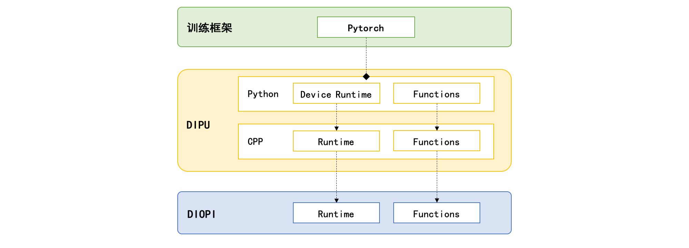

# DeepLink实现华为昇腾Atlas 800T A2上的千卡大规模训练

DeepLink作为芯片与深度学习框架适配桥梁，前端通过deeplink.framework的dipu组件，对接了原生的pytorch深度学习训练框架，底层通过标准化的DIOPI算子接口，适配了华为基于CANN计算框架的Atlas 800T A2训练服务器。针对大模型训练、微调及推理的场景，DeepLink通过DeepLinkExt定义了相关的大模型算子标准化接口，对上适配ModelLink、InternLM、InternEvo等大模型训练框架，对下适配标准化DIOPI定义的大模型算子，赋予Ascend Atlas 800T A2计算平台上高效训练大模型的能力。

当前，DeepLink针对Ascend Atlas 800T A2计算平台，已经完成对ModelLink、InternLM、InternEvo等大模型训练框架的适配，并利用这些框架，对上海人工智能实验室开源的书生大模型，商汤科技研发的日日新大模型，Meta公司开源的llama2大模型等进行了千卡的大规模训练。


<p align=center>图1：1024卡上基于DeepLink的torch_dipu和华为torch_npu的对比</p>

以ModelLink+llama2千卡训练为例，当前阶段基于DeepLink + pytorch的大模型训练，相对torch_npu + pytorch，在资源利用率上，前者在host端对cpu的使用需求降低大约5%，在npu设备端，两者对加速芯片的显存使用率和芯片使用率相当。在llama2的训练上，对token的消耗DeepLink + pytorch达到约350 tgs，相对torch_npu + pytorch的345 tgs而言，DeepLink + pytorch方案已经显现出较小的性能优势。

## 适配过程
### 一、环境准备

#### (1) docker镜像

1.  拉取docker镜像
``` bash
#dipu_latest 指向最新镜像
docker pull registry.sensetime.com/parrots/dipu_ascend:dipu_latest
若要指定版本的镜像
docker pull registry.sensetime.com/parrots/dipu_ascend:dipu0.3.0-a0
#版本号：dipu_latest （根据dipu的tag命名，例如：v0.3.0-a0 对应 dipu0.3.0-a0 ）
```

2. 启动docker镜像

``` bash
docker run -itd \
    -e ASCEND_VISIBLE_DEVICES=6 \
    -p 22133:22 \
    -v /mnt:/mnt \
    --name ${容器名}\
    registry.sensetime.com/parrots/dipu_ascend:dipu_latest bash
 # ASCEND_VISIBLE_DEVICES npu卡号。选择空闲卡挂载
 # -p 端口映射  
``` 

3. 激活DeepLink所需的环境

```bash
source /root/dipu_latest
#或 source /root/dipu0.3.0-a0
```

#### (2)物理机 

配置Python及gcc工具：
```bash
# 准备 python，如 3.9 版本
conda create --prefix=dipu python=3.9
conda activate dipu

# 安装gcc-7.5， 需要root权限
sudo apt-get install gcc-7.5
```

安装cpu版的pytorch:
```bash
pip install torch==2.1.0 --index-url https://download.pytorch.org/whl/cpu
```

### 二、仓库准备

DeepLink适配pytorch和Atlas 800T A2芯片进行深度学习模型训练，主要包括deeplink.framework、DIOPI、DeepLinkExt三个组件，其中DIOPI可以独立进行面向底层软件栈的Ascend Atlas 800T A2的适配。

#### (1)DIOPI适配环境

首先拉取DIOPI仓库：

```bash
git clone https://github.com/DeepLink-org/DIOPI.git
```

然后编译目标硬件芯片 Ascend Atlas 800T A2 的 DIOPI 算子适配库：
```bash
cd DIOPI/impl
sh scripts/build_impl.sh ascend
```
上述命令默认会把DIOPI编译为Release版本的libdiopi_impl.so库，如需要编译Debug版本的libdiopi_impl.so，可以参考以下命令：

```bash
cd DIOPI/impl
mkdir build
cd build 
cmake .. -DIMPL_OPT=ascend -DCMAKE_BUILD_TYPE=Debug -DTEST=ON 
make -j
```

#### (2)deeplink.framework仓库准备

首先拉取deeplink.framework仓库及其第三方依赖库，主要是[DIOPI](https://github.com/DeepLink-org/DIOPI.git)和[kineto](https://github.com/pytorch/kineto.git)：

```bash
git clone --recurse-submodules https://github.com/DeepLink-org/deeplink.framework.git
```
或者：
```bash
git clone https://github.com/DeepLink-org/deeplink.framework.git
cd deeplink.framework
git submodule update --init --recursive
```
然后编译目标硬件芯片Ascend Atlas 800T A2的deeplink.framework库：
```bash
cd deeplink.framework/dipu
bash scripts/ci/ascend/ci_ascend_script.sh build_dipu
```

#### (3)DeepLinkExt仓库准备 

DeepLinkExt组件依赖deeplink.framework和DIOPI组件，需要先根据3.2.2准备好deeplink.framework的编译，才能编译DeepLinkExt组件。

首先拉取DeepLinkExt仓库：
```bash
git clone https://github.com/DeepLink-org/DeepLinkExt
```
然后设置deeplink.framework和DIOPI的环境变量：
```bash
export PYTHONPATH=$WORKDIR/deeplink.framework/dipu/:$PYTHONPATH
export DIPU_ROOT=$WORKDIR/deeplink.framework/dipu/torch_dipu
export DIOPI_PATH=$WORKDIR/deeplink.framework/dipu/third_party/DIOPI/proto
export VENDOR_INCLUDE_DIRS=/usr/local/Ascend/ascend-toolkit/latest/include
```

最后编译DeepLinkExt：

```bash
cd DeepLinkExt
python3 setup.py build_ext --inplace
```

### 三、 Atlas 800T A2适配过程

#### (1)算子适配 

DIOPI在模型训练框架和芯片计算库之间定义了统一的[标准算子接口](https://github.com/DeepLink-org/DIOPI/tree/main/proto/include/diopi)，适配Ascend Atlas 800T A2时，Ascend 910的CANN软件栈已经提供了基于AscendCL的底层算子kernel实现。DIOPI适配的工作就是要分析DIOPI算子的定义，及AscendCL kernel的定义及功能，用AscendCL kernel实现DIOPI算子，DIOPI算子实现在impl目录下。

以适配DIOPI的diopiBatchNorm算子为例，首先分析proto中定义的[diopiBatchNorm](https://github.com/DeepLink-org/DIOPI/blob/9c4961ca97c53fd0c4834abe61f05710a8b46985/proto/include/diopi/functions.h#L74)算子，如下：
```c++
/**
 * @brief Applies Batch Normalization for each channel across a batch of data.
 * @param[in] ctx Context environment.
 * @param[in] input input tensor. type = [float32, float16, float64].
 * @param[in] weight weight tensor. type = [float32, float16, float64].
 * @param[in] bias bias tensor. type = [float32, float16, float64].
 * @param[in] running_mean weighted average tensor. type = [float32, float16, float64].
 * @param[in] running_var weighted variance tensor. type = [float32, float16, float64].
 * @param[in] training check if in training mode.
 * @param[in] momentum Used to calculate the running mean and variance during runtime. type = [float32, float64]
 * @param[in] eps The value added to the denominator during batch normalization to ensure numerical stability. type = [float32, float64]
 * @param[out] out normalized result. type = [float32, float16, float64].
 * @param[out] save_mean Mean tensor,the mean value for each feature channel of the input tensor. type = [float32, float16, float64].
 * @param[out] save_invstd Backup of inverse standard deviation computed during training. type = [float32, float16, float64].
 */
DIOPI_API diopiError_t diopiBatchNorm(diopiContextHandle_t ctx, diopiTensorHandle_t out, diopiTensorHandle_t save_mean, diopiTensorHandle_t save_invstd,
                                      diopiConstTensorHandle_t input, diopiConstTensorHandle_t weight, diopiConstTensorHandle_t bias,
                                      diopiTensorHandle_t running_mean, diopiTensorHandle_t running_var, bool training, double momentum, double eps);
```

然后根据Ascend Atlas 800T A2 文档分析CANN软件栈中是否有对应的 `batch_norm` 的 kernel 实现，如果CANN软件栈提供了对应的 `batch_norm` 的kernel实现，则直接调用该 kernel 实现；否则，根据CANN软件栈的基本算子能力，在 DIOPI 中组合实现 `diopiBatchNorm` 算子。通过文档可知，CANN软件栈提供了 `aclnnBatchNorm` 算子kernel，其原型如下：

```c++
aclnnStatus aclnnBatchNormGetWorkspaceSize(const aclTensor *input, 
                                           const aclTensor *weight, 
                                           const aclTensor *bias, 
                                           aclTensor *runningMean, 
                                           aclTensor *runningVar, 
                                           bool training, 
                                           double momentum, 
                                           double eps, 
                                           aclTensor *output, 
                                           aclTensor *saveMean, 
                                           aclTensor *saveInvstd, 
                                           uint64_t *workspaceSize, 
                                           aclOpExecutor **executor)`
aclnnStatus aclnnBatchNorm(void *workspace, 
                           uint64_t workspaceSize, 
                           aclOpExecutor *executor, 
                           const aclrtStream stream)
```
在对齐算子的功能及对应的参数含义后，在DIOPI的impl下实现对应的[diopiBatchNorm算子](https://github.com/DeepLink-org/DIOPI/blob/9c4961ca97c53fd0c4834abe61f05710a8b46985/impl/ascend_npu/diopi_impl/batch_norm.cpp#L14)：
```c++
diopiError_t diopiBatchNorm(diopiContextHandle_t ctx, 
                            diopiTensorHandle_t out, 
                            diopiTensorHandle_t saveMean, 
                            diopiTensorHandle_t saveInvstd,
                            diopiConstTensorHandle_t input, 
                            diopiConstTensorHandle_t weight, 
                            diopiConstTensorHandle_t bias, 
                            diopiTensorHandle_t runningMean,
                            diopiTensorHandle_t runningVar, 
                            bool training, double momentum, double eps) {
    BEGIN_CALL_ACL_OP(out, saveMean, saveInvstd, input, 
                      weight, bias, runningMean, runningVar);
    EXEC_NPU_CMD(aclnnBatchNorm, inputAt, weightAt, biasAt, 
                 runningMeanAt, runningVarAt, training, momentum, 
                 eps, outAt, saveMeanAt, saveInvstdAt);
    END_CALL_ACL_OP();
}
```

算子的适配实现后，还需要设计算子测例，以保证算子功能的正确性，参考[DIOPI算子校验](#(1)DIOPI的算子校验)章节。

#### (2)pytorch适配
DeepLink通过DIOPI标准算子接口接入Ascend Atlas 800T A2后，还需通过dipu对接pytorch的Eager模式，让基于pytorch的模型脚本得以在Ascend Atlas 800T A2平台上进行训练。另外对Graph模式的支持由dicp完成，该部分还在研发中。

dipu结构上分Python和CPP实现两部分，如图。


dipu的runtime主要分两部分，Core & Distributed和Device。

第一部分Core & Distributed是从pytorch中c10和c10d相关接口中的设备无关部分抽象出来的运行时基类，当前包括`DIPUAllocator`、`DIPUGenerator`、`DIPUStream/Event/Guard`、`ProcessGroupDICL`等。这些类会把设备相关的请求代理到第二部分Device定义的设备相关接口上。

针对Ascend Atlas 800T A2的适配，dipu提供了不同的显存缓存机制，包括BF和BS等缓存策略，大幅提升了显存的利用效率。

第二部分Device是定义的设备相关的接口，不同厂商的芯片对应一组实现。针对Ascend Atlas 800T A2的实现，可以参考[dipu/torch_dipu/csrc_dipu/vendor/ascend/deviceimpl.cpp](https://github.com/DeepLink-org/deeplink.framework/blob/main/dipu/torch_dipu/csrc_dipu/vendor/ascend/deviceimpl.cpp)，其中包含了对设备的管理和显存管理，数据搬运等接口函数的实现。

#### (3)DeepLinkExt
DeepLinkExt对下直接调用DIOPI的算子实现，对上承接了大模型训练、推理框架的算子，并提供了基于pytorch的算子组合实现。

以flash attention算子为例，在ModelLink框架下适配Ascend Atlas 800T A2的主要过程如下。

ModelLink中的[flash attention](https://github.com/Ascend/AscendSpeed/blob/bak/ascendspeed/ops/FlashAttention.py)算子定义为：
``` python
class _FlashAttention(Function):
    @staticmethod
    def forward(ctx, query, key, value, head_num, input_layout, pse, padding_mask, 
                atten_mask, scale, keep_prob, pre_tockens, next_tockens,
                gen_mask_parallel, sync):
        # impl

    @staticmethod
    def backward(ctx, grad_outputs):
        # impl
```
``` python
class FlashAttention(Module):
    def __init__(self):
        super(FlashAttention, self).__init__()
        self.atten = _FlashAttention.apply

    def forward(self, query, key, value, head_num, input_layout, pse=None, 
                padding_mask=None, atten_mask=None, scale=1., keep_prob=1., 
                pre_tockens=2147483647, next_tockens=2147483647, # max of int32
                gen_mask_parallel=True, sync=False):
        # impl
```

分析以上代码可知，[flash attention](https://github.com/Ascend/AscendSpeed/blob/bak/ascendspeed/ops/FlashAttention.py)的实现使用了pytorch的前向和反向计算机制，在DeepLinkExt的接口中，直接对接FlashAttention类，实现其forward和backward成员函数，其[定义及实现](https://github.com/DeepLink-org/DeepLinkExt/blob/main/deeplink_ext/ascend_speed/flash_attention.py)参考如下：

```python
class FlashSelfAttention(torch.autograd.Function):
    @staticmethod
    def forward(ctx, q, k, v, attention_mask, dropout_p, 
                softmax_scale, head_num, input_layout):
        ......
        return out

    @staticmethod
    def backward(ctx, dout):
        return dq, dk, dv, None, None, None, None, None
```

以上在DeepLinkExt中定义好对接ModelLink框架的接口后，在其实现中调用了通过pybind11导出到py空间的DIOPI中定义的flash attention算子。其[定义及绑定](https://github.com/DeepLink-org/DeepLinkExt/blob/33bbb614efafb8f292f73ec9b3b847a653f4c1a7/csrc/extensions.cpp#L195)如下：

```python
auto extFlashAttentionV2(at::Tensor& out, const at::Tensor& q,
                         const at::Tensor& k, const at::Tensor& v,
                         at::Generator& gen, const at::Tensor& attention_mask,
                         double p_dropout, double softmax_scale,
                         int64_t head_num, const std::string& input_layout) {
    ......    
    [[maybe_unused]] auto context = callDiopiKeepContext(
      diopiFlashAttentionV2, out, &dropout_mask, &softmax_max, &softmax_sum,
      &softmax_out, gen, q, k, v, attention_mask, p_dropout, softmax_scale,
      head_num, input_layout.c_str());

    ......
}

auto extFlashAttentionBackward(at::Tensor& grad_q, at::Tensor& grad_k,
                               at::Tensor& grad_v, const at::Tensor& grad_out,
                               const at::Tensor& q, const at::Tensor& k,
                               const at::Tensor& v, const at::Tensor& out,
                               const c10::optional<at::Tensor>& attention_mask,
                               const c10::optional<at::Tensor>& dropout_mask,
                               const at::Tensor& softmax_max,
                               const at::Tensor& softmax_sum,
                               const at::Tensor& softmax_out, double p_dropout,
                               double softmax_scale, int64_t head_num,
                               const std::string& input_layout) {
  callDiopi(diopiFlashAttentionBackward, grad_q, grad_k, grad_v, grad_out, q, k,
            v, out, attention_mask, dropout_mask, softmax_max, softmax_sum,
            softmax_out, p_dropout, softmax_scale, head_num,
            input_layout.c_str());
    ......
}


PYBIND11_MODULE(TORCH_EXTENSION_NAME, m) {
    ......
    if (&diopiFlashAttentionV2 != nullptr) {
        m.def("fa_fwd_v2", &extFlashAttentionV2, "deeplink ext_fa_fwd_v2");
    }
    if (&diopiFlashAttentionBackward != nullptr) {
        m.def("fa_bwd", &extFlashAttentionBackward, "deeplink ext_fa_bwd");
    }
    ......
}
```

上面flash attention的前向计算（extFlashAttentionV2）和反向计算（extFlashAttentionBackward）中调用的diopiFlashAttentionV2和diopiFlashAttentionBackward就是DIOPI中针对flash attention定义的标准算子接口，这两个接口用于适配底层Ascend Atlas 800T A2的算子实现。DIOPI中flash attention算子对Ascend Atlas 800T A2的适配过程可以参考[算子适配](#(1)算子适配)章节。

### 四、性能问题解决过程 
#### (1)profiler工具分析热点算子
DeepLink适配好Ascend Atlas 800T A2后，在模型训练过程中，发现性能未达到预期。我们可以借助profiler工具找出热点算子及耗时显著的算子，着重进行算子的性能优化。

以`aten::linalg_vector_norm`算子为例，初期deeplink.framework是通过diopiNorm算子适配的，版本升级后，发现Ascend Atlas 800T A2 已经对`aclnnLinalgVectorNorm`进行了独立的支持。DeepLink对该算子进行了快速支持，并通过profiler工具抓取了`aten::linalg_vector_norm`算子的两个版本的性能，实现了算子性能的提升。


利用profiler工具分析模型训练过程中算子的性能时，还发现了在算子调用链中频繁出现的setDevice问题。理论上讲，线程启动后，会执行一次setDevice，在后续执行算子计算时，是不应该频繁调用这一接口的，否则会对计算性能造成较大影响。发现这一问题后，我们对setDevice的逻辑进行了重构，使得一个训练step的性能得到了大幅提升。


#### (2)优化allocator平滑训练抖动问题
dipu内部使用的allocator是deeplink针对pytorch现有方案的不足，对内存占用、长时间训练时缓存内部的碎片数量和设备上物理内存的碎片数量、tensor申请和释放的耗时等各方面做了深度优化，性能优于pytorch现有方案。但是前期优化时，是基于小模型来验证。但是大模型训练时会使用多种并行策略，通信吞吐变高，在通信流上使用的内存需要等到通信完成才能使这块内存被重用。针对大模型训练时的特点，我们对缓存allocator模块做了优化，在可用内存较高时，降低通信流使用的内存块的优先级,优先分配空闲内存。

#### (3)千卡训练性能问题排查
在基于DeepLink + pytorch 用Ascend Atlas 800T A2 1024卡训练llama2的过程中，既发现了DeepLink适配Ascend Atlas 800T A2的通讯问题，也发现了Ascend Atlas 800T A2千卡集群的单点故障问题。

* 通讯问题：
  
  由于华为集合通信库hccl的限制, 在多卡训练时出现了sdma mem copy error的问题，后面我们对setDevice的行为做了限制，不在做集合通信时，在其他任何线程切换设备，避免了这个问题。这个bug后续通过软件栈升级得到了解决。在千卡训练时，遇到了一些稳定性问题。比如出现过allreduce 报传入参数非法的问题，经定位是集群交换机bug引起，后经和集群运维沟通后修复。也出现卡住问题，经定位是通讯问题导致，经优化setDevice逻辑后也得以解决。
  
* 单点故障：

  对于集群单节点故障问题可以使用二分法筛查机器，比如1024卡训练故障（性能低、卡死、报错等），但是512卡训练正常，则可以在占用正常训练的512卡时，启动另512卡以复现问题，复现问题后，把有问题的512卡分成两个256，依次类推则可以找出问题节点。

### 五、结果验证

#### (1)DIOPI的算子校验

DIOPI组件中包括了算子一致性测试框架diopi_test，支持在没有训练框架的情况下，验证算子适配正确性的能力。一致性测试框架针对每一个DIOPI算子，从不同的数据类型、张量维度、非张量参数等角度设计多个测例，保确保DIOPI 标准算子接口中每个参数及功能均被测试。

以 [算子适配](#(1)算子适配) 章节中的 `diopiBatchNorm` 算子为例，在适配好Ascend Atlas 800T A2的相应算子后，可以通过配置文件的方式增加测试用例，其步骤如下：

首先在[diopi_test/python/configs/diopi_configs.py](https://github.com/DeepLink-org/DIOPI/blob/main/diopi_test/python/configs/diopi_configs.py)中配置新的测试用例， 然后在[impl/ascend/device_configs.py](https://github.com/DeepLink-org/DIOPI/blob/main/impl/ascend/device_configs.py)中配置需要跳过的测例，并根据需要调整相应的精度。
```python
# diopi_test/python/configs/diopi_configs.py
device_configs = {
    ......
    'batch_norm': dict(
        name=["batch_norm"],
        dtype=[np.float32, np.float16, np.float64],
        atol=1e-3,
        rtol=1e-4,
        atol_half=1e-1,
        rtol_half=1e-2,
        para=dict(
            # training=[False, False, True, True, False, True, True, True],
            # momentum=[0.1, 0.15, 0.2, 0.25, 0, 1, -1, -0.3],
            # eps=[1e-5, 1e-4, 1e-4, 1e-5, 0, 1, -1, -1e-5],
            training=[False, False, True, True],
            momentum=[0.1, 0.15, 0.2, 0.25],
            eps=[1e-5, 1e-4, 1e-4, 1e-5],
        ),
        tensor_para=dict(
        ......
}

# impl/ascend/device_configs.py
device_configs = {
    ......
    'batch_norm': dict(
        name=["batch_norm"],
        atol_half=1e-1,
        rtol_half=1e-1,
        atol=1e-2,
        rtol=1e-2,
     ),
    ......
}
```

配置好算子的测例后，生成对应的测例输入数据和基准输出数据，然后生成可执行的测试用例脚本，执行测例，其基本步骤如下：

```python
python main.py --mode gen_data --fname batch_norm #在nvidia上生成测试input和output基准。并copy到对应的ascend Atlas 800T A2机器上。
python main.py --mode gen_case --fname batch_norm # 在ascend Atlas 800T A2机器上生成pytest测试用例。
python main.py --mode run_test  #使用pytest来运行测例。
```

最后根据测例执行结果，对适配的算子进行评估。

关于diopi_test的更详细的使用，可以参考[一致性测试的说明](https://github.com/DeepLink-org/DIOPI/tree/main/diopi_test)。

#### (2)基于torch_dipu的模型训练
##### 1.InternEvo
首先激活python环境。
```bash
conda activate dipu_dev_py39
source /usr/local/Ascend/ascend-toolkit/set_env.sh
```

然后，准备好模型训练环境，参考[deeplink.framework仓库准备](#(2) deeplink.framework仓库准备)和[DeepLinkExt仓库准备](#(3) DeepLinkExt仓库准备)依次安装好deeplink.framework和DeepLinkExt，并下载[InternEvo](https://github.com/InternLM/InternEvo)代码。

```bash
cd /root/workspace/
git clone git@github.com:InternLM/InternEvo.git
```

最后，选择要训练的模型配置文件，并启动模型训练任务。下面以internlm2模型7B的demo为例子，使用1024卡进行测试。

```bash
export JOB_NAME="104B_7.0.0"
export HCCL_IF_BASE_PORT=30000
export HCCL_CONNECT_TIMEOUT=1200
export HCCL_INTRA_ROCE_ENABLE=1
export HCCL_INTRA_PCIE_ENABLE=0

export MKL_NUM_THREADS=1
export OMP_NUM_THREADS=1

export INTERNLM_ACCELERATOR=dipu
cd /root/workspace/InternEvo

torchrun --nproc_per_node=16 --nnodes=64 --node_rank=0 --master_addr=127.0.0.1 --master_port=9999  train.py --config configs/104B_7.0.0.py --launcher torch --backend nccl  2>&1 | tee -a internevo_${JOB_NAME}.log
```

查看训练日志信息，以及部分日志。
```python
tail -f /root/workspace/InternEvo/internevo_${JOB_NAME}.log

# 部分日志信息
INFO [record_metrics.py, line 341, in record_current_batch_training_metrics] - pid=293 : tflops=142.97284001343704 step=5597 loss=2.3067 real_tgs=148.33 tgs (tokens/gpu/second)=149.24 tgs/last_tgs_1=149.24 tgs/tgs_all=144.28 tgs/tgs_avg=146.94 tgs/tgs_SMA=145.01 tgs/last_tgs_10=149.1 tgs/last_tgs_50=144.98 lr=4.1912826995234156e-05 loss_scale=2097152.0 grad_norm={'0_default': 3.812955735280569, '1_fp32': 0.0} micro_num=32 num_consumed_tokens=23479713792 inf_nan_skip_batches=0 
```

##### 2.ModelLink+ascendspeed
通过对DeepLink的三个组件deeplink.framework、DIOPI及DeepLinkExt的适配后，就可以通过DeepLink + pytorch在Ascend Atlas 800T A2平台上利用ModelLink框架训练llama2模型。

编译DeepLink组件并配置好相应的路径后，还需要准备ModelLink框架及其依赖的其他python组件，其主要步骤为：

* 激活python环境：
```python
conda activate npu_dev_py39
source /usr/local/Ascend/ascend-toolkit/set_env.sh
```
* 安装apex：
```python
git clone -b master https://gitee.com/ascend/apex.git
cd apex/
bash scripts/build.sh --python=3.9
cd apex/dist/
pip install apex-0.1_ascend-cp39-cp39-linux_x86_64.whl 
```

* 安装deepspeed：
```python
pip3 install deepspeed==0.9.2
```

* 安装megaton：
```python
git clone https://github.com/NVIDIA/Megatron-LM.git
cd Megatron-LM
git checkout 285068c8108e0e8e6538f54fe27c3ee86c5217a2
#在Megatron-LM目录下执行：
git clone https://gitee.com/ascend/Megatron-LM.git megatron_npu_adaptor
cd megatron_npu_adaptor
pip install -e .
pip install -r requirements.txt
cd ..
pip install -e .
```

* 准备ModelLink框架：
```python
git clone https://github.com/DeepLink-org/ModelLink_Ascend.git -b dipu
```

准备好以上环境后，根据Ascend Atlas 800T A2资源和训练目标，执行相应的训练策略，执行模型训练。

以Ascend Atlas 800T A2 1024卡训练为例，在ModelLink的配置文件[pretrain_llama2_70B_ptd.sh](https://github.com/DeepLink-org/ModelLink_Ascend/blob/dipu/examples/llama2/pretrain_llama2_70B_ptd.sh)中配置好模型参数及训练策略，然后执行训练：
```python
# examples/llama2/pretrain_llama2_70B_ptd.sh
bash examples/llama2/pretrain_llama2_70B_ptd.sh
```

每个iteration 模型训练消耗的数据日志如下：
```python
 iteration     1665/    5000 | consumed samples:      3409920 | consumed tokens:  13967032320 | elapsed time per iteration (ms): 23205.2 | learning rate: 7.762E-05 | global batch size:  2048 | lm loss: 1.993132E+00 | loss scale: 16384.0 | grad norm: 2.486 | actual seqlen:  4096 | number of skipped iterations:   0 | number of nan iterations:   0 | samples per second: 88.256 | TFLOPs: 148.25 | tgs (tokens/gpu/second): 353.02 time (ms)
 iteration     1666/    5000 | consumed samples:      3411968 | consumed tokens:  13975420928 | elapsed time per iteration (ms): 23112.3 | learning rate: 7.767E-05 | global batch size:  2048 | lm loss: 1.915679E+00 | loss scale: 16384.0 | grad norm: 2.395 | actual seqlen:  4096 | number of skipped iterations:   0 | number of nan iterations:   0 | samples per second: 88.611 | TFLOPs: 148.84 | tgs (tokens/gpu/second): 354.44 time (ms)
```