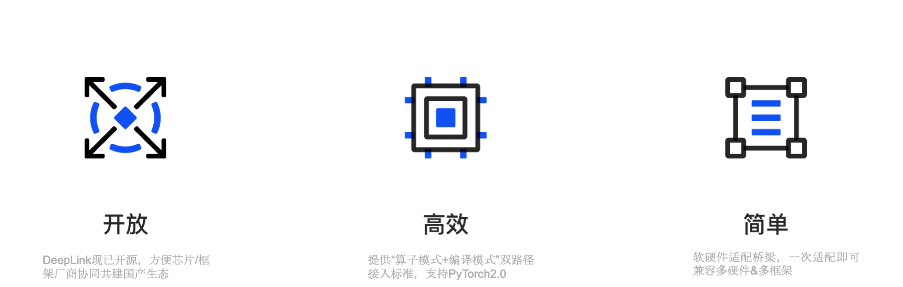
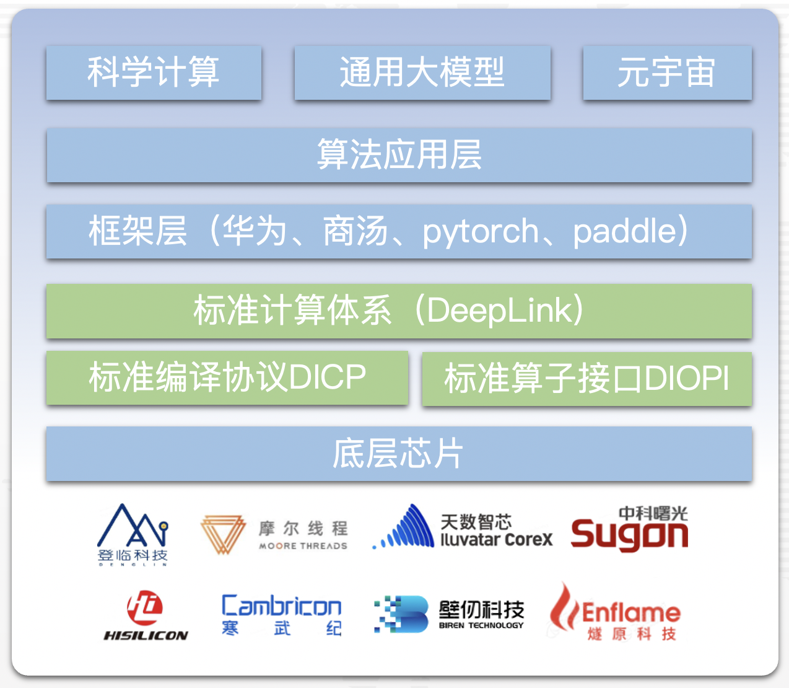

.. DeepLink Doc documentation master file, created by
   sphinx-quickstart on Thu May 11 14:46:13 2023.
   You can adapt this file completely to your liking, but it should at least
   contain the root `toctree` directive.
.. role:: red

.. role:: blue

欢迎来到 DeepLink 教程文档!
==============================================

DeepLink建立算力&框架适配桥梁，充分释放多样算力
^^^^^^^^^^^^^^^^^^^^^^^^^^^^^^^^^^^^^^^^^^^^^^^^^^^^^^^^^^^^^^^^^^^^^^^^^^^^^^

| DeepLink是一套设备无关的接口体系，作为芯片于深度学习框架适配的“桥梁”，根本性实现软硬件解耦，破除生态壁垒。遵守此标准可以实现主流框架与芯片高效适配，极大降低算力使用门槛，减少技术阻力。从而打破算力和框架的垄断，实现算力要素多样化。并且通过编译的力量，提升整体的训练效率。面对国际形势诡谲多变的现状，为发展国产替代、实现人工智能的软硬件独立自主起到了关键的纽带作用。

| DeepLink从人工智能芯片-深度学习框架的适配实践中总结出来，在二者之间定义了一套计算契约，良好的函数抽象使得上游芯片和下游框架两层在适配工程实施时能有效地解耦。与此同时，基于这种实践，可将芯片的适配工作复用到不同的训练框架适配中去。目前，DeepLink已：

1. 支持AI硬件接入，且已经实现6+以上国产芯片的训练支持；
2. 完善的一致性测例支持，支持5000+个算子测例，覆盖cv/nlp等常见模型；
3. 覆盖20+以上cv模型，提供大模型支持，提供200+标准算子接口；
4. 支持OpenMMLab等常见算法库；
5. 支持Pytorch/SenseParrots等训练框架；
6. 
.. | 人工智能标准化计算接口协议(DeepLink)从人工智能芯片-深度学习框架的适配实践中总结出来，在二者之间定义了一套计算契约，良好的函数抽象使得上游芯片和下游框架两层在适配工程实施时能有效地解耦。与此同时，基于这种实践，还可以将芯片的适配工作复用到不同的训练框架适配中去。
.. | DeepLink的标准化定义包含算子接口（DIOPI）和编译接口（DICP）两个部分。并提供200+标准算子接口，支持5000+个算子测例，覆盖CV类常见问题以及NLP等多场景模型，具备语言类大模型支持能力：
.. | DeepLink已包含 :red:`200+标准算子接口`，支持 :red:`5000+个算子测例`，覆盖CV类常见问题以及NLP等多场景模型，具备 :red:`语言类大模型支持能力`.

DeepLink体系
====================================

| 接口的标准化定义包含算子接口（DIOPI）和编译接口（DICP）两个部分：
   
| **标准算子接口** （DIOPI）定义了一套用于连接上层训练框架和下层人工智能芯片的接口，包括算子开发和算子映射两部分。一方面，训练框架的算子开发者和芯片厂商的底层芯片的开发者可以利用同一套定义快速、灵活的算子标准接口完成算子开发工作，另一方面训练框架中的算子和硬件平台的底层实现可以通过一套易用、灵活的标准映射到算子标准接口体系中。通过这种算子映射的方式，屏蔽了具体的训练框架和硬件芯片的类别和一一对应关系，将传统的单一芯片与单一框架的适配流程转换为不依赖具体框架和芯片架构的统一化实现。

| **标准编译协议** （DICP）定义了统一的计算描述（中间表示），通过计算图获取技术获取深度学习模型中的计算任务表达为上述中间表示，然后通过计算图优化技术自动生成人工智能芯片设备代码，从而提高研发效率和计算的执行性能。中间表示是介于源语言和目标语言之间的程序表示，能够极大程度地提高编译流程的可拓展性，同时也能降低优化流程对前端和后端的破坏。多层次中间表示包含从应用到芯片端的多种表示层次，不同层次旨在解决不同尺度的问题。
      
| 标准算子接口与编译协议分别支撑起了目前深度学习框架的两大模式：Eager模式（命令行交互模式）与Graph模式（图模式）。标准算子接口支持的Eager模式是主攻易用性，使得算法工程师能在短时间内进行多种尝试；编译协议支持的Graph模式是主攻高性能，能大幅提升训练效率，最大限度的释放芯片能力。

| 基于以上标准算子接口与编译协议，提供了一套硬件无关的上层框架衔接通道，兼容主流的训练框架与算法生态。此外，DeepLink还包含验证一致性的测例库和工具：一套完整的测试框架和一套算子函数测试，它含有一个一定规模的算子测例集合，可以在没有训练框架的情况下，确保厂商适配的算子功能正确，使得芯片厂商无需训练框架即可对适配结果的正确性进行验证，减少了训练框架带来的复杂性。

面向群体
====================

1. **对硬件行业：**
  - 实现软硬件解耦，根本性的破除生态壁垒
  - 一次适配即可兼容国际和国产框架，建立开放兼容的新生态
2. **对框架行业：**
  - 实现软硬件解耦，专心框架的性能优化
  - 一次适配即可支持多家优秀国产AI芯片s
3. **对应用行业：**
  - 实现主流框架与芯片高效适配，极大降低算力使用门槛，激活算力使用需求
  - 融入Torch 软件大生态，海量的优秀算法框架，让模型训练更简单

索引
====================

.. toctree::
   :maxdepth: 1
   :caption: DIOPI
   :includehidden:

   doc/DIOPI/Introduction
   doc/DIOPI/quick_start
   doc/DIOPI/API/API_index
   DIOPI/DIOPI-TEST/python/docs/source/cn_ref
   doc/DIOPI/FAQ

.. toctree::
   :maxdepth: 1
   :caption: DIPU
   :includehidden:

   doc/DIPU/Introduction
   doc/DIPU/quick_start
   doc/DIPU/API/API_index
   doc/DIPU/FAQ

.. toctree::
   :maxdepth: 1
   :caption: DICP
   :includehidden:

   doc/DICP/Introduction

.. toctree::
   :maxdepth: 1
   :caption: 硬件测评
   :includehidden:

   doc/Chip_test/Introduction

.. toctree::
   :maxdepth: 1
   :caption: 社区
   :includehidden:

   doc/Community/Contributors
   doc/Community/PullRequest
   doc/Community/CodingRule2
